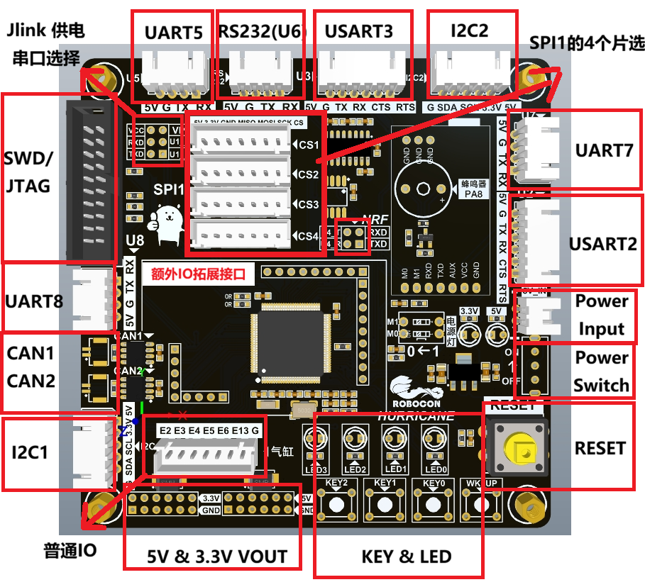

# 2025F4主控

## 硬件资源分布

## 硬件资源列表

|      资源       | 数量 |                  说明                  |
| :-------------: | :--: | :------------------------------------: |
|       MCU       |  1   |         STM32F429VET6-LQFP100          |
|    SPI FLASH    |  1   |                 W25Q64                 |
|     供电口      |  1   |             5V供电，XH2.54             |
| JTAG/SWD 调试口 |  1   |               下载、调试               |
|     电源灯      |  2   |                5V；3.3V                |
|     状态灯      |  4   | LED0红色、LED1绿色、LED2黄色、LED3蓝色 |
|    功能按键     |  4   |                                        |
|    普通串口     |  5   |           U2；U3；U5；U7；U8           |
|       CAN       |  2   |               CAN1；CAN2               |
|       I2C       |  2   |               I2C1；I2C2               |
|       SPI       |  1   |             SPI1加4个片选              |
|      RS232      |  1   |                接USART6                |
|       NRF       |  1   |                接UART4                 |
|     蜂鸣器      |  1   |            5V供电有源蜂鸣器            |
|   引出拓展IO    |  24  |                接拓展板                |

## IO引脚分配

|            Port            |            Pin            |            Function            |
| :-----------------------------: | :-----------------------------: | :-----------------------------: |
|             A            |              0            |               WK_UP            |
|              A            |               1            |                GPIO            |
|            A         |             2         |              USART2_TX         |
|            A         |             3         |              USART2_RX         |
|            A         |             4         |              W25Q64_CS         |
|            A          |             5          |              SPI1_SCK          |
|            A         |             6         |              SPI1_MISO         |
|            A         |             7         |              SPI1_MOSI         |
|              A            |               8            |                GPIO            |
|            A         |             9         |              USART1_TX         |
|           A         |            10         |              USART1_RX         |
|            A          |             11          |               CAN1_RX          |
|            A          |             12          |               CAN1_TX          |
|             A           |              13           |                SWDIO           |
|             A          |              14          |                SWDCLK          |
|             A            |              15            |                GPIO            |
|              B            |               0            |                LED1            |
|              B            |               1            |                LED0            |
|           B          |            2          |             BOOT1-GND          |
|               B            |                3            |                 SWO            |
|              B            |               4            |                GPIO            |
|             B          |              5          |               CAN2_RX          |
|             B          |              6          |               CAN2_TX          |
|              B            |               7            |                GPIO            |
|             B         |              8         |               I2C1_SCL         |
|             B         |              9         |               I2C1_SDA         |
|            B         |             10         |               I2C2_SCL         |
|            B         |             11         |               I2C2_SDA         |
|            B         |             12         |               SPI1_CS1         |
|            B         |             13         |               SPI1_CS2         |
|            B         |             14         |               SPI1_CS3         |
|            B         |             15         |               SPI1_CS4         |
|              C            |               0            |                LED2            |
|              C            |               1            |                LED3            |
|              C            |               2            |                KEY1            |
|              C            |               3            |                KEY0            |
|              C            |               4            |                GPIO            |
|              C            |               5            |                GPIO            |
|            C         |             6         |              USART6_TX         |
|            C         |             7         |              USART6_RX         |
|             C         |              8         |               TIM3_CH3         |
|             C         |              9         |               TIM3_CH4         |
|            C         |             10         |               UART4_TX         |
|            C         |             11         |               UART4_RX         |
|            C         |             12         |               UART5_TX         |
|             C            |              13            |                KEY2            |
|           C         |            14         |              32.768kHz         |
|           C         |            15         |              32.768kHz         |
|              D            |               0            |                GPIO            |
|              D            |               1            |                GPIO            |
|             D         |              2         |               UART5_RX         |
|            D        |             3        |              USART2_CTS        |
|            D        |             4        |              USART2_RTS        |
|              D            |               5            |                GPIO            |
|              D            |               6            |                GPIO            |
|              D            |               7            |                GPIO            |
|            D         |             8         |              USART3_TX         |
|            D         |             9         |              USART3_RX         |
|             D            |              10            |                GPIO            |
|           D        |            11        |              USART3_CTS        |
|           D        |            12        |              USART3_RTS        |
|             D            |              13            |                GPIO            |
|             D            |              14            |                GPIO            |
|             D            |              15            |                GPIO            |
|             E         |              0         |               UART8_RX         |
|             E         |              1         |               UART8_TX         |
|          E       |           2       |            气缸(普通GPIO)       |
|          E       |           3       |            气缸(普通GPIO)       |
|          E       |           4       |            气缸(普通GPIO)       |
|          E       |           5       |            气缸(普通GPIO)       |
|          E       |           6       |            气缸(普通GPIO)       |
|             E         |              7         |               UART7_RX         |
|             E         |              8         |               UART7_TX         |
|             E         |              9         |               TIM1_CH1         |
|            E         |             10         |               TIM1_CH2         |
|            E         |             11         |               TIM1_CH3         |
|            E         |             12         |               TIM1_CH4         |
|          E      |           13      |             气缸(普通GPIO)      |
|             E            |              14            |                GPIO            |
|             E            |              15            |                GPIO            |
|              H           |               0           |                25MHz           |
|              H           |               1           |                25MHz           |

