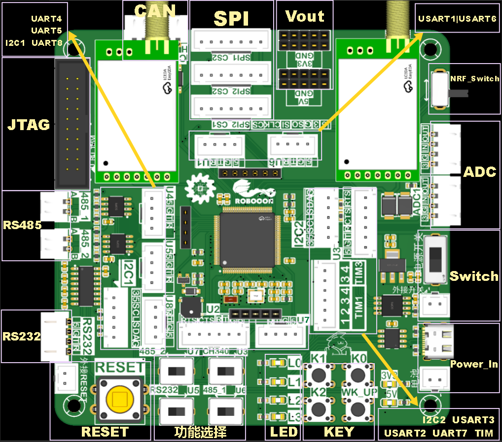

# 2026F4主控

## 资源分布

## 资源分配

|   资源    | 数量 |                            说明                            |
| :-------: | :--: | :--------------------------------------------------------: |
|    MCU    |  1   |                       STM32F429VET6                        |
|   JTAG    |  1   |                      下载，选接UART4                       |
|  蜂鸣器   |  1   |                     3V3供电无源蜂鸣器                      |
|   按键    |  4   |                             /                              |
|  电源灯   |  2   |                          3V3；5V                           |
|  状态灯   |  4   |           LED0红色、LED1绿色、LED2黄色、LED3蓝色           |
| SPI Flash |  1   |                           W25Q64                           |
|   RESET   |  2   |                         板载、外接                         |
| 电源开关  |  2   |                         板载、外接                         |
|  供电口   |  2   |                  5V供电；Type C和XHB2.54                   |
| USB转TTL  |  1   |                           CH340N                           |
|   RS232   |  1   |                         选接UART5                          |
|   RS485   |  2   |              485_1选接USART6；485_2选接UART7               |
|    I2C    |  2   |                         I2C1；I2C2                         |
|    CAN    |  2   |                         CAN1；CAN2                         |
|    SPI    |  2   |           SPI1、SPI2加两个片选，SPI1_CS1接W25Q64           |
|    ADC    |  2   |                          控制气泵                          |
|   串口    |  8   | USART1；USART2；USART3；UART4；UART5；USART6；UART7；UART8 |
|  定时器   |  6   |                          6个通道                           |
|    NRF    |  2   |             选接USART1；NRF1有收发，NRF2只有收             |
|  拓展IO   |  15  |                             /                              |

## 引脚分配

| Port | Pin  |  Function   |
| :--: | :--: | :---------: |
|  A   |  0   |    WK_UP    |
|  A   |  1   |    GPIO     |
|  A   |  2   |  USART2_TX  |
|  A   |  3   |  USART2_RX  |
|  A   |  4   |   SPI1_CS   |
|  A   |  5   |  SPI1_SCK   |
|  A   |  6   |  SPI1_MISO  |
|  A   |  7   |  SPI1_MOSI  |
|  A   |  8   |    GPIO     |
|  A   |  9   |  USART1_TX  |
|  A   |  10  |  USART1_RX  |
|  A   |  11  |   CAN1_RX   |
|  A   |  12  |   CAN1_TX   |
|  A   |  13  |    SWDIO    |
|  A   |  14  |   SWDCLK    |
|  A   |  15  |    GPIO     |
|  B   |  0   |    LED1     |
|  B   |  1   |    LED0     |
|  B   |  2   |  BOOT1-GND  |
|  B   |  3   |     SWO     |
|  B   |  4   |  SPI1_CS2   |
|  B   |  5   |   CAN2_RX   |
|  B   |  6   |   CAN2_TX   |
|  B   |  7   |  SPI2_CS2   |
|  B   |  8   |  I2C1_SCL   |
|  B   |  9   |  I2C1_SDA   |
|  B   |  10  |  I2C2_SCL   |
|  B   |  11  |  I2C2_SDA   |
|  B   |  12  |  SPI2_CS1   |
|  B   |  13  |  SPI2_SCK   |
|  B   |  14  |  SPI2_MISO  |
|  B   |  15  |  SPI2_MOSI  |
|  C   |  0   |    LED2     |
|  C   |  1   |    LED3     |
|  C   |  2   |    KEY1     |
|  C   |  3   |    KEY0     |
|  C   |  4   | ADC1/2_IN14 |
|  C   |  5   | ADC1/2_IN15 |
|  C   |  6   |  USART6_TX  |
|  C   |  7   |  USART6_RX  |
|  C   |  8   |  TIM3_CH3   |
|  C   |  9   |  TIM3_CH4   |
|  C   |  10  |  UART4_TX   |
|  C   |  11  |  UART4_RX   |
|  C   |  12  |  UART5_TX   |
|  C   |  13  |    KEY2     |
|  C   |  14  |  32.768kHz  |
|  C   |  15  |  32.768kHz  |
|  D   |  0   | RS485_1_EN  |
|  D   |  1   | RS485_2_EN  |
|  D   |  2   |  UART5_RX   |
|  D   |  3   | USART2_CTS  |
|  D   |  4   | USART2_RTS  |
|  D   |  5   |    GPIO     |
|  D   |  6   |    GPIO     |
|  D   |  7   |    GPIO     |
|  D   |  8   |  USART3_TX  |
|  D   |  9   |  USART3_RX  |
|  D   |  10  |    GPIO     |
|  D   |  11  | USART3_CTS  |
|  D   |  12  | USART3_RTS  |
|  D   |  13  |    GPIO     |
|  D   |  14  |    GPIO     |
|  D   |  15  |    GPIO     |
|  E   |  0   |  UART8_RX   |
|  E   |  1   |  UART8_TX   |
|  E   |  2   |    GPIO     |
|  E   |  3   |    BEEP     |
|  E   |  4   |    GPIO     |
|  E   |  5   |    GPIO     |
|  E   |  6   |    GPIO     |
|  E   |  7   |  UART7_RX   |
|  E   |  8   |  UART7_TX   |
|  E   |  9   |  TIM1_CH1   |
|  E   |  10  |  TIM1_CH2   |
|  E   |  11  |  TIM1_CH3   |
|  E   |  12  |  TIM1_CH4   |
|  E   |  13  |    GPIO     |
|  E   |  14  |   CTRL_1    |
|  E   |  15  |   CTRL_2    |
|  H   |  0   |    25MHz    |
|  H   |  1   |    25MHz    |

