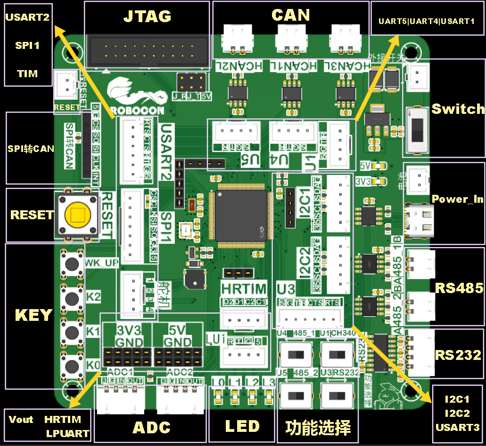

# 2026G4主控

## 资源分布

## 资源分配

|   资源    | 数量 |                     说明                      |
| :-------: | :--: | :-------------------------------------------: |
|    MCU    |  1   |                 STM32G474VET6                 |
|   JTAG    |  1   |               下载，选接LPUART1               |
|  蜂鸣器   |  1   |               3V3供电无源蜂鸣器               |
|   按键    |  4   |                       /                       |
|  电源灯   |  2   |                    3V3；5V                    |
|  状态灯   |  4   |    LED0红色、LED1绿色、LED2黄色、LED3蓝色     |
| SPI Flash |  1   |                    W25Q64                     |
|   RESET   |  2   |                  板载、外接                   |
| 电源开关  |  2   |                  板载、外接                   |
|  供电口   |  2   |            5V供电；Type C和XHB2.54            |
| USB转TTL  |  1   |                    CH340N                     |
|   RS232   |  1   |                  选接USART3                   |
|   RS485   |  2   |        485_1选接UART4；485_2选接UART5         |
|    I2C    |  2   |          I2C1（I2C3）；I2C2（I2C4）           |
|    CAN    |  3   |               CAN1；CAN2；CAN3                |
|    SPI    |  1   |         SPI1加两个片选，SPI1_CS2转CAN         |
|    ADC    |  2   |                   控制气泵                    |
|   串口    |  6   | LPUART1；USART1；USART2；USART3；UART4；UART5 |
|    TIM    |  8   |   4个通用定时器通道，4个高分辨率定时器输出    |
|  拓展IO   |  16  |                       /                       |

## 引脚分配

| Port | Pin  |     Function     |
| :--: | :--: | :--------------: |
|  A   |  0   |      WK_UP       |
|  A   |  1   |       GPIO       |
|  A   |  2   |       BEEP       |
|  A   |  3   |     ADC1_IN4     |
|  A   |  4   |      CTRL_1      |
|  A   |  5   |     SPI1_CLK     |
|  A   |  6   |    SPI1_MISO     |
|  A   |  7   |    SPI1_MOSI     |
|  A   |  8   |    FDCAN3_RX     |
|  A   |  9   |    USART1_TX     |
|  A   |  10  |    USART1_RX     |
|  A   |  11  |       GPIO       |
|  A   |  12  |       GPIO       |
|  A   |  13  |      SWDIO       |
|  A   |  14  |      SWCLK       |
|  A   |  15  |    FDCAN3_TX     |
|  B   |  0   |    ADC3_IN12     |
|  B   |  1   |      CTRL_2      |
|  B   |  2   |       GPIO       |
|  B   |  3   |       SWO        |
|  B   |  4   |       GPIO       |
|  B   |  5   |    FDCAN2_RX     |
|  B   |  6   |    FDCAN2_TX     |
|  B   |  7   |       GPIO       |
|  B   |  8   |    BOOT0-GND     |
|  B   |  9   |       GPIO       |
|  B   |  10  |    LPUART1_RX    |
|  B   |  11  |    LPUART1_TX    |
|  B   |  12  |   HRTIM1_CHC1    |
|  B   |  13  |   HRTIM1_CHC2    |
|  B   |  14  |   HRTIM1_CHD1    |
|  B   |  15  |   HRTIM1_CHD2    |
|  C   |  0   |     TIM1_CH1     |
|  C   |  1   |     TIM1_CH2     |
|  C   |  2   |     TIM1_CH3     |
|  C   |  3   |     TIM1_CH4     |
|  C   |  4   |       KEY0       |
|  C   |  5   |       KEY1       |
|  C   |  6   |     I2C4_SCL     |
|  C   |  7   |     I2C4_SDA     |
|  C   |  8   |     I2C3_SCL     |
|  C   |  9   |     I2C3_SDA     |
|  C   |  10  |     UART4_TX     |
|  C   |  11  |     UART4_RX     |
|  C   |  12  |     UART5_TX     |
|  C   |  13  |       KEY2       |
|  C   |  14  |    32.768kHz     |
|  C   |  15  |    32.768kHz     |
|  D   |  0   |    FDCAN1_RX     |
|  D   |  1   |    FDCAN1_TX     |
|  D   |  2   |     UART5_RX     |
|  D   |  3   |    USART2_CTS    |
|  D   |  4   |    USART2_RTS    |
|  D   |  5   |    USART2_TX     |
|  D   |  6   |    USART2_RX     |
|  D   |  7   |       GPIO       |
|  D   |  8   |    USART3_TX     |
|  D   |  9   |    USART3_RX     |
|  D   |  10  |       GPIO       |
|  D   |  11  |    USART3_CTS    |
|  D   |  12  |    USART3_RTS    |
|  D   |  13  |       GPIO       |
|  D   |  14  |    RS485_2_EN    |
|  D   |  15  |    RS485_1_EN    |
|  E   |  0   |     SPI1_CS1     |
|  E   |  1   |     SPI1_CS2     |
|  E   |  2   |       GPIO       |
|  E   |  3   |       INT        |
|  E   |  4   |       GPIO       |
|  E   |  5   |       GPIO       |
|  E   |  6   |       LED0       |
|  E   |  7   |       LED1       |
|  E   |  8   |       LED2       |
|  E   |  9   |       LED3       |
|  E   |  10  |   QUADSPI1_CLK   |
|  E   |  11  | QUADSPI1_BK1_NCS |
|  E   |  12  | QUADSPI1_BK1_IO0 |
|  E   |  13  | QUADSPI1_BK1_IO1 |
|  E   |  14  | QUADSPI1_BK1_IO2 |
|  E   |  15  | QUADSPI1_BK1_IO3 |
|  F   |  0   |      25MHz       |
|  F   |  1   |      25MHz       |
|  F   |  2   |       GPIO       |
|  F   |  9   |       GPIO       |
|  F   |  10  |       GPIO       |
|  G   |  10  |      RESET       |

