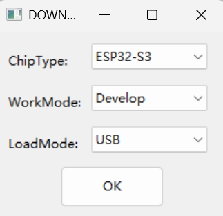
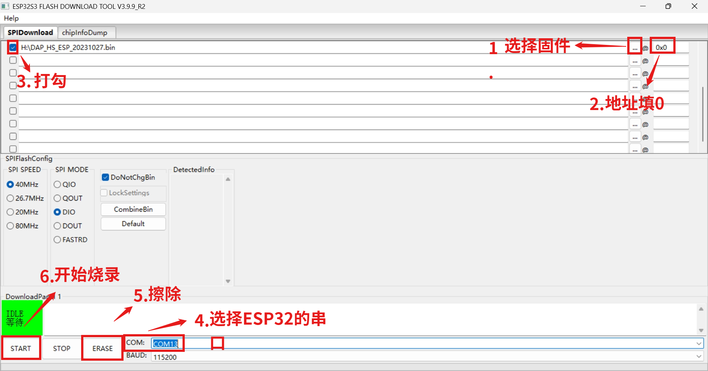
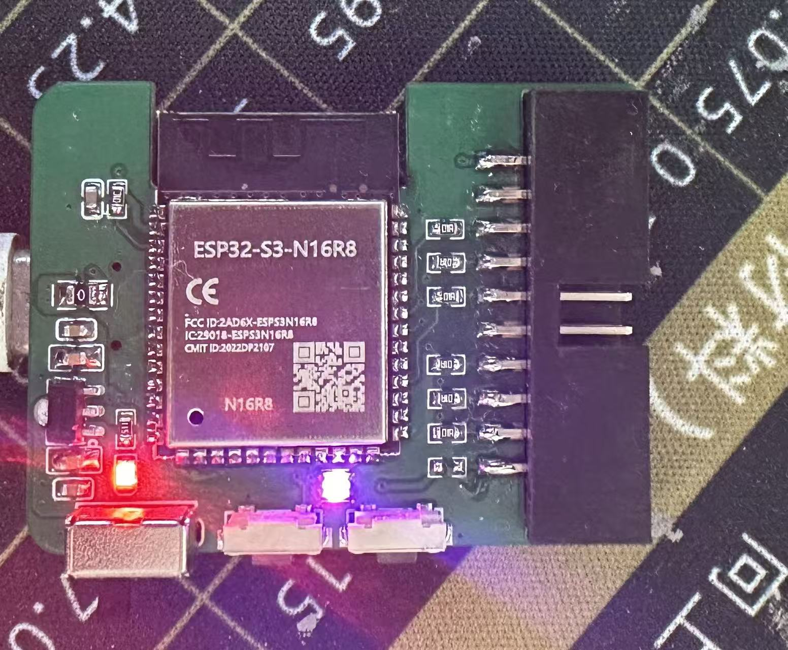

# 无线Daplink使用手册

参考[高速无线DAP调试器Lite - 立创开源硬件平台](https://oshwhub.com/ylj2000/dap_hs_esp_open)设计，修改线序为Jlink线序，主控板Jtag即可兼容Jlink和无线Daplink

## 固件烧录

硬件焊接完成后，usb插电脑，设备管理器会不停刷新。长按住A后重新再上电，ESP32进入烧录模式，设备管理器的通用串行总线设备显示USB JTAG/serial debug unit，即进入烧录模式。

打开flash_download_tool，选择ESP32-S3、Develop、USB。

在文件夹中选择需要烧录的固件，后方的起始地址填0，选择ESP32的串口，先点ERASE进行擦除，擦除完后点START进行烧录。（需要多点几下才会开始擦除和烧录）

烧录完成后重新上电，初始化是有线模式，State灯为红色，此时设备管理器的通用串行总线设备显示Horco CMSIS-DAP v2。

## 主从配对

第一个Daplink长按按键B再上电，直到State灯变为紫色，第二个同样的操作，不过State灯不会变紫，两个Daplink的State灯会分别同时变成蓝色和绿色。蓝色是主机，绿色是从机（**蓝色插电脑，绿色插板子**）

## 模式切换

### 有线模式

先上电，再长按按键A知道State灯变成黄色，再短按按键B切换State灯为红色。若是临时使用，短按按键A即可，下次上电依旧是原来的模式；若是长期使用，长按按键A直至State闪黄灯，再短按A退出。

### 无线模式

跟主从配对操作相同，不再赘述

## 资料下载

电路组队员可直接在**嘉立创团队-其他-Daplink**中查看工程

点击下载Gerber、外壳、面板资料：[资料链接](https://pan.quark.cn/s/37286f7ce8e4)

