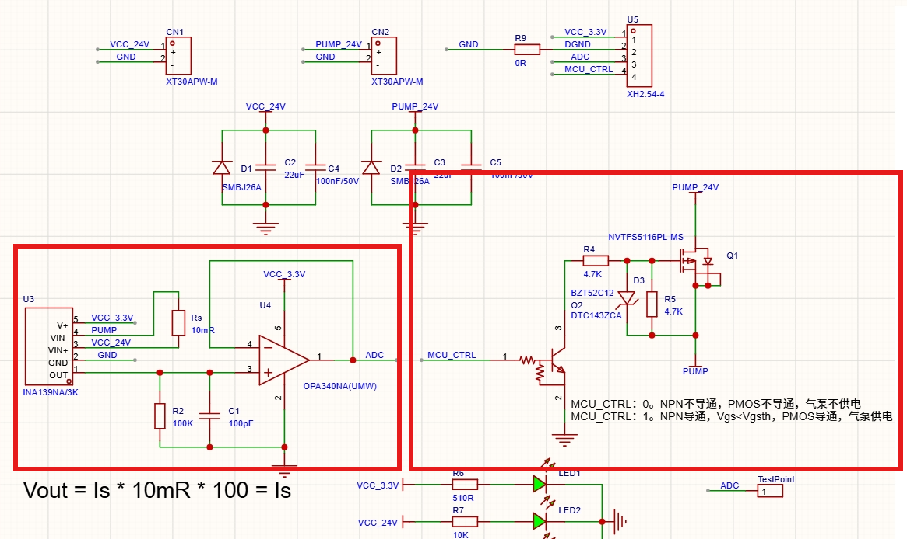

# 单路气泵控制板

以往气泵的控制方式是使用气压传感器去判断是否吸到了物品，再通过单片机控制继电器控制气泵的通断。本电路将两者集成，与气泵串联，通过检测气泵的电流来判断是否吸到物品，同样使用单片机控制气泵通断。可根据实际情况集成多个实现多路控制。

## 控制原理

气泵空载和带载时的电流是不同的，测量得到启动最大电流2.24A左右，空载1.82A左右，负载1.06A左右。所以我们可以通过检测气泵工作时的电流来判断是否吸取到了物品，本电路将气泵的电流转换成了MCU可以读取的电压，只需要MCU的ADC引脚来读取电压判断状态，即可进行逻辑控制。

## 电路实现

右边是一个很典型的MCU高低电平控制24V通断的电路，MCU_CTRL为高电平时气泵通电开始工作，MCU_CTRL为低电平时气泵不通电。左边INA139测量气泵的电流，通过OPA340将电流转成电压，改变R2电阻的阻值即可改变增益根据公式：
$$
V_{out}=(I_s)(R_s)(1000uA/V)(R_L)
$$
Vout与Is数值相同，也在MCU可读取的电压范围内。