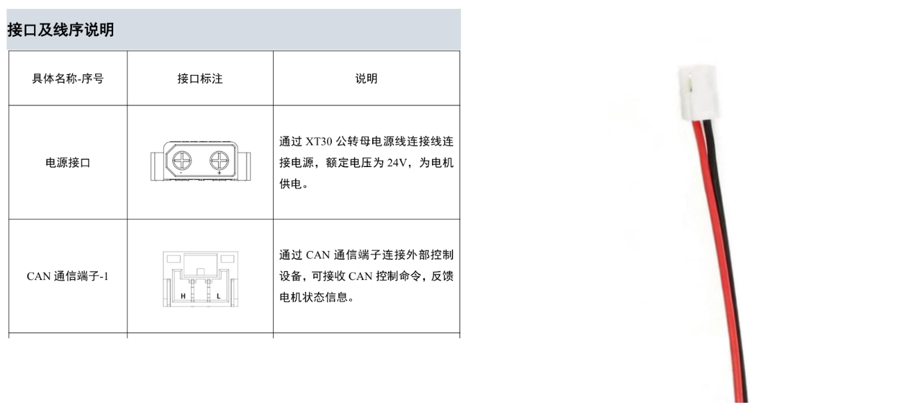
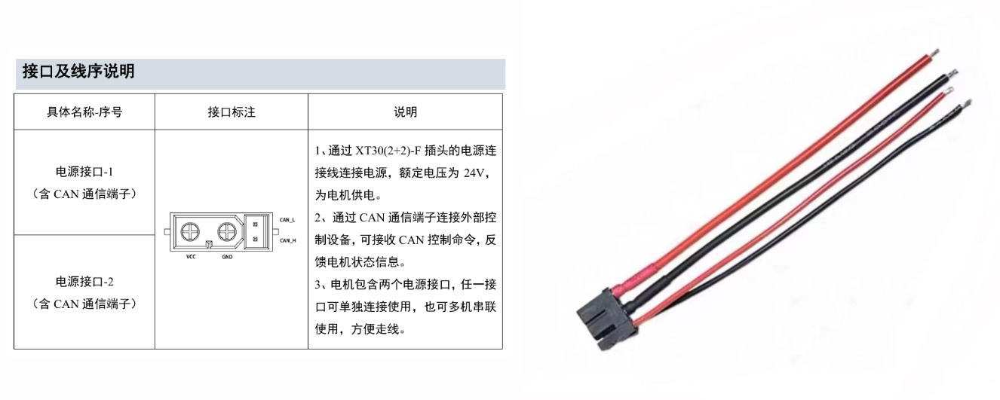
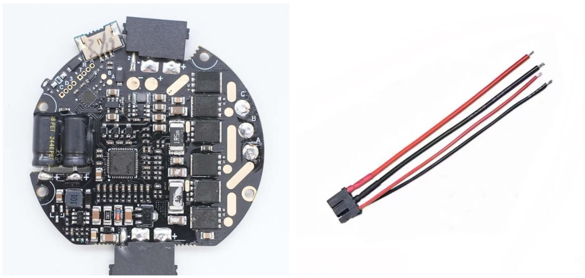
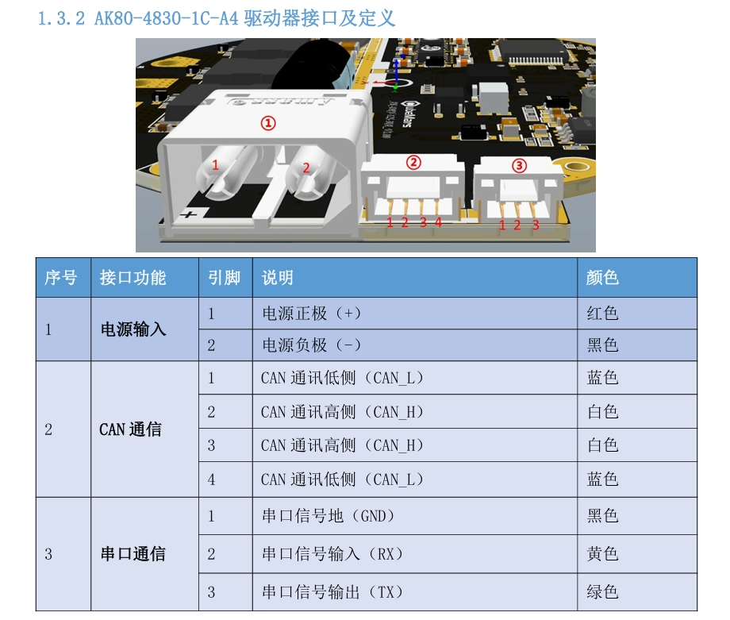

# CAN & RS485接线

电机上常用的CAN接口和485接口是GH1.25或者XT30 2+2，但是经过长时间拔插，插口很容易变松，导致机器人在运动时出现故障。所以在分电板和主控上使用XHB2.54接口。

我们一般规定红线为高或A、黑线为低或B，但是淘宝上购置的端子线、不同品牌电机接口各有不同，仅凭线的颜色分辨高低不可取，所以对目前使用的电机进行整理。

## 大疆

GH1.25卡扣面对自己，**左黑右红**

### M3508

### M2006

### GM6020

## 达妙

GH1.25卡扣面对自己，**左红右黑**，XT30 2+2母头底部标注了1和2 , 1是高，2是低

### DM8006

### DM6220

### DM4340

### DM4310

## 宇树

XT30 2+2母头底部标注了1和2 , 1是A，2是B

### GO-M8010-6

## CubeMars

### AK80

