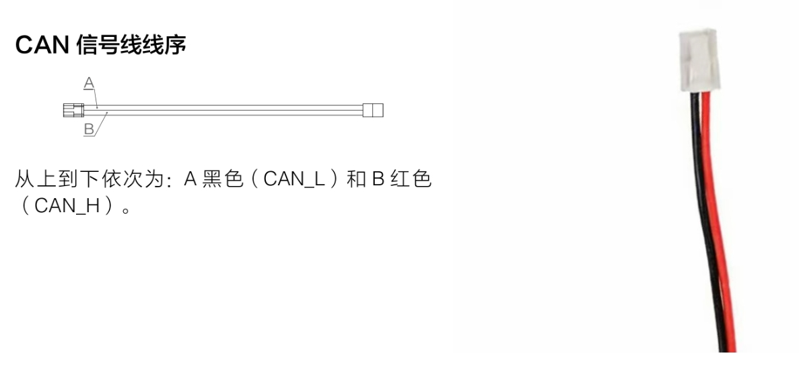
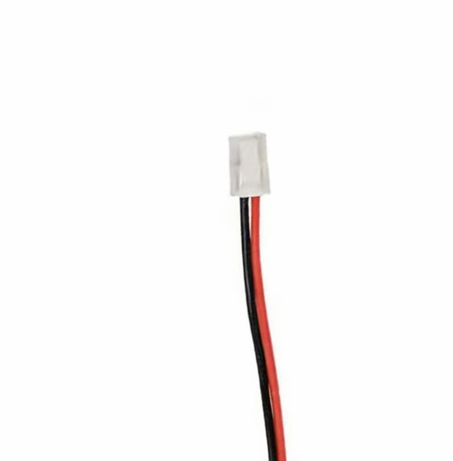
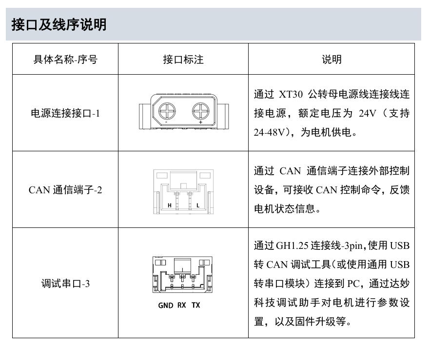
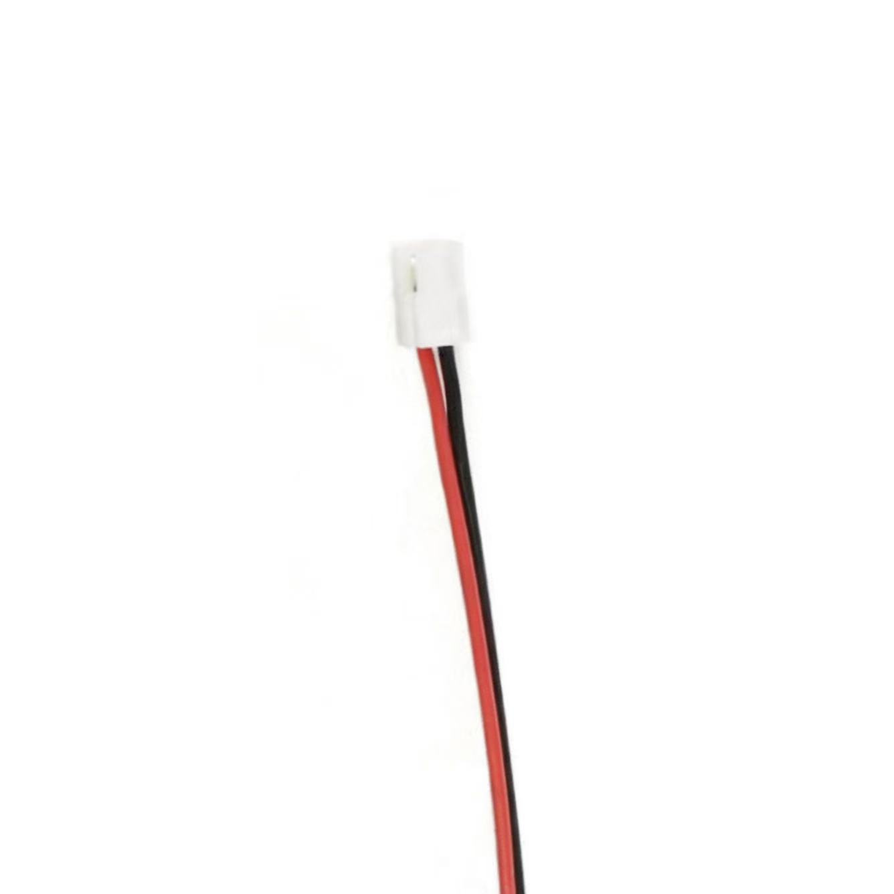

# CAN接线

电机上常用的CAN接口是GH1.25，但是经过长时间拔插，插口很容易变松，导致机器人在运动时出现故障。所以在分电板和主控上使用XHB2.54。

我们一般规定红线为高、黑线为低，但是淘宝上购置的端子线、不同品牌电机接口各有不同，仅凭线的颜色分辨高低不可取，所以对目前使用的电机进行整理。

## 大疆电机

GH1.25卡扣面对自己，**左黑右红**

### M3508

### M2006

### GM6020

## 达妙电机

GH1.25卡扣面对自己，**左红右黑**

### DM4310

### DM8006

### DM6220

CubeMars电机

AK80

