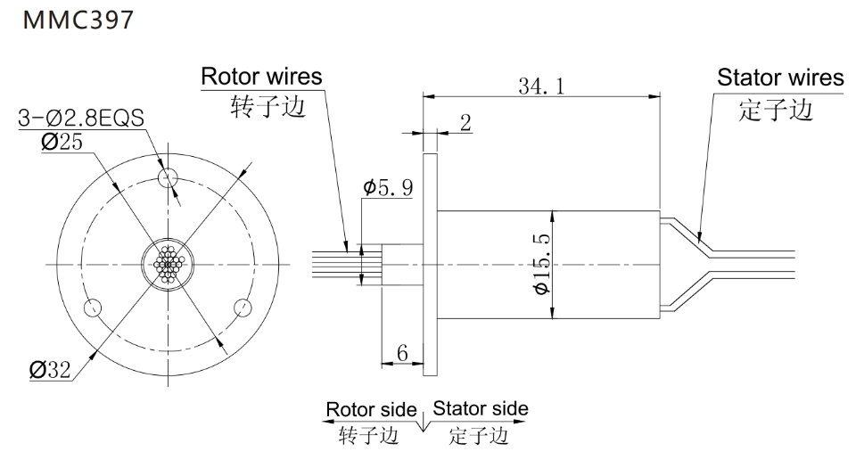
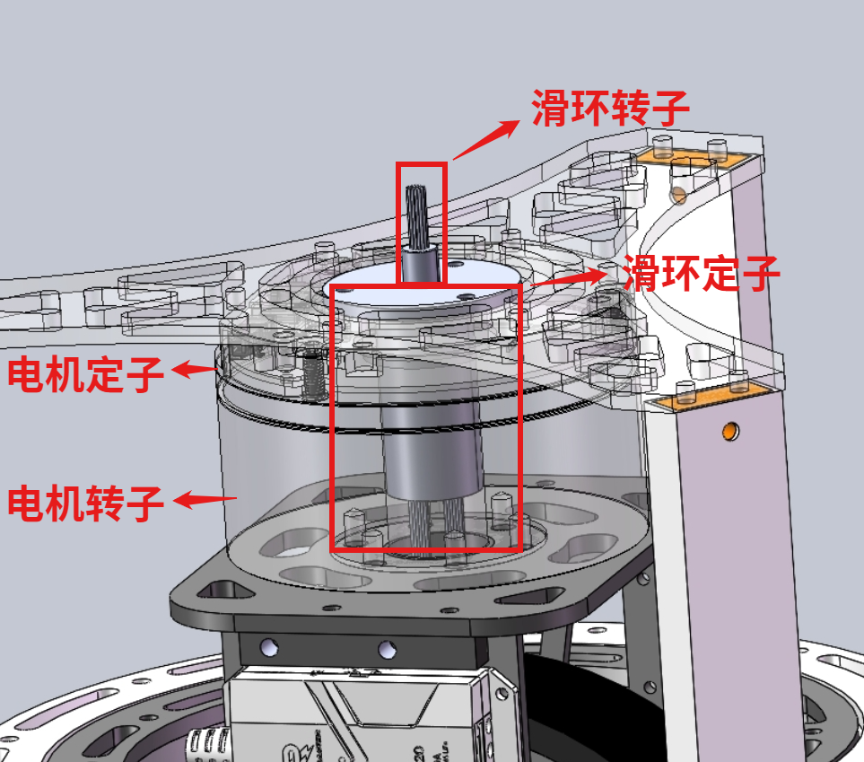
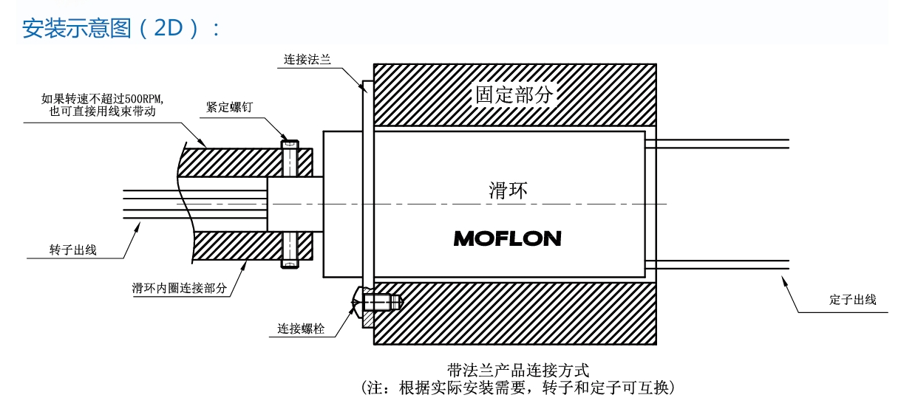

# 滑环

滑环学名集电环，通常用于360°无限连续旋转的领域，比赛中用于给舵轮的航向电机接线，舵向电机需是中空电机，如DM6220、GM6020

## 型号选择

**1.根据中空电机的空心轴内径选择滑环的直径**，如GM6020的内径为18mm，DM6220的内径为16mm，要兼容两个电机，滑环直径需要小于16mm

**2.根据需要控制的电机的电流选择滑环每根线的耐流**，可以选择少线大电流或多线小电流

## 接线方式

以目前使用的滑环MMC397为例，该滑环直径15.5mm，总路数24，每根线耐流2A，N个1A 电流环并起来可作为1路Nx1A电流环使用。C620电流最大持续电流20A，线路分为四部分：11根线接电池正极、11根线接电池负极、1根线接CAN_H、1根线接CAN_L。**需要特别注意的是电池正极和电池负极的22根线千万不能弄混，不然VG短接。**

## 安装方式

滑环分为转子边和定子边，两边各固定在电机的转子和定子

根据实际安装需要，转子和定子可以互换。例如现在的滑环就是互换的接法，**这种情况下滑环的定子需要与电机的转子固定到一起，千万不能和电机的定子固定**

