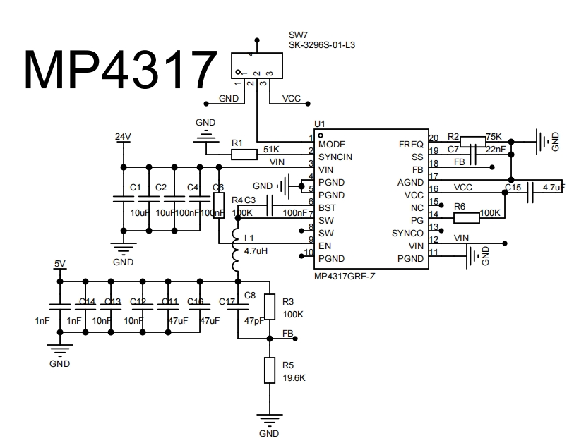
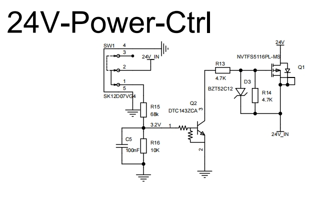
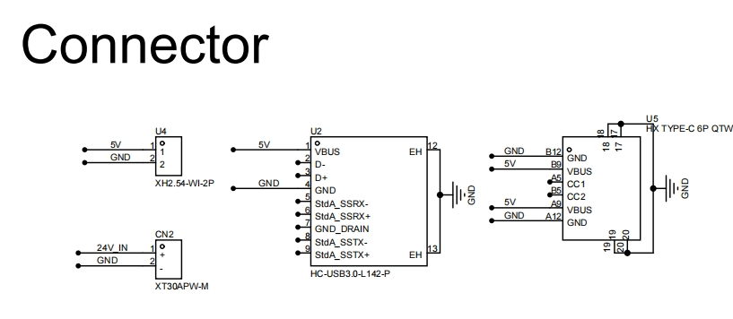
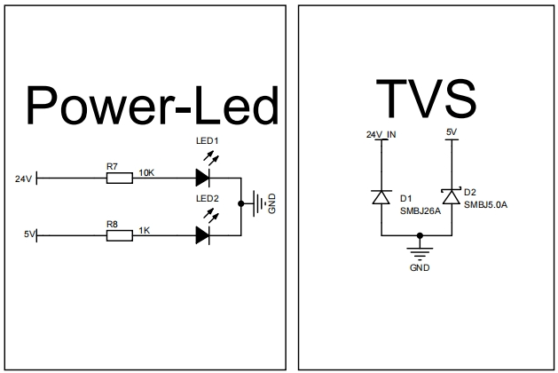
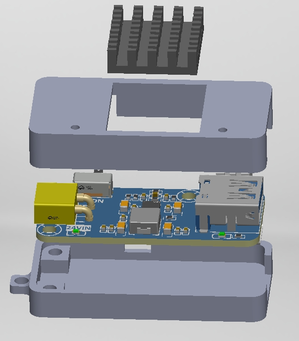
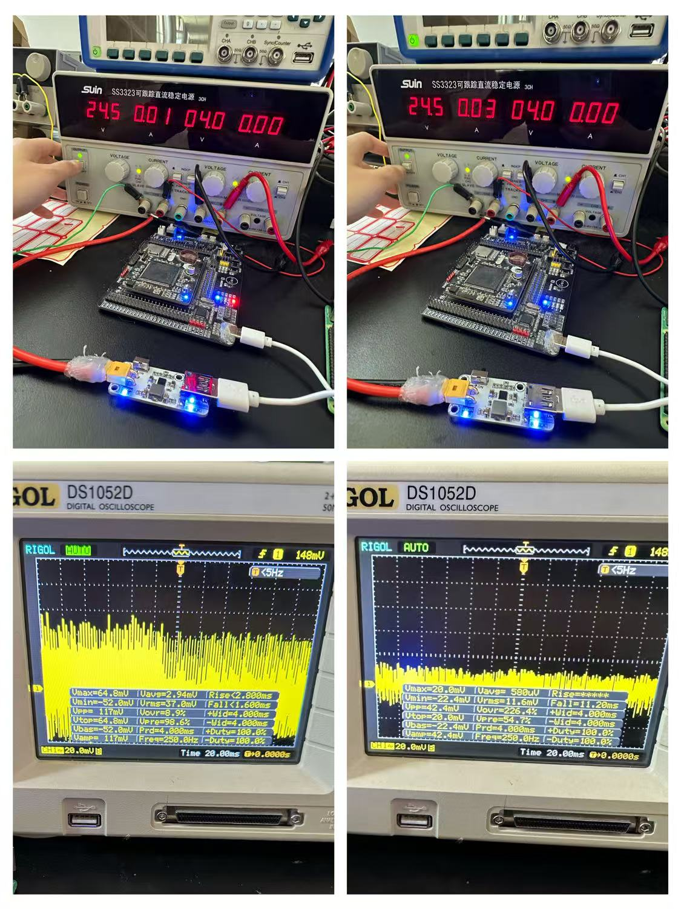

# MP4317宽负载双模式24V转5V模块

## 设计背景

该模块原本是给树莓派5V3A供电使用，考虑到5V同样可以给主控板供电，而传统BUCK芯片在输出3A重载能力时，面对轻载（接近空载）场景会出现转换效率极低的问题，增加功耗且影响供电稳定性。MP4317芯片具备AAM和FCCM两种工作模式，可通过模式切换适配不同负载，既能保证重载纹波，也能保证轻载效率。

树莓派以 SoC为主控，其核心频率高，对电源的瞬态响应和纹波敏感，如果5V供电纹波过大，可能会通过 LDO 或 DC-DC 耦合到核心电压上，导致外设误码率升高甚至系统降频、重启。 50mA-200mA 的功耗对于 STM32 来说是比较典型的运行电流，一般主控板上使用AMS1117等LDO对5V进行降压， LDO 具有较高的 PSRR，能够很好地滤除5V输入端的纹波。既然 LDO 已经帮助挡住了纹波，那么前端5V采用 AAM 模式提高转换效率，是性价比极高的方案。

## 模块使用方法

**1.单独给树莓派或给树莓派和主控板一起供电（重载）**：将24V电池插入XT30供电口，后端可通过TypeC或TypeA连接至树莓派，将MODE选择开关拨置FCCM，供电开关拨置ON即可使用

**2.单独给主控板供电（轻载）**：将24V电池插入XT30供电口，后端可通过XH2.54 2p连接至主控板，将MODE选择开关拨置AAM，将开关拨置ON即可使用

## MP4317两种工作模式简述

### FCCM

Force Continuous Current Mode，强制连续导通模式。在FCCM模式下：即使负载非常小，下管在同步周期内依然会开启。当电感电流降到 0 以下时，电流会从输出端倒流回地。这意味着电感里的电流会像波浪一样，在正负值之间波动，但永远不会停下来。**FCCM的优势是无论轻载重载，纹波都较小；劣势是轻载时开关动作依然频繁，且有环路损耗，导致效率低。**

### AAM

Advanced Asynchronous Mode，异步高级模式。在普通的 PWM模式下，无论负载大小，开关频率通常保持不变。当电器处于待机或轻载状态时，虽然输出电流很小，但开关损耗依然很高，这会导致效率骤降。AAM 的核心思想是按需供电。它将传统的连续脉冲变成了非连续的、间歇性的脉冲。**AAM 的优势是极高的轻载效率；劣势是间歇性供电导致电压起伏、纹波较大。**

## 原理图

## 爆炸图

## 测试结果

### 轻载

FCCM：24V供电电流大约30mA，输出纹波大约42.4mV

AAM：24V供电电流大约10mA，输出纹波大约117mV

**虽然AAM牺牲了输出纹波，但是在轻载情况下帮助减少了约 66% 的损耗**

### 重载

经测试，树莓派的USB外设最高只会达到1.2A的电流，稳定电流600mA，达不到重载要求🤡

## Datasheet

[MP4317](https://www.monolithicpower.com/en/documentview/productdocument/index/version/2/document_type/Datasheet/lang/en/sku/MP4317GRE/document_id/10027/)

[Advanced Asynchronous Modulation  Application Note](https://media.monolithicpower.cn/document/Advanced Asynchronous Modulation.pdf)
