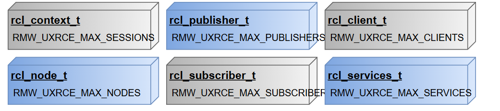
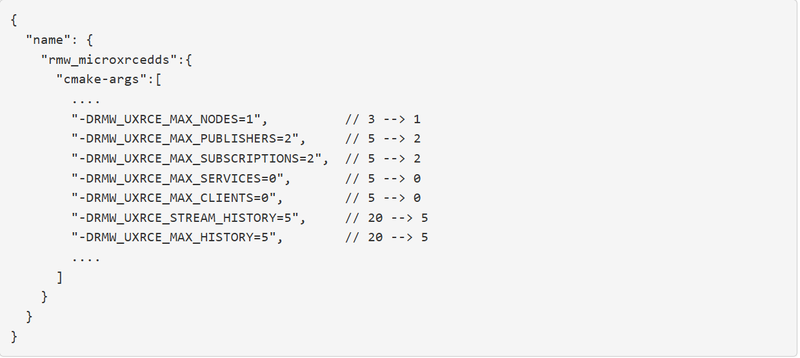
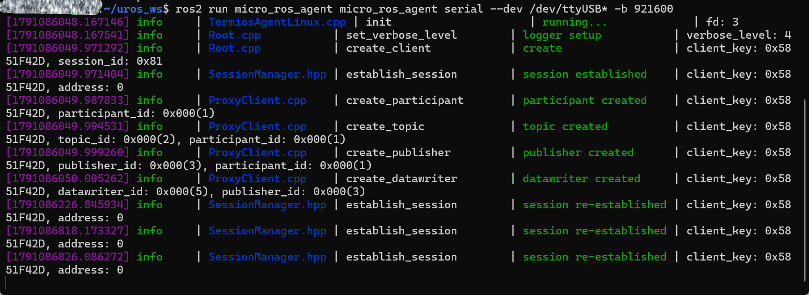

# 中间件配置

[官方参考资料](https://micro.vulcanexus.org/docs/tutorials/advanced/microxrcedds_rmw_configuration/)

micro-ROS是专门运行在资源极度有限的微控制器上的 ROS 2。由于单片机的内存十分有限，不能随意浪费，所以精打细算的内存配置和**调优**是必不可少的，这样才能让micro-ROS在极小内存的芯片上高效运行。

## 为什么要调优

+ **痛点：**普通电脑上的 ROS 2 喜欢用动态内存分配，但这在单片机上极易导致内存碎片化或内存溢出崩溃。
+ **解决策略：**micro-ROS 几乎把所有内存都改成了静态内存池，相当于提前占好固定大小的位置。
+ **带来的要求：**开发者必须在编译前做调优，用几个节点，发多大的包，都需要“量身定制”。

## 内存资源优化

### 底层的 Micro XRCE-DDS（负责数据网络传输）

单片机和上位机之间是通过 **Stream（流/消息队列）** 进行通信的。流分为两种模式：


| 通信模式                    | 工作方式                                                 | 内存结构                                                  | 最大消息长度             |
| :-------------------------- | :------------------------------------------------------- | :-------------------------------------------------------- | :----------------------- |
| **Best-Effort（尽力而为）** | 像单格信箱，信件只放一封，发出去就不管了，丢了不补发。   | 只有一个数据缓冲区，每次只能 推送一条消息。               | MTU - 12字节             |
| **Reliable（可靠传输）**    | 像多格储物柜，把缓冲区切成多个槽位，支持重发和确认应答。 | 缓冲区被切分为多个连续的槽位，存放多条待确认/重发的消息。 | (MTU - 12字节) *槽位数量 |

> **关键 CMake 调优参数：**
>
> - **单次传输单元大小（MTU）**：
>   - 根据通信方式（UDP/TCP/串口）设置：`UCLIENT_UDP_TRANSPORT_MTU`、`UCLIENT_TCP_TRANSPORT_MTU`、`UCLIENT_SERIAL_TRANSPORT_MTU`。
>   - 它决定了尽力而为流的缓冲区大小，同时也等于可靠流中**单个槽位**的大小。
> - **可靠流的槽位数量（History）**：
>   - `RMW_UXRCE_STREAM_HISTORY`：决定可靠传输队列里最多能存几条消息。
> - **QoS 关联**：在代码中通过 QoS 策略选择是 `BEST_EFFORT` 还是 `RELIABLE`，底层就会走对应的缓冲区逻辑。

### 上层的 rmw-microxrcedds （ROS 2 实体内存池）

为了管理 ROS 概念中的节点、话题发布者、订阅者等，系统为每一种类型都分配了**独立的静态内存池**。



#### 实体与 CMake 配置参数对应关系

- `rcl_node_t`（节点） -->  `RMW_UXRCE_MAX_NODES`
- `rcl_publisher_t`（发布者） -->  `RMW_UXRCE_MAX_PUBLISHERS`
- `rcl_subscriber_t`（订阅者） -->  `RMW_UXRCE_MAX_SUBSCRIPTIONS`
- `rcl_services_t`（服务服务端） -->  `RMW_UXRCE_MAX_SERVICES`
- `rcl_client_t`（服务客户端） -->  `RMW_UXRCE_MAX_CLIENTS`
- `rcl_context_t`（会话上下文） -->  `RMW_UXRCE_MAX_SESSIONS`

#### 消息历史队列大小

- `RMW_UXRCE_MAX_HISTORY`：订阅者在读取消息前，用于暂存消息的历史队列深度。

#### 配置示例（`.meta` 配置文件裁剪）



官方文档（上图）给出了一个乒乓球示例中修改 `.meta` 文件的做法：

- 默认创建 3 个节点、5 个发布者、5 个服务等；
- 精简参数：
  - 节点设为 **1**（`-DRMW_UXRCE_MAX_NODES=1`）
  - 发布者/订阅者设为 **2**（`-DRMW_UXRCE_MAX_PUBLISHERS=2`, `SUBSCRIPTIONS=2`）
  - 用不到的 Service 和 Client 直接**设为 0**（省下大量内存）
  - 历史队列从 20 砍到 **5**。

读者可以自行尝试。

## 动态配置参数

除了在编译前写死在 `.meta` 文件中，micro-ROS 还允许开发者**在程序运行初始化时**通过 C 语言 API 动态配置连接参数。

### 可配置的项目

- Agent 的 IP 地址和端口
- 串口设备路径
- **客户端唯一标识：`client_key`**

### API调用步骤解析

```c
#include <rmw_microros/rmw_microros.h>

// 1. 初始化 RCL 选项和上下文结构体
rcl_init_options_t init_options = rcl_get_zero_initialized_init_options();
rcl_context_t context = rcl_get_zero_initialized_context();
rcl_init_options_init(&init_options, rcl_get_default_allocator());

// 2. 从 RCL 选项中提取出底层的 RMW 配置句柄
rmw_init_options_t* rmw_options = rcl_init_options_get_rmw_init_options(&init_options);

// 3. 动态设置 IP 和端口（例如：127.0.0.1 : 8888）
rmw_uros_options_set_udp_address("127.0.0.1", "8888", rmw_options);

// 或 动态设置串口设备（例如：/dev/ttyAMA0）
rmw_uros_options_set_serial_device("/dev/ttyAMA0", rmw_options);

// 4. 设置固定的 client_key（例如：0xBA5EBA11）
rmw_uros_options_set_client_key(0xBA5EBA11, rmw_options);

// 5. 正式启动初始化
rcl_init(0, NULL, &init_options, &context);

```

### 关于`client_key` 

- **默认情况**：如果开发者不指定，客户端每次启动都会**随机生成**一个 `client_key`。
- **设置固定值的好处**：如果单片机重启或意外断线重连，上位机可以通过这个固定的 key **识别出“还是同一个客户端”**，直接**复用**之前在 Agent 端已经创建好的 DDS 实体资源，避免 Agent 每次都重新分配资源导致内存浪费或握手延迟。



但实际上笔者发现，单片机上生成的 `client_key` 是一个**固定值**，无论重启多少次。翻阅资料后发现，一个独立的单片机系统，如果不引入一个随机信号，永远不能实现随机的效果，即**伪随机数**，所以我们能看到 `client_key` 为定值。不过笔者还是建议设置一个固定值，防止如果有两个客户端共用相同的 `client_key` ，Agent会识别**混淆**。
