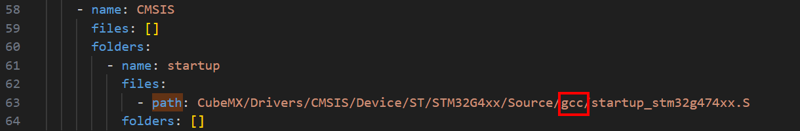
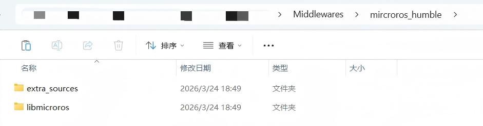

# 嵌入战队模板

## 启动文件修改



注意这里的start_up文件的path中的标注位置，一定要改成`gcc`！！

## 添加文件

在模板的 `Middlewares` 层新建文件夹，用于存放 `microros` 相关文件。

这里命名为 `microros_humble` 。



向文件夹中添加如图所示文件，随后在工程中添加以下文件即可：

* `libmicroros.a`

* `custom_memory_manager.c`

* `microros_allocators.c`

* `microros_time.c`

* `dma_transport.c`：如果你不是用串口+DMA通信，改用符合的文件。

把 `extra_sources` 中的文件全部整合成到同一级。

## 函数修改

### dma_transport.c

修改以下内容：

```c
#define UART_DMA_BUFFER_SIZE 512

bool cubemx_transport_open(struct uxrCustomTransport * transport){
    UART_HandleTypeDef * uart = (UART_HandleTypeDef*) transport->args;
    return true;
}

size_t cubemx_transport_read(struct uxrCustomTransport* transport, 
                             uint8_t* buf, size_t len, int timeout, uint8_t* err){
    UART_HandleTypeDef * uart = (UART_HandleTypeDef*) transport->args;

    int wrote = 0;

     wrote = uart_dmarx_read(uart, buf, len);

    return wrote;
}

删去无用变量
static uint8_t dma_buffer[UART_DMA_BUFFER_SIZE];
static size_t dma_head = 0, dma_tail = 0;

osDelay改成vTaskDelay
```

## 头文件修改

### MicroROSConfig.h

若有 `MicroROSConfig.h` 文件，添加进工程即可。若无，则新建文件，输入以下代码：

```c
#ifndef _MICROROS_CONFIG_H
#define _MICROROS_CONFIG_H

#include <rcl/rcl.h>
#include <rcl/error_handling.h>
#include <rclc/rclc.h>
#include <rclc/executor.h>
#include <uxr/client/transport.h>
#include <rmw_microxrcedds_c/config.h>
#include <rmw_microros/rmw_microros.h>

#include "microros_allocators.h"
#include "dma_transport.h"

#endif /* _MICROROS_CONFIG_H */
```

### dma_transport.h

若有 `dma_trasport.h` 文件，添加进工程即可。若无，则新建文件，输入以下代码：

```c
#ifndef DMA_TRANSPORT_H
#define DMA_TRANSPORT_H

bool cubemx_transport_open(struct uxrCustomTransport * transport);

bool cubemx_transport_close(struct uxrCustomTransport * transport);

size_t cubemx_transport_write(struct uxrCustomTransport* transport, uint8_t * buf, size_t len, uint8_t * err);

size_t cubemx_transport_read(struct uxrCustomTransport* transport, uint8_t* buf, size_t len, int timeout, uint8_t* err);

#endif //DMA_TRANSPORT_H
```

### microros_allocators.h

若有 `microros_allocators.h` 文件，添加进工程即可。若无，则新建文件，输入以下代码：

```c
#ifndef MICROROS_ALLOCATORS_H
#define MICROROS_ALLOCATORS_H

void * microros_allocate(size_t size, void * state);

void microros_deallocate(void * pointer, void * state);

void * microros_reallocate(void * pointer, size_t size, void * state);

void * microros_zero_allocate(size_t number_of_elements, size_t size_of_element, void * state);

#endif //MICROROS_ALLOCATORS_H
```

### include.h

添加以下头文件：

```c
#include "MicroROSConfig.h"
#include <std_msgs/msg/int32.h>
```

### microros_allocators.c

头文件替换为以下所示：

```c
#include <unistd.h>
#include "FreeRTOS.h"
#include "task.h"
#include "microros_allocators.h"
```

### dma_transport.c

头文件替换为以下所示：

```c
#include <uxr/client/transport.h>

#include <rmw_microxrcedds_c/config.h>

#include <cubemx.h>
#include "FreeRTOS.h"
#include "task.h"

#include <unistd.h>
#include <stdio.h>
#include <string.h>
#include <stdbool.h>
#include "dma_transport.h"
```

### microros_time.c

头文件替换为如下所示：

```
#include <unistd.h>
#include <time.h>

#include "FreeRTOS.h"
#include "task.h"
```

## 串口配置

+ 记得开启所需串口, `DMA RX` , `DMA TX` 全开。 
+ `DMA` 接收缓冲区改成1024。

## 堆栈配置

打开 `FreeRTOSConfig` 文件，将 `configTOTAL_HEAP_SIZE` 改为**1024*40**。

## 构建配置

+ `GCC` 编译器用 **`13.2.rel1`** 版本（已验证可用，其他更高版本读者可自行测试）！
+ 链接脚本路径就是 `STM32F429XX_FLASH.ld` 的路径，如果你放根目录下，直接写 `STM32F429XX_FLASH.ld` 即可。
+ 链接库选项改为 `-lm -lmicroros` 。

## 接下来编译通过即可。