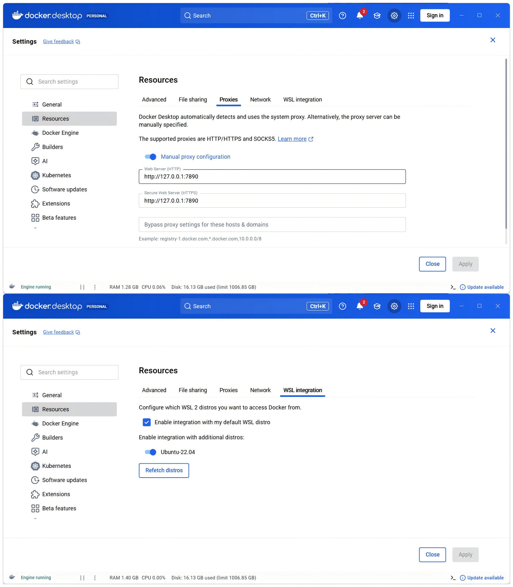
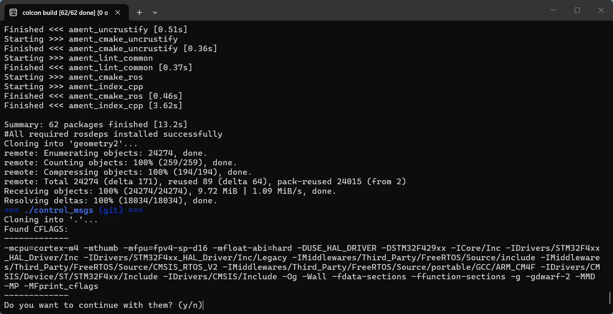
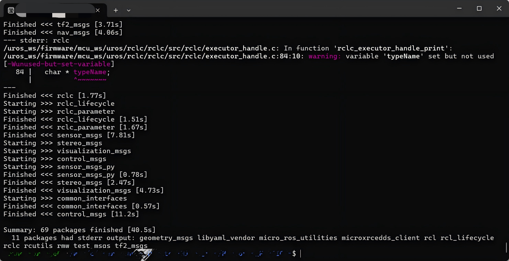
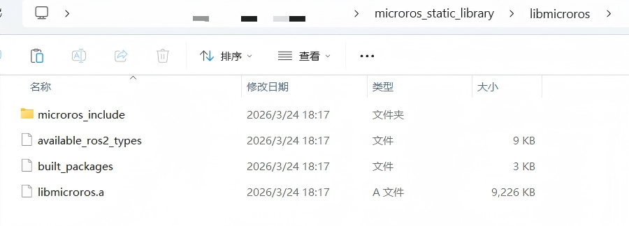
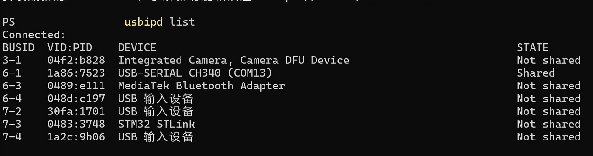
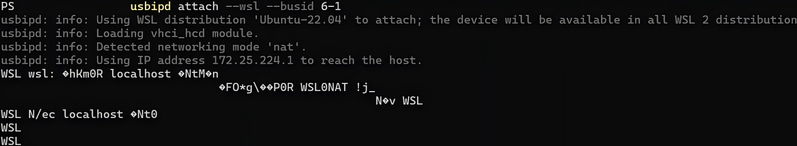
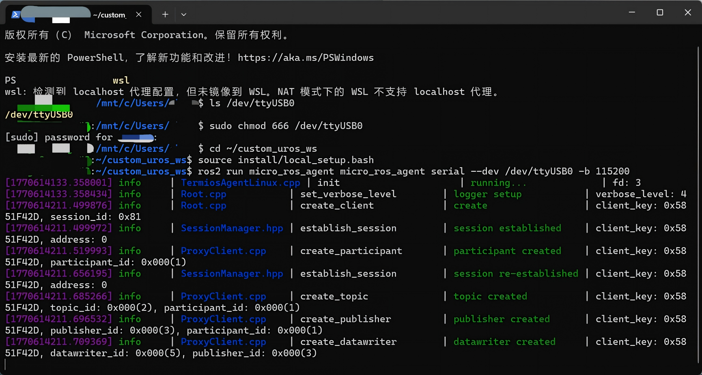
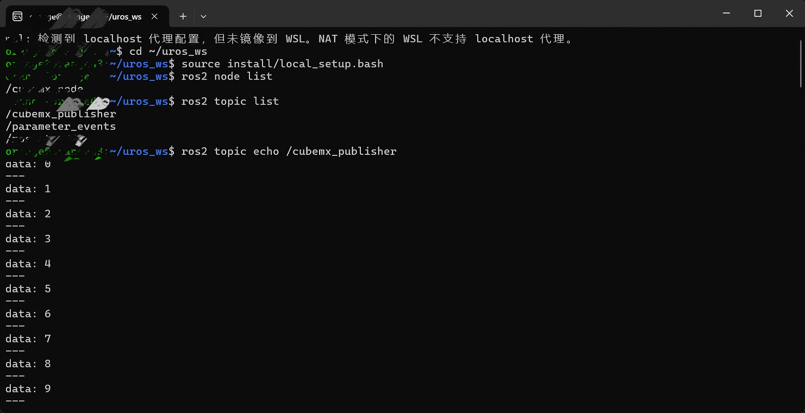

# 详细配置指南

## STM32CubeMX配置

### 基础系统配置 (`System Core`)

+ **RCC**：将 **High Speed Clock (HSE)** 设置为 `Crystal/Ceramic Resonator`。
+ **SYS**：将 **Debug** 设置为 `Serial Wire`， **Timebase Source** 选用一个基本定时器即可。

### 通信外设配置(`Connectivity`)

+ **选择串口**：这里使用 **USART3** （可自行选择）。
+ **Mode**： 选择 `Asynchronous`（异步模式）。
+ **Baud Rate（在Parameter Settings中）**: 设置为 `115200`（需与之后电脑上的 Agent 匹配）。
+ **DMA Settings (关键)**：
  1. 点击 `Add` 按钮，添加 `USART3_RX` 和 `USART3_TX`。
  2. 将 **Priority**（优先级）均设为 `High`。
  3. **Mode** 设置：`RX` 根据DMA接收方式自行选择对应的模式，`TX`设为 `Normal`（单次模式），这对于 micro-ROS 的连续数据流至关重要。
+ **NVIC Settings**：勾选 `USART3 global interrupt`。

### FreeRTOS 任务栈配置 ( `Middleware and Software Packs`)

+ **Interface**：选择`CMSIS_V2`。
+ **Tasks and Queues**：将 **defaultTask** 的 **Stack Size**  改为 `3000`。
+ **Config parameters**：将 **TOTAL_HEAP_SIZE** 改为 `40000`。

### 时钟树配置（`Clock COnfiguration`）

+ **输入晶振 **：左侧 `HSE` 蓝色框内填入 **25** (取决于你板子晶振的实际频率，通常是 8 或 25)。
+ **PLL 选择**：将 `PLL Source Mux` 选为 **HSE**。
+ **系统时钟选择**：将 `System Clock Mux` 选为 **PLLCLK**。
+ **最终频率 (HCLK)**：在右侧中间的 `HCLK (MHz)` 输入框中数值直接填到最大值，然后按回车键，CubeMX 会自动帮你计算中间的所有倍频参数。

### 构建工程（`Project Manager`）

- **Project Name**：填入你的项目名。
- **Toolchain / IDE**：下拉框务必选择 **Makefile**。
- **Code Generator 选项**：
  - 勾选 **Generate peripheral initialization as a pair of '.c/.h' files per peripheral**。
- **GENERATE CODE** ：**恭喜你，完成了工程的初步构建！**

---

## 网络配置

### WSL

+ 在 **CLASH** 中开启 **允许局域网接入Clash**。
+ 开启一个 `wsl` 终端，运行以下命令：

```powershell
// 自动获取宿主机的网关 IP 并写入代理变量
host_ip=$(ip route | grep default | awk '{print $3}')
export http_proxy="http://${host_ip}:<端口>"
export https_proxy="http://${host_ip}:<端口>"

// 测试
curl -I -v https://github.com
```

如果你看到出现了 `HTTP/2 200` 或者是 `200 OK`，这就说明 WSL 到 Windows 代理的桥梁已经彻底建好了！

### Docker

如图所示配置即可，端口自行修改，这里以7890为例。



配置完点击 `Apply` --> `Restart`。

---

## 修改Makefile文件

在文件 **最末尾** ，加上下面这两行代码：

```
print_cflags:
	@echo $(CFLAGS)
// 不能打空格，一定要是Tab！！
```

---

## 编译静态库

### 编译过程

**友情提示**：推荐在网络代理**稳定**的环境下进行，笔者由于网络问题白白流失了上百个G的流量。

将修改后的 `Makefile` 文件移到  `microros_static_library` 同级位置。

新开一个 `wsl` 终端，配置好网络，先进入 `microros_static_library` 的上一级目录。

由于此文件位于 `windows` 中，我们需要做一个路径转换，我们复制此文件所在的地址，然后执行以下命令：

```
cd /mnt/地址         注意：（C、D盘后的冒号改成‘/’，‘\’也改成'/'，磁盘名称改为小写）
cd /mnt/c/Users/chenz/Desktop/micro_ros_stm32cubemx_utils
docker pull microros/micro_ros_static_library_builder:humble
// 这里的humble依据版本自行修改

docker run -it --rm \
  -v $(pwd):/project \
  -e MICROROS_LIBRARY_FOLDER=microros_static_library \
  -e http_proxy="http://${host_ip}:<端口>" \
  -e https_proxy="http://${host_ip}:<端口>" \
  microros/micro_ros_static_library_builder:humble
```



仔细看终端里提取出来的 `CFLAGS`，里面有几个极其关键的参数：

- `-mcpu=cortex-m4`：准确识别出了 `Cortex-M4` 内核。
- `-DSTM32F4xx`：精准识别出了芯片型号。
- `-mfpu=fpv4-sp-d16 -mfloat-abi=hard`：开启了硬件硬件浮点运算支持。

这说明 Docker 容器现在的跨平台编译环境已经完全看懂了你的硬件底层配置。它马上就会用这套定制参数去交叉编译 micro-ROS 静态库，确保生成的代码能在你的板子上完美运行，而不会出现架构不匹配的底层硬件错误。

**大胆输入y并回车！！**



看到如图所示的 `Summary` 和出现的终端提示符，**恭喜你编译成功！**

### 静态库分析



进入如图文件夹

+ **`libmicroros.a`**：这是编译好的终极静态库文件，包含了所有底层的通信逻辑。

+ **`microros_include`**：这里面装满了你需要调用的各种 API 头文件（比如 `rclc`, `std_msgs` ，但消息类型变量不能自由定义）。

+ **`available_ros2_types`**：这是`microros`可用的消息类型，由编译时生成。

### 例程

```c
/* USER CODE BEGIN Header_StartDefaultTask */
/**
  * @brief  Function implementing the defaultTask thread.
  * @param  argument: Not used
  * @retval None
  */
/* USER CODE END Header_StartDefaultTask */
void StartDefaultTask(void *argument)
{
  /* USER CODE BEGIN 5 */

  // micro-ROS configuration

    rmw_uros_set_custom_transport(
        true,
        (void *) &usart3_handle,
        cubemx_transport_open,
        cubemx_transport_close,
        cubemx_transport_write,
        cubemx_transport_read);

    rcl_allocator_t freeRTOS_allocator = rcutils_get_zero_initialized_allocator();
    freeRTOS_allocator.allocate = microros_allocate;
    freeRTOS_allocator.deallocate = microros_deallocate;
    freeRTOS_allocator.reallocate = microros_reallocate;
    freeRTOS_allocator.zero_allocate =  microros_zero_allocate;

    if (!rcutils_set_default_allocator(&freeRTOS_allocator)) {
        printf("Error on default allocators (line %d)\n", __LINE__); 
    }

    // micro-ROS app

    rcl_publisher_t publisher;
    std_msgs__msg__Int32 msg;
    rclc_support_t support;
    rcl_allocator_t allocator;
    rcl_node_t node;

    allocator = rcl_get_default_allocator();

    int res;

    // create init_options
    res = rclc_support_init(&support,0,NULL,&allocator);
    if(res != RCL_RET_OK) {
        printf("rclc_support_init failed: %d\n",res); 
        vTaskDelay(NULL);
        return;
    }

    // create node
    rclc_node_init_default(&node, "cubemx_node", "", &support);
    if(res != RCL_RET_OK) {
        printf("rclc_node_init_default failed: %d\n",res); 
        vTaskDelay(NULL);
        return;
    }

    // create publisher
    rclc_publisher_init_default(
        &publisher,
        &node,
        ROSIDL_GET_MSG_TYPE_SUPPORT(std_msgs, msg, Int32),
        "cubemx_publisher");

    msg.data = 0;

    rclc_executor_t executor; // 新增：定义执行器
    rclc_executor_init(&executor, &support.context, 1, &allocator);

    while(1)
    {
        // 这行代码负责处理底层的通信维护、心跳包和回调
        rclc_executor_spin_some(&executor, pdMS_TO_TICKS(10)); 
        rcl_ret_t ret = rcl_publish(&publisher, &msg, NULL);
        if (ret != RCL_RET_OK)
        {
            printf("Error publishing (line %d)\n", __LINE__); 
        }

        msg.data++;
        vTaskDelay(pdMS_TO_TICKS(100));
    }
  /* USER CODE END 5 */
}
```

**编译，烧录，即可！**

---

## 代理端构建

如果通信协议选择使用的**micro-XRCE-DDS 协议**，在运行ROS2的主机上还需构建`microros_agent`,[官方教程参照](https://github.com/micro-ROS/micro_ros_setup?tab=readme-ov-file)。按照官方教程完整流程构建，除了可配置`miccroros_agent`，**还可获得所有源码，如之前缺失的.c文件。**但文件层次比较复杂，需仔细研究一番。

**若只构建`microros_agent`:**

### 创建工作空间并拉取代码

```
# 1. 刷新系统底层的 ROS 2 环境
source /opt/ros/humble/setup.bash

# 2. 创建并进入工作空间
mkdir -p ~/uros_ws/src
cd ~/uros_ws

# 3. 下载 micro_ros_setup 源码 (指定 humble 分支)
git clone -b humble https://github.com/micro-ROS/micro_ros_setup.git src/micro_ros_setup
```

### 安装依赖并编译基础包

```
# 1. 更新包列表并初始化 rosdep 
sudo apt update
rosdep update

# 2. 安装工作空间需要的系统依赖
rosdep install --from-paths src --ignore-src -y

# 3. 编译 micro_ros_setup 基础包
colcon build
```

### 构建 micro-ROS Agent

```
# 1. 必须先 source 刚刚编译好的基础包
source install/local_setup.bash

# 2. 创建 Agent 的依赖环境 (这步会去 GitHub 下载 agent 源码，可能需要一点时间)
ros2 run micro_ros_setup create_agent_ws.sh

# 3. 编译 Agent 包 (这步耗时最长，底层也是调用的 colcon build)
ros2 run micro_ros_setup build_agent.sh
```

### 重新加载环境并测试

```
# 1. 刷新整个工作空间的环境变量 
source install/setup.bash

# 2. 尝试运行你的 Agent
ros2 run micro_ros_agent micro_ros_agent serial --dev /dev/ttyUSB0 -b 115200
```

在执行最后一行命令前，可重启wsl终端，进行如下操作：

在powershell中 `usbipd list` 查询串口



如图，找到CH340对应的端口

`usbipd bind --busid 6-1 --force` 若state不为shared则强制绑定

`usbipd attach --wsl --busid 6-1` 将端口映射到wsl

会出现如下乱码，为正常现象



然后在wsl进行如下操作

```
ls /dev/ttyUSB*                      //查询串口映射
sudo chmod 666 /dev/ttyUSB*          //给予串口最高读写权限
cd ~/uros_ws                           //切换至工作目录下
source install/local_setup.bash      //加载相应资源
ros2 run micro_ros_agent micro_ros_agent serial --dev /dev/ttyUSB* -b 115200 
                                     //构建agent
```

最后在开发板按下reset，如图所示



新开一个wsl窗口

```
cd ~/uros_ws                         //切换至工作目录下
source install/local_setup.bash      //加载相应资源
ros2 daemon stop                     //停止 ROS 2 的后台守护进程
ros2 daemon start                    //开启 ROS 2 的后台守护进程
                                     //这两步是重启 Ros 2 的网络发现机制
ros2 node list                       //查询节点
ros2 topic list                      //查询话题
ros2 topic echo /cubemx_publisher    //运行话题
```

过程如图所示



# **恭喜成功！**
