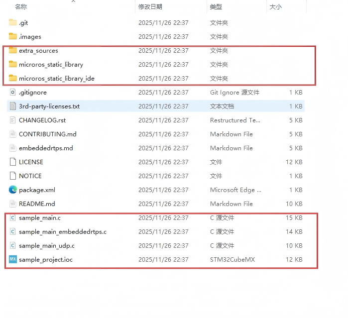
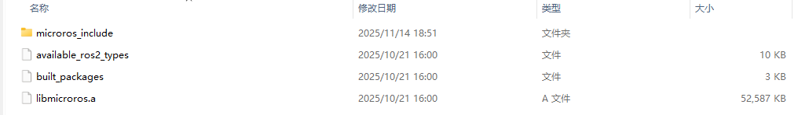
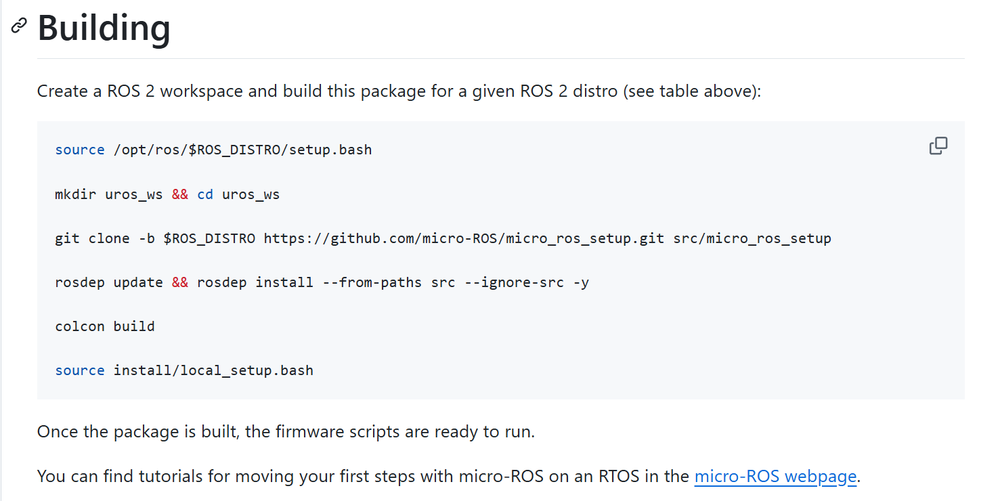
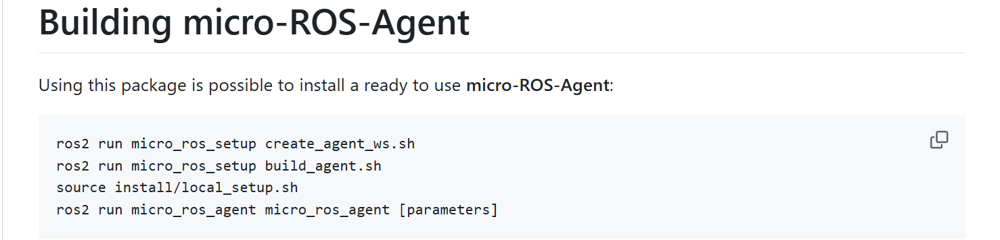
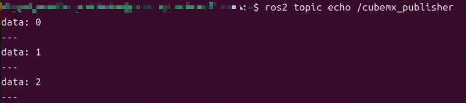

# 概述

**本篇以`cubemx`模板构建`microros`代码，实现stm32F429IGT6运行简单例程。**

官方学习网站：https://micro.ros.org/

# 嵌入式端构建流程

以该仓库为教程：https://github.com/micro-ROS/micro_ros_stm32cubemx_utils

**大致步骤：**

* 克隆仓库

* 选择`sample_project.ioc`，在`cubemx`中打开并完善配置，生成`MakeFile`工程。
* 修改`MakeFile`文件
* 从Docker拉取镜像并构建生成静态库`libmicroros.a`及头文件。
* 添加文件，添加例程代码，进行测试。


# 具体步骤

## 克隆仓库

无他，找寻个喜欢的位置，直接克隆即可。

**以下是克隆下的仓库，只需关注所框文件：**



* `extra_sources`:里面是`microros`框架针对STM32嵌入式平台提供的适配层和底层支持代码。
* `custom_memory_manager.c`:microros实际管理分配内存的代码，使用的是`freertosAPI`函数
  * `microros_allocators.c`:对`custom_memory_manager.c`的进一步封装
  * `microros_time.c`:为 micro-ROS 客户端库提供精确的系统时间，使用的是`freertosAPI`函数
  * `microros_transports`文件夹下的四个文件，是官方提供的物理传输层接口，分别通过串口+DMA,串口中断，`udp`,`usb`与电脑连接，从而实现板子和电脑上的数据传输。

* `microros_static_library,microros_static_library_ide`是静态库构建的核心，为 Docker 容器提供所有必要的脚本和配置文件。最后生成的静态库就这这两个文件夹下面，以`cubemx`模板构建在前者文件夹，`IDE`则在后者。
* `sample_main.c,sample_main_udp.c,sample_main_embeddedrtps.c`三者都是得的例程，区别在传输协议上，前两个用的是**micro-XRCE-DDS 协议**，通过串口，网络与ROS节点通信，依赖**micro-ROS Agent** 充当中继；`embeddedrtps.c`则是**直接在嵌入式设备上运行完整的 DDS/RTPS 协议栈**，可直接与ROS节点通信，不依赖**micro-ROS Agent** ，延迟更低，但资源消耗太大。
* `sample_project.ioc`其实没啥用，就是正常的`cubemx`工程配置。


## 生成`MakeFile`工程

通过`cubemx`配置生成`MakeFile`工程。配置时只需注意串口，`DMA`,`FreeRTOS`，任务栈要给大，官方推荐3000。


## 修改`MakeFile`文件

`MakeFile`文件在Docker编译生成静态库中很重要，Docker编译时会读取你工程中的`MakeFile`文件中关于**编译工具，选项的设置，**如编译器版本，是否使用硬件浮点等。默认是不用修改的。


## 构建生成静态库

```
docker pull microros/micro_ros_static_library_builder:kilted
docker run -it --rm -v $(pwd):/project --env MICROROS_LIBRARY_FOLDER=micro_ros_stm32cubemx_utils/microros_static_library microros/micro_ros_static_library_builder:kilted
```

​    构建过程其实就这几行命令，注意选择自己需要的R版本，还有比较令人恼火的是，因为网络代理原因，拉取完镜像，**构建编译时总是失败，原因是无法连接到`github`**。作者被折磨了好几天，也未能解决，在`linux`上构建编译时从未成功,几次成功的经历都是在WSL环境下实现的。注意Docker的代理需要手动配置，WSL2的也需要手动配置。希望读者不会遇到该问题，或读者能轻松解决。


​    构建成功之后，我们会在`microros_static_library`文件夹中找到`libmicroros`文件夹，该文件夹就是生成的静态库等所需文件。



* `microros_include`文件夹是各种头文件。
* `libmicroros.a`就是静态库文件，里面包含了`microros`的函数具体实现，相当于它没有给我们.c源文件，而是把他们包含在了.a静态库中。优点是不用添加一堆文件，缺点万一有问题不能debug，因为你没有源码，并且消息类型变量不能自由定义。
* `available_ros2_types`这是`microros`可用的消息类型，由编译时生成。
* `built_packages`这个似乎是用于版本记录控制的，无需太关注。


## 添加例程，文件进行测试

### 添加文件

​    就五个文件（头文件除外）

* `libmicroros.a`

* `custom_memory_manager.c`
* `microros_allocators.c`
* `microros_time.c`
* `dma_transport.c`:如果你不是用串口+DMA通信，改用符合的文件。


## 例程

参照`sample_main.c`，主要代码如下：

```c
/* USER CODE BEGIN 4 */
bool cubemx_transport_open(struct uxrCustomTransport * transport);
bool cubemx_transport_close(struct uxrCustomTransport * transport);
size_t cubemx_transport_write(struct uxrCustomTransport* transport, const uint8_t * buf, size_t len, uint8_t * err);
size_t cubemx_transport_read(struct uxrCustomTransport* transport, uint8_t* buf, size_t len, int timeout, uint8_t* err);

void * microros_allocate(size_t size, void * state);
void microros_deallocate(void * pointer, void * state);
void * microros_reallocate(void * pointer, size_t size, void * state);
void * microros_zero_allocate(size_t number_of_elements, size_t size_of_element, void * state);
/* USER CODE END 4 */

/* USER CODE BEGIN Header_StartDefaultTask */
/**
  * @brief  Function implementing the defaultTask thread.
  * @param  argument: Not used
  * @retval None
  */
/* USER CODE END Header_StartDefaultTask */
void StartDefaultTask(void *argument)
{
  /* USER CODE BEGIN 5 */

  // micro-ROS configuration

  rmw_uros_set_custom_transport(
    true,
    (void *) &huart3,
    cubemx_transport_open,
    cubemx_transport_close,
    cubemx_transport_write,
    cubemx_transport_read);

  rcl_allocator_t freeRTOS_allocator = rcutils_get_zero_initialized_allocator();
  freeRTOS_allocator.allocate = microros_allocate;
  freeRTOS_allocator.deallocate = microros_deallocate;
  freeRTOS_allocator.reallocate = microros_reallocate;
  freeRTOS_allocator.zero_allocate =  microros_zero_allocate;

  if (!rcutils_set_default_allocator(&freeRTOS_allocator)) {
      printf("Error on default allocators (line %d)\n", __LINE__); 
  }

  // micro-ROS app

  rcl_publisher_t publisher;
  std_msgs__msg__Int32 msg;
  rclc_support_t support;
  rcl_allocator_t allocator;
  rcl_node_t node;

  allocator = rcl_get_default_allocator();

  //create init_options
  rclc_support_init(&support, 0, NULL, &allocator);

  // create node
  rclc_node_init_default(&node, "cubemx_node", "", &support);

  // create publisher
  rclc_publisher_init_default(
    &publisher,
    &node,
    ROSIDL_GET_MSG_TYPE_SUPPORT(std_msgs, msg, Int32),
    "cubemx_publisher");

  msg.data = 0;

  for(;;)
  {
    rcl_ret_t ret = rcl_publish(&publisher, &msg, NULL);
    if (ret != RCL_RET_OK)
    {
      printf("Error publishing (line %d)\n", __LINE__); 
    }
    
    msg.data++;
    osDelay(10);
  }
  /* USER CODE END 5 */
}
```


# 代理端构建

​        如果通信协议选择使用的**micro-XRCE-DDS 协议**，在运行ROS2的主机上还需构建`microros_agent`,官方教程参照：https://github.com/micro-ROS/micro_ros_setup?tab=readme-ov-file。按照官方教程完整流程构建，除了可配置`miccroros_agent`，**还可获得所有源码，如之前缺失的.c文件。**但文件层次比较复杂，需仔细研究一番。

​    **若只构建`microros_agent`:**

只需参考运行**Building，Building micro-ROS-Agent**这两部分的命令代码。

    





# 成果检验

最终效果：



