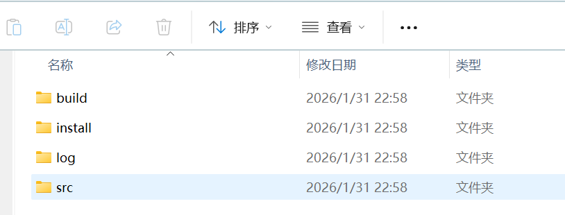
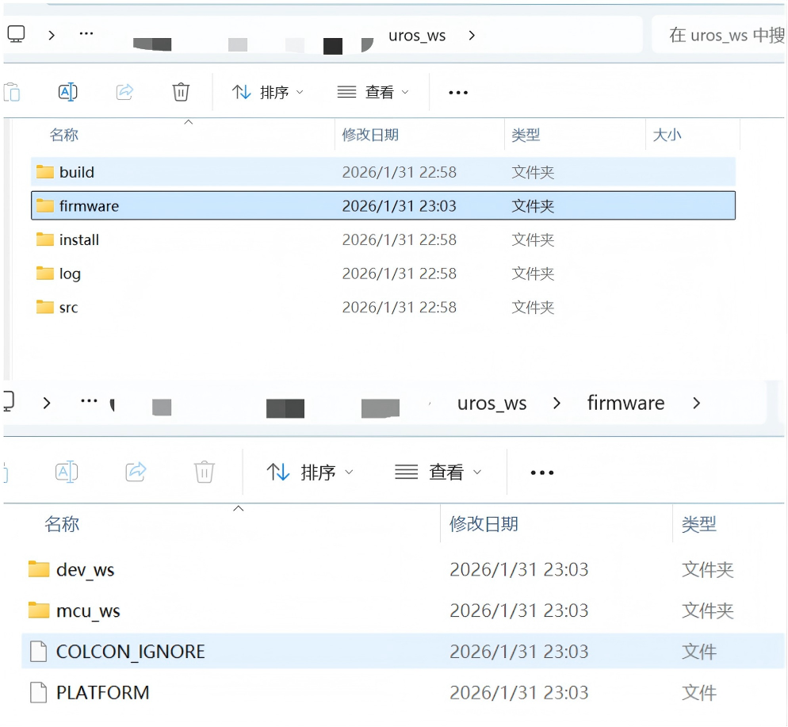
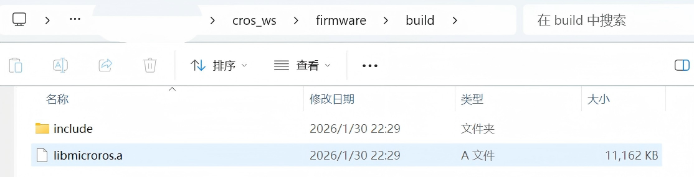

# 自定义消息+静态库

参考资料：

1. [官方github构建工具仓库](https://github.com/micro-ROS/micro_ros_stm32cubemx_utils)
2. [自定义消息官方教程](https://github.com/micro-ROS/micro_ros_stm32cubemx_utils)
3. [构建静态库官方教程](https://github.com/micro-ROS/micro_ros_stm32cubemx_utils)

---

## 前言

  之前使用官方支持的`CubeMX`的microros静态库，虽然操作方便（直接使用），但局限很大，如消息类型无法自行定义，功能难以调整。所以查阅官网文档，使用`micro_ros_setup`包自行手动构建集成。下面我们先介绍其整体体系流程，再讲解具体操作步骤。


## microros项目构建体系

  microros产生于ROS体系，是为了将庞大的ROS体系搬到mcu上而诞生的。所以microros的很多功能都是**基于ROS2本体进行二次封装和裁剪修改的产物**。

### 基石：`micro_ros_setup`

  **micro_ros_setup包是microros项目的构建工具。**因为microros是要运行在单片机上，所以它的编译构建与运行在linux上的ROS2不同。该包帮我们集成整合了各种编译，构建的条件指令，最终让我们处理microros项目只需要四步（即四条主要命令）;

1. 创建：`ros2 run micro_ros_setup create_firmware_ws.sh`
2. 配置：`ros2 run micro_ros_setup configure_firmware.sh`
3. 构建：`ros2 run micro_ros_setup build_firmware.sh`
4. 下载：`ros2 run micro_ros_setup flash_firmware.sh`

> 每条命令后面跟的参数需读者自行了解。

  

  运行上面完整四条命令是用于纯linux环境下的项目。我们采用静态库+CubeMX这种打法的话，**只需用到创建和构建两步。**

### 构建`micro_ros_setup`包

  参照GitHub上仓库说明，运行如下命令即可：

```bash
source /opt/ros/$ROS_DISTRO/setup.bash

mkdir uros_ws && cd uros_ws

git clone -b $ROS_DISTRO https://github.com/micro-ROS/micro_ros_setup.git src/micro_ros_setup

rosdep update && rosdep install --from-paths src --ignore-src -y

colcon build

source install/local_setup.bash
```

 结果如下：



## 自定义消息

1. 创建固件：`ros2 run micro_ros_setup create_firmware_ws.sh generate_lib` 

   该命令创建 `mcu_ws` 工作空间，并下载 micro-ROS 的所有**核心源码**（RCL, RCLC, RMW 等），为后续的交叉编译做准备。

   成功后文件结构如下：

   

2. 运行软件包创建命令：

   ```bash
   cd firmware/mcu_ws
   ros2 pkg create --build-type ament_cmake my_custom_message
   cd my_custom_message
   mkdir msg
   touch msg/MyCustomMessage.msg
   ```

3. 在自动生成的`CMakeLists.txt`文件中，添加如下代码：

   ```bash
   ...
   find_package(rosidl_default_generators REQUIRED)
   
   rosidl_generate_interfaces(${PROJECT_NAME}
     "msg/MyCustomMessage.msg"
    )
   ...
   ```

4. 在自动生成的`package.xml`文件中,添加如下代码：

   ```bash
   ...
   <build_depend>rosidl_default_generators</build_depend>
   <exec_depend>rosidl_default_runtime</exec_depend>
   <member_of_group>rosidl_interface_packages</member_of_group>
   ...
   ```

5. 在`msg/MyCustomMessage.msg`文件中定义你的消息类型，如：

   ```
   bool bool_test
   byte byte_test
   char char_test
   float32 float32_test
   float64 double_test
   ```


### 生成静态库

  生成静态库主要是依据命令:

```bash
ros2 run micro_ros_setup build_firmware.sh $(pwd)/my_custom_toolchain.cmake $(pwd)/my_custom_colcon.meta
```


  **所以我们只需准备好my_custom_toolchain.cmake和my_custom_colcon.meta两个文件即可**。

* **my_custom_toolchain.cmake：**核心作用是定义交叉编译工具链，即指定编译器路径，指定硬件架构参数（目标芯片是 Cortex-M4 还是 M7，是否开启硬件浮点单元（FPU），指令集是 Thumb 还是 ARM）

  文件模板( Cortex-M4,开启FPU,使用Thumb)：

  ```
  set(CMAKE_SYSTEM_NAME Generic)
  set(CMAKE_CROSSCOMPILING 1)
  set(CMAKE_TRY_COMPILE_TARGET_TYPE STATIC_LIBRARY)
  
  # 1. 设置编译器名称 (请确保你在终端输入 arm-none-eabi-gcc -v 能看到版本)
  set(CMAKE_C_COMPILER arm-none-eabi-gcc)
  set(CMAKE_CXX_COMPILER arm-none-eabi-g++)
  
  set(CMAKE_C_COMPILER_WORKS 1 CACHE INTERNAL "")
  set(CMAKE_CXX_COMPILER_WORKS 1 CACHE INTERNAL "")
  
  # 2. 设置编译参数 (针对 Cortex-M4F)
  set(FLAGS "-O2 -ffunction-sections -fdata-sections -fno-exceptions -mcpu=cortex-m4 -mthumb -mfloat-abi=hard -mfpu=fpv4-sp-d16" CACHE STRING "" FORCE)
  
  # 3. 把参数应用到 C 和 C++ 编译器
  set(CMAKE_C_FLAGS_INIT "-std=c11 ${FLAGS} -DCLOCK_MONOTONIC=0 -D'__attribute__(x)='" CACHE STRING "" FORCE)
  set(CMAKE_CXX_FLAGS_INIT "-std=c++11 ${FLAGS} -fno-rtti -DCLOCK_MONOTONIC=0 -D'__attribute__(x)='" CACHE STRING "" FORCE)
  
  set(__BIG_ENDIAN__ 0)
  ```

  > **一般只需修改 2.设置编译参数一行 **，建议使用13.2以上版本的 arm-none-eabi-gcc，否则上面的cmake文件还需补充很多内容才可使用。高版本工具链会自行补充

* **my_custom_colcon.meta：**作用是处理中间件配置与裁剪。microros的功能很多，有些不需要的功能我们可以在此禁止掉，减轻单片机的运行压力。

  文件模板：

  ```
  {
      "names": {
          "tracetools": {
              "cmake-args": [
                  "-DTRACETOOLS_DISABLED=ON",
                  "-DTRACETOOLS_STATUS_CHECKING_TOOL=OFF"
              ]
          },
          "rosidl_typesupport": {
              "cmake-args": [
                  "-DROSIDL_TYPESUPPORT_SINGLE_TYPESUPPORT=ON"
              ]
          },
          "rcl": {
              "cmake-args": [
                  "-DBUILD_TESTING=OFF",
                  "-DRCL_COMMAND_LINE_ENABLED=OFF",
                  "-DRCL_LOGGING_ENABLED=OFF"
              ]
          }, 
          "rcutils": {
              "cmake-args": [
                  "-DENABLE_TESTING=OFF",
                  "-DRCUTILS_NO_FILESYSTEM=ON",
                  "-DRCUTILS_NO_THREAD_SUPPORT=ON",
                  "-DRCUTILS_NO_64_ATOMIC=ON",
                  "-DRCUTILS_AVOID_DYNAMIC_ALLOCATION=ON"
              ]
          },
          "microxrcedds_client": {
              "cmake-args": [
                  "-DUCLIENT_PIC=OFF",
                  "-DUCLIENT_PROFILE_UDP=OFF",
                  "-DUCLIENT_PROFILE_TCP=OFF",
                  "-DUCLIENT_PROFILE_DISCOVERY=OFF",
                  "-DUCLIENT_PROFILE_SERIAL=OFF",
                  "-UCLIENT_PROFILE_STREAM_FRAMING=ON",
                  "-DUCLIENT_PROFILE_CUSTOM_TRANSPORT=ON"
              ]
          },
          "rmw_microxrcedds": {
              "cmake-args": [
                  "-DRMW_UXRCE_MAX_NODES=5",
                  "-DRMW_UXRCE_MAX_PUBLISHERS=5",
                  "-DRMW_UXRCE_MAX_SUBSCRIPTIONS=5",
                  "-DRMW_UXRCE_MAX_SERVICES=4",
                  "-DRMW_UXRCE_MAX_CLIENTS=4",
                  "-DRMW_UXRCE_MAX_HISTORY=4",
                  "-DRMW_UXRCE_TRANSPORT=custom"
              ]
          }
      }
  }
  ```


  准备好上述两个文件，运行：

```
ros2 run micro_ros_setup build_firmware.sh $(pwd)/my_custom_toolchain.cmake $(pwd)/my_custom_colcon.meta
```

即可构建生成静态库，得到文件如下



* **libmicroros.a：**静态库文件
* **include：**该文件夹为头文件夹，主要包含了microros的核心源码和 ROS 2 最常用的消息类型，**附加我们自定义的消息类型**。

  **这就是我们最终需要的文件，把他们移植到我们的单片机项目中，即可使用有我们自定义消息类型的microros了。**

  
