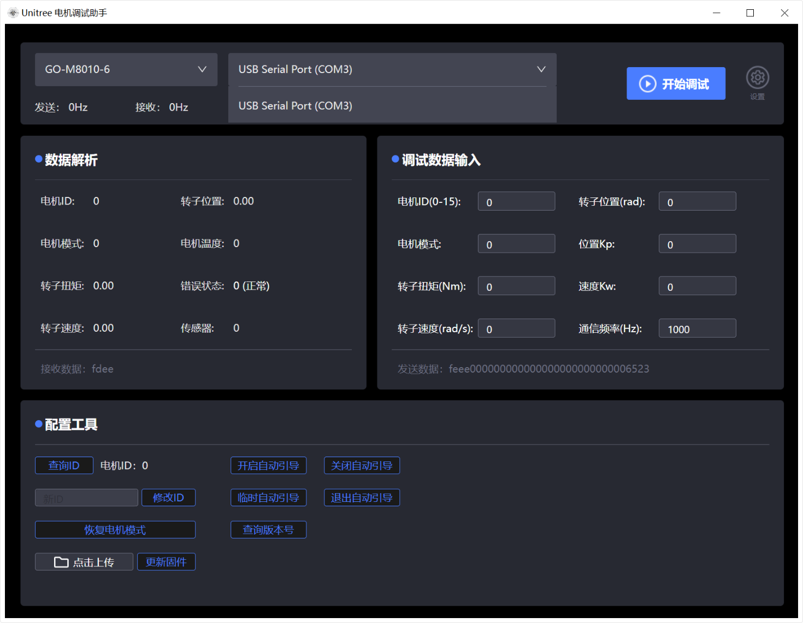
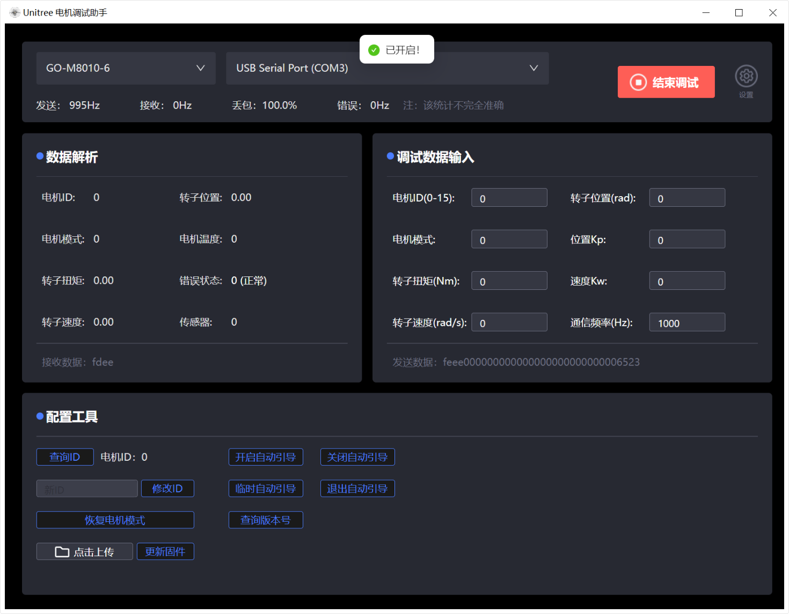
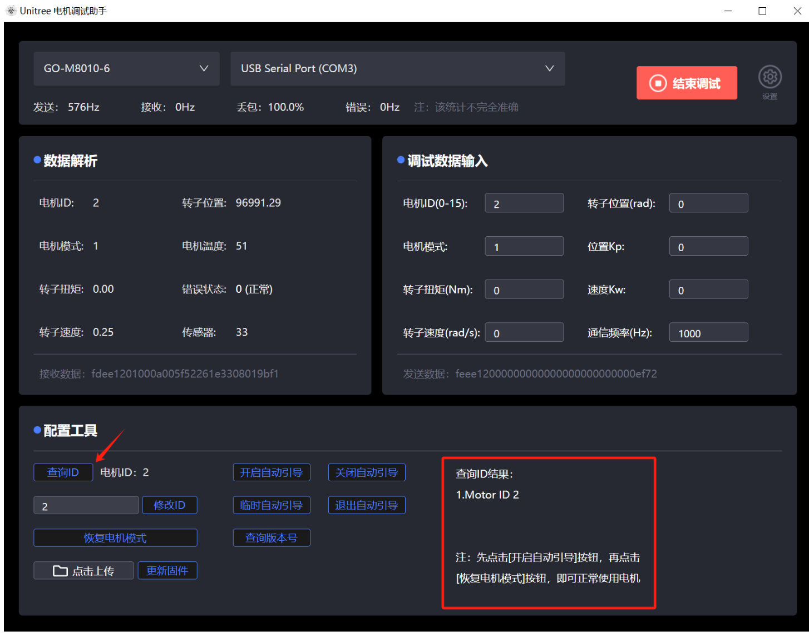
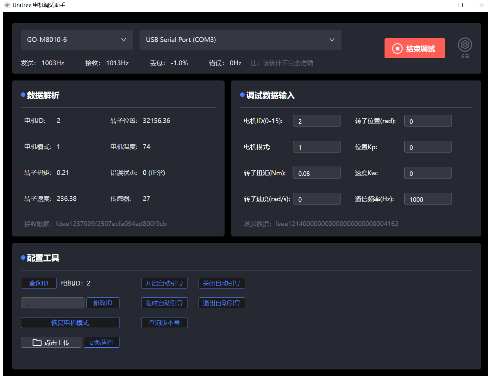
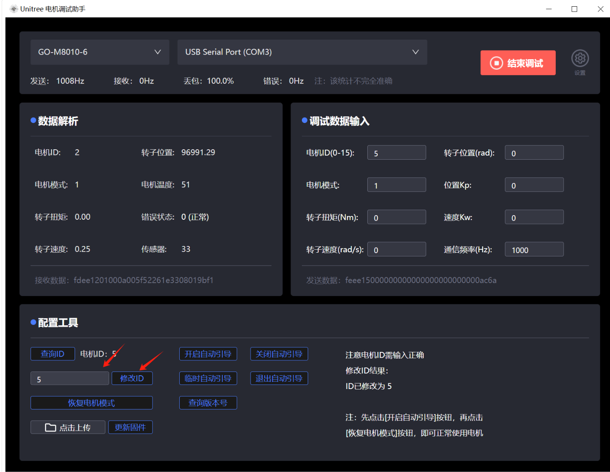

# 宇树GO-M8010-6电机

## 一、上位机的使用

[宇树科技 文档中心](https://support.unitree.com/home/zh/Motor_SDK_Dev_Guide)

### 1. 选择串口



点击**开始调试**，会出现以下界面，电机调试助手将连接电机。如连接成功，可看到**发送频率**的数值不断发生变化。



### 2. 电机ID查询



查询过电机ID后，无法直接调试。先点击**开启自动引导**，再点击**恢复点击模式**，即可正常使用电机。

### 3. 电机控制

在右侧输入框内输入正确的**电机ID**和**控制参数**，上位机随即将控制指令发送给电机，即可进行电机控制。



### 4. 电机ID修改



## 二、驱动程序解析

### 1. 数据结构定义

`unitree_motor_handle_t` 是电机对象句柄，包含电机当前状态的各种参数。包含以下内容：

```c
/**
 * @brief 电机参数结构体 
 * 
 */
typedef struct {
    uint8_t motor_id; // 电机ID
    uint8_t mode;     // 0:空闲 1:FOC控制 2:电机标定
    int Temp;         // 温度
    int MError;       // 错误码
    float T;          // 当前实际电机输出力矩(电机本身的力矩)(Nm)
    float W;          // 当前实际电机速度(电机本身的速度)(rad/s)
    float Pos;        // 当前电机转子位置(rad)
    float offset_angle;    // 电机上电时角度偏移量
    int correct;      // 接收数据是否完整(1完整，0不完整)
    int footForce;    // 足端力传感器原始数值
    bool got_offset; 

    uint16_t calc_crc;
    uint32_t bad_msg; // CRC校验错误 数量

} unitree_motor_handle_t;
```

`ctrl_param_t` 也是电机对象句柄，包含电机预期状态的各种参数。包含以下内容：

```c
typedef struct {
    unsigned short id;   // 电机ID，15代表广播数据包
    unsigned short mode; // 0:空闲 1:FOC控制 2:电机标定
    float T;             // 期望关节的输出力矩(电机本身的力矩)(Nm)
    float W;             // 期望关节速度(电机本身的速度)(rad/s)
    float Pos;           // 期望关节位置(rad)
    float K_P;           // 关节刚度系数(0-25.599)
    float K_W;           // 关节速度系数(0-25.599)

} ctrl_param_t;
```

### 2. 函数用法说明

+ `unitree_motor_init` 初始化电机
  + `motor` 电机状态接收句柄
  + `motor_id` 电机ID
  + `mode` 电机模式
+ `unitree_send_data` 调整电机控制数据并发送
  + `huart` 485复用的对应串口
  + `motor` 电机状态接收句柄
  + `ctrl_param` 电机状态发送句柄
+ `unitree_receive_data` 接收电机数据
  + `huart` 485复用的对应串口
+ `rs_list_init` 初始化消息哈希表
  + `len` 桶组长度，大于等于电机数量

### 3. 设计核心思想

驱动底层封装了复杂的通信协议与数据换算，为上层提供统一且直观的接口：

- **消息哈希表管理**：底层采用哈希桶链表（`table_t`）机制管理多个电机节点。初始化时通过 `rs_list_add_new_node` 将电机的 ID 与句柄绑定。
- **自动零点校准**：驱动内部维护了 `offset_angle`（上电时角度偏移量）和 `got_offset`（是否已获取偏移）变量。首次接收到有效电机数据时，会自动记录当前原始位置作为零位偏置。后续的所有位置解算（`Pos`）都会减去此偏置，确保上电后的当前位置恒为零点。
- **安全保护机制**：在未成功获取电机上电偏移量（`got_offset == false`）之前，底层会在发送端强制将期望速度、期望力矩、刚度系数及速度系数全部清零，防止电机上电暴走。

## 三、驱动代码使用

1. 将整个文件夹复制到 `Drivers/Bsp` 中
2. 将 `unitree_motor.c` 和 `crc_ccitt.c` 添加到工程的 `BSP` 分组中
3. 在 `bsp.h` 中包含 `unitree_motor.h` 

```c
void unitree_demo(void) {
	/* 声明宇树电机参数句柄，目标位置:Pos = 2rad */
	unitree_motor_handle_t motor1 = {0};
	ctrl_param_t param = {0, 1, 0, 0, 2, 3, 0.2};
	
	/* 电机初始化，1个电机，ID为0 */
    rs_list_init(1);
    unitree_motor_init(&motor1, 0, 1); 
    while(1)
    {
    	/* 这里用串口1作为485的复用 */
    	unitree_receive_data(&usart1_handle);
    	HAL_Delay(2);
    	unitree_send_data(&usart1_handle, &motor1, param);
    	HAL_Delay(3);
	}
}
```

**注：485的EN引脚在 `unitree_motor.h` 中定义，可根据需求修改使用**
