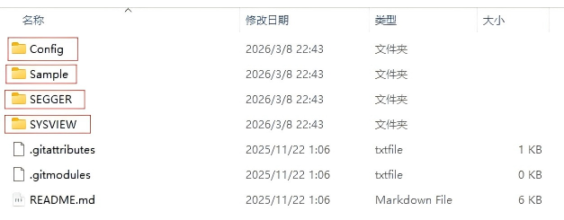
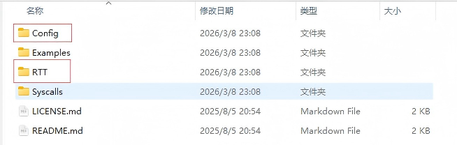

# SystemView配置指南

  SystemView 是一个用于虚拟分析嵌入式系统的工具包。SystemView 可以完整的深入观察一个应用程序的运行时行为，这远远超出一个调试器所能提供的。这在开发和处理具有多个线程和事件的复杂系统时尤其有效。

**本文档主要讲解如何将SystemView配置到freertos项目中使用。**

> 本文聚焦配置过程，配置完成后，如何应用其查看分析，本文不涉及，推荐参考该博主的官文中译版：https://blog.csdn.net/bjr2016
> 有兴趣的朋友也可直接参考官方文档：https://www.segger.com/downloads/jlink/UM08027

## 下载PC端上位机

直接前往官方下载即可：https://www.segger.com/downloads/systemview/

该文件只是PC端上位机的文件包，真正核心的单片机端的传输，检测代码内容不在这里。


## 单片机端的监控源码获取

前往github下载：

### SystemView:

https://github.com/SEGGERMicro/SystemView.git

**SystemView** 是一个上层的**应用层**，负责采集 RTOS 的上下文切换事件，并将其打包成特定格式的数据流。SystemView 只是 RTT 众多应用场景中的*其中一个*。

| 主要文件                                                | 作用描述                                                     |
| ------------------------------------------------------- | ------------------------------------------------------------ |
| SEGGER_SYSVIEW.c` / `.h                                 | SystemView 的数据格式化引擎。它负责接收中断号、任务 ID、API 编号，然后打包成 SystemView 上位机规定好的数据包，最后调用 RTT 的函数把包发出去。 |
| SEGGER_SYSVIEW_ConfDefaults.h` / `SEGGER_SYSVIEW_Conf.h | 监控探头的配置文件。可以在这里配置你的系统时钟频率、要监控哪些中断、是否开启某些高级特性的追踪。 |
| Sample/FreeRTOSv11                                      | FreeRTOS 原码里留了很多名为 `trace...` 的空宏定义（钩子函数）。这两个文件里面写满了真正的函数，专门用来替换掉那些空宏。每当 FreeRTOS 发生任务切换，就会触发这里的代码，从而抓取到实时的调度记录。 |
| Global.h                                                | 基础数据类型重定义头文件                                     |


### RTT:

https://github.com/SEGGERMicro/RTT.git

 **RTT (Real-Time Transfer)** 是一个底层的**数据传输协议层**，负责在单片机的 RAM 和主机的 J-Link 之间建立超高速的双向内存读写通道。

|        主要文件         |                           作用描述                           |
| :---------------------: | :----------------------------------------------------------: |
|    SEGGER_RTT.c/ .h     |   定义了向缓冲区写数据、读数据的基础 API，高速通信的核心。   |
|    SEGGER_RTT_Conf.h    | 配置文件，可以定义开启几个通道、每个通道的缓冲区大小等配置。 |
|   SEGGER_RTT_printf.c   | SEGGER 官方重写了 C 语言标准的 `printf` 函数，将其底层指向了 RTT 通道。 |
| SEGGER_RTT_ASM_ARMv7M.S |       汇编级性能优化补丁，用纯汇编重写了核心写入函数。       |


## 移植至FreeRTOS项目

### 添加文件

* SystemView文件夹

  只需将标注文件夹复制粘贴到项目中，位置自己决定，复制后将其中.h文件路径，.c文件全部添加至项目中即可。
  
  > Sample文件夹下只用移植自己对应的操作系统文件夹
  
  

* RTT文件夹

  操作同上。

  

### 添加代码

1. **`FreeRTOSConfig.h`** 文件**最末尾**。（但最后的 `#endif` 之前），添加如下代码：

   `#include "SEGGER_SYSVIEW_FreeRTOS.h" `

2. 在 `main.c`中添加：

   `#include "SEGGER_SYSVIEW.h"`

3. 在单片机**硬件外设（如时钟、串口）初始化完成之后**，且在**创建任何 FreeRTOS 任务和启动调度器之前**添加如下代码：

   ```c
   SEGGER_SYSVIEW_Conf();  // 配置 RTT 传输通道和系统时钟基准
   SEGGER_SYSVIEW_Start(); 
   ```

### 构建下载


## 上位机验收

1. 打开SystemView
2. 在软件顶部菜单栏，点击 **Target** -> **Recorder Configuration**
3. 在弹出的设置窗口中：
   - **Target Device (目标芯片):** 填入你的具体型号，比如  `STM32F429IG`。
   - **Target Interface & Speed (接口与速度):** 通常选择 `SWD`，速度默认 `4000 kHz` 即可。
   - **RTT Control Block Detection:** 选择 `Auto Detection`（自动检测）。
4. 配置好后点击 OK。然后点击菜单栏的 **Target** -> **Start Recording**（或者直接点工具栏上那个**绿色的“播放”三角小图标**）。
5. 一切顺利，可看到色彩斑斓的时间轴不停涌动，即可窥探操作系统内部的细微操作！

> **确保JLink一直保持连接**，STLink操作可能会有所不同，需另行查阅。

