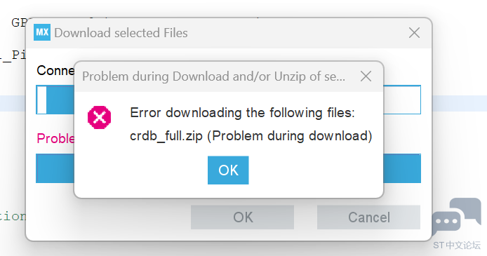

### STM32CubeMX

意法半导体公司推出的自动生成项目模板的软件。

 **Java 官网下载：** [下载地址](https://www.java.com/zh_CN/download/windows-64bit.jsp) 

**CubeMX 官网下载：** [下载地址](https://www.st.com/stm32cubemx)

请自行攻略下载教程。

下载完成后如果创建新文件出现如下错误：

请使用手机热点连接电脑重试。

