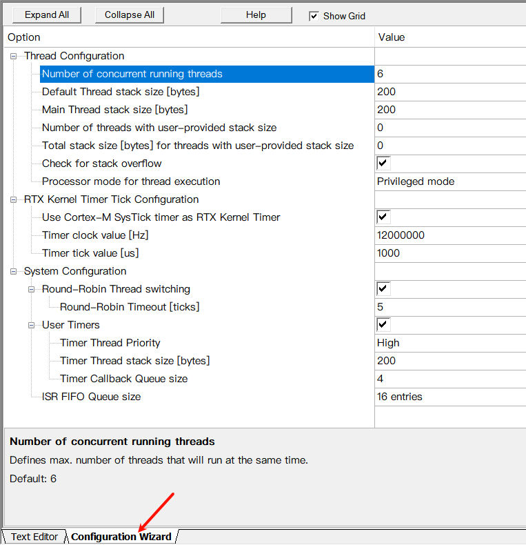

---
hide:
  - navigation
  - toc
---

# CMSIS配置向导标记

官方链接：https://open-cmsis-pack.github.io/Open-CMSIS-Pack-Spec/main/html/configWizard.html

这里只是翻译一下。

## 标记规则

配置向导由标记条目和标记修饰组成。用这些标记可以为配置文件在IDE中创建GUI配置项 (参照下面的显示效果)。用GUI可以方便用户检查和修改配置文件，以满足实际应用需要。需要遵循以下规则：

- 标记向导区域必须在100行代码之内开头，而且必须以下面的标记开头：
    ``` C
    // <<< Use Configuration Wizard in Context Menu >>>
    ```
- 标记向导区域以下面可选的标记结束：
    ``` C
    // <<< end of configuration section >>>
    ```
- 在代码中，标记是写成注释的。每行标记必须以双斜杠注释打头(`//`)
- 默认情况下，会修改标记后紧跟着的代码
- 下表中标记`*`的条目可以有一个默认值。默认值可以跳过一些代码(查看表中的跳过示例)。这会覆盖之前的规则
- 下表中标记`+`的条目可以跟一个标识符。当指定标识符后，紧跟着的代码会匹配标识符然后修改。查看下表的标识符例子。标识符不可以与默认值同时使用
- 可以在标记条目中添加描述。描述内容可以在选中项目后显示(查看下表)
- 标记条目和标记修饰符中的空白字符会被忽略
- 除了封闭注释条目以外，你不能在配置向导行中使用`<`和`>`符号

下表是标记规则：

<table>
    <tbody>
        <tr>
            <th style="width:210px">标识符</th>
            <th style="width:100px">是否带文本</th>
            <th>描述</th>
        </tr>
        <tr>
            <td><code>&lt;h&gt;</code></td>
            <td>是</td>
            <td>
            标题，创建一个组，由<code>&lt;h&gt;</code>和<code>&lt;/h&gt;</code>括起来的配置项都属于一个组，可以展开、折叠。它不会修改代码，只是用来分组的。下面是选自<a href="Embedded/cmsis_config_wizard/#_3">代码示例</a>一部分片段：<br>
            ``` C
            // <h>Thread Configuration  -- header without checkbox to group other items
            //   ...
            // </h>
            ```
            标题条目如<a href="Embedded/cmsis_config_wizard/#_4">效果预览</a>中的<code>Thread Configuration</code>所示。
            </td>
        </tr>
        <tr>
            <td><code>&lt;e&gt;<sup>*+</sup></code></td>
            <td>是</td>
            <td>启用或禁用一个组，可以选择是否启用组内的所有配置项。组内的配置项目都由`<e>`和`</e>`括起来。下面是选自<a href="Embedded/cmsis_config_wizard/#_3">代码示例</a>一部分片段：<br>
            ``` C
            // <e>Round-Robin Thread switching              -- header with checkbox
            // ===============================
            //
            // <i> Enables Round-Robin Thread switching.    -- tooltip information for the header
            #ifndef OS_ROBIN
            #define OS_ROBIN 1                              -- this value is set through the checkbox
            #endif
            // <o>Round-Robin Timeout [ticks] <1-1000>
            // <i> Defines how long a thread will execute before a thread switch.
            // <i> Default: 5
            // <d> 5
            #ifndef OS_ROBINTOUT
            #define OS_ROBINTOUT 5
            #endif
            // </e>
            ```
            选择框选中以后，会设置<code>OS_ROBIN</code>为1，没有选中则设置为0。并且还会影响<code>OS_ROBINOUT</code>的设置。如<a href="Embedded/cmsis_config_wizard/#_4">效果预览</a>中<code>&lt;e&gt;Round-Robin Thread switching ... &lt;/e&gt;</code>所示。
            </td>
        </tr>
        <tr>
            <td><code>&lt;e.<em>i</em>&gt;<sup>*+</sup></code></td>
            <td>是</td>
            <td>可以修改特定位(<em>i</em>)(例如：<code>&lt;e.4&gt;</code> - 修改bit4的值)。
            ``` C
            // <e.4>Serial Number
            // <i>Enable Serial Number String.
            // <i>If disabled, Serial Number String will not be assigned to USB Device.
            #define USBD0_STR_DESC_SER_EN           1
            ```
            这个例子创建了一个标题<code>Serial Number</code>，选择框可以设置值。如果选中，<code>USBD0_STR_DESC_SER_EN</code>置1。
        </tr>
        <tr>
            <td><code>&lt;/h&gt;, &lt;/e&gt;, 或 &lt;/c&gt;</code></td>
            <td>是</td>
            <td>标题、选择组或注释的结尾</td>
        </tr>
        <tr>
            <td><code>&lt;n&gt; </code></td>
            <td>是</td>
            <td>显示提示文本
            ``` C
            // <i>This is shown as a tooltip when hovering over a text.
            ```
        </tr>
        <tr>
            <td><code>&lt;i&gt; </code></td>
            <td>是</td>
            <td>对该条目的解释。
            ``` C
            // <i>This is shown as a tooltip when hovering over a text.
            ```
            这个表中有许多例子都有解释。
        </tr>
        <tr>
            <td><code>&lt;d&gt; </code></td>
            <td>是</td>
            <td>该条目的默认值
            ``` C
            // <o MODE> Operation Mode
            // <modeOne=> Mode 1
            // <modeTwo=> Mode 2
            // <d> modeOne
            // #define MODE       modeTwo
            ```
            二值选项，如<code>&lt;e&gt;</code>和<code>&lt;q&gt;</code>，分别以0和1表示「禁用」和「启用」。用此选项可以实现「重置默认值」的功能。
        </tr>
        <tr>
            <td><code>&lt;c&gt;<sup>*</sup></code></td>
            <td>是</td>
            <td>启用代码片段：创建一个选择框来选择注释或不注释代码片段。勾选后代码会取消注释。<br>注释后，在每行前面都会添加双斜杠(//)注释，包括空格。
            ``` C
            // <c1> Comment sequence block until block end when disabled
            //<i> This may carry the block's description
            
            foo
            
            +bar
            
            -xFoo
            // </c>
            ```
            在这个例子中，如果勾选选择框，这些代码都不会被注释。
        </tr>
        <tr>
            <td><code>&lt;!c&gt;<sup>*</sup></code></td>
            <td>是</td>
            <td>禁用代码片段：创建一个选择框来选择注释或不注释代码片段。勾选后代码会被注释。<br>注释后，在每行前面都会添加双斜杠(//)注释，包括空格。
            ``` C
            // <!c1> Comment sequence block until block end when enabled
            //<i> This may carry the block's description
            //
            //foo
            //
            //+bar
            //
            //-xFoo
            // </c>
            ```
            在这个例子中，如果勾选选择框，这些代码都会被注释。
        </tr>
        <tr>
            <td><code>&lt;q&gt;<sup>*+</sup></code></td>
            <td>是</td>
            <td>通过选择框设置0或1。
            ``` C
            //  <h> Chip-select control
            //     <q> ASYNCWAIT: Wait signal during asynchronous transfer
            //      <i> Enables the FSMC to use the wait signal even during an asynchronous protocol.
            // </h>
            #define RTE_FSMC_BCR1_ASYNCWAIT         0   -- this is changed via a checkbox
            ```
        </tr>
        <tr>
            <td><code>&lt;o&gt;<sup>*+</sup></code></td>
            <td>是</td>
            <td>输入数值
            ``` C
            // <o>Round-Robin Timeout [ticks] <1-1000>  -- text displayed on screen. Range of [ticks] is [1..1000] 
            // <i> Defines how long a thread will execute before a thread switch.  -- tooltip info
            // <i> Default: 5                           -- tooltip info. Both displayed in one tooltip.
            // <d> 5                                    -- default value
            #ifndef OS_ROBINTOUT
            #define OS_ROBINTOUT 5
            #endif
            // </e>
            ```
            这个例子中创建了一个文本框来设置<code>Round-Robin Timeout [Ticks]</code>的值，输入范围可以是1 ~ 1000。
        </tr>
        <tr>
            <td><code>&lt;o.<em>i</em>&gt;<sup>*+</sup></code></td>
            <td>是</td>
            <td>设置单个bit(例如：<code>&lt;e.4&gt;</code> - 修改bit4的值)。
            ``` C
            // <o.4> <o.0>High-speed
            //   <i>Enable High-speed functionality (if device supports it).
            #define USBD0_HS                        0
            ```
            这个例子创建了标题和一个选择框，如果勾选，<code>USBD0_HS</code>的bit4将会被置1。
        </tr>
        <tr>
            <td><code>&lt;o.<em>x</em>..<em>y</em>&gt;<sup>*+</sup></code></td>
            <td>是</td>
            <td>设置一段bit(例如：<code>&lt;o.4..5&gt;</code> - bit[5:4]).
            ``` C
            //   <h>String Settings
            //   <i>These settings are used to create the String Descriptor.
            //     <o.0..15>Language ID <0x0000-0xFCFF>
            //     <i>English (United States) = 0x0409.
            //   </h>
            #define USBD0_STR_DESC_LANGID           0x0409
            ```
            这个例子创建了一个标题和一个文本框来设置<code>String Settings</code>和<code>Language ID</code>。输入范围可以是<code>&lt;0x0000-0xFCFF&gt;</code>。用户可以在这个范围里输入。这个选项可以修改bit[15:0]。
        </tr>
        <tr>
            <td><code>&lt;y&gt;<sup>+</sup></code></td>
            <td>是</td>
            <td>输入一个标识符或者数字
            ``` C
            //   <y>Value or Define Symbol that specifies number of open files <1-16>
            //   <i>Define number of files that can be opened at the same time.
            #define FAT_MAX_OPEN_FILES      maxFiles
            
            //   <y> FAT_MAX_OPEN_FILES>Value or Define Symbol that specifies number of open files <1-16>
            #define OTHER_SYMBOL            "This is a text"
            #define FAT_MAX_OPEN_FILES      8
            ```
            这个例子中，第一个创建了一个输入框，可以输入数字或者标识符，数字的输入范围是1 ~ 16。第二个例子是一个标识符，输入框会定位到<code>FAT_MAX_OPEN_FILES</code>的位置并设置它的值。
        </tr>
        <tr>
            <td><code>&lt;s&gt;<sup>*+</sup></code></td>
            <td>是</td>
            <td>输入ASCII字符串
            ``` C
            //  <s>Manufacturer String
            //  <i>String Descriptor describing Manufacturer.
            #define USBD0_STR_DESC_MAN              L"Keil Software"
            ```
            创建一个输入框，用户可以输入文本。字符串长度没有限制。
        </tr>
        <tr>
            <td><code>&lt;s.<em>i</em>&gt;<sup>*+</sup></code></td>
            <td>是</td>
            <td>输入ASCII字符串，但是长度限制在<em>i</em>
            ``` C
            //  <s.126>Manufacturer String
            //  <i>String Descriptor describing Manufacturer.
            #define USBD0_STR_DESC_MAN              L"Keil Software"
            ```
            这个例子长度限制为126个字符。默认字符串是 "Keil Software"。
        </tr>
        <tr>
            <td><code>&lt;a.<em>i</em>&gt;<sup>*+</sup></code></td>
            <td>是</td>
            <td>输入数组长度为<em>i</em>的数值
            ``` C
            //  <a.8 PUBLIC_KEY> Public key for signing <0..255> <f.h>
            //  <d> {0x00, 0x00, 0x00, 0x00, 0x00, 0x00, 0x00, 0x00}
            #define PUBLIC_KEY {0x00, 0x01, 0x02, 0x03, 0x04, 0x05, 0x06, 0x07, 0x08}
            ```
            这个例子中数组的每个元素的大小都限制在0 ~ 255也就是1字节以内。默认全为零。可以用格式控制来确保显示为16进制。GUI最多支持显示64个元素。
            </td>
        </tr>
        <tr>
            <td><em><b>跳过示例</b></em> <br>
                <code>&lt;q<em>n&gt;</em>; <br>
                &lt;o<em>n&gt;</em>; &lt;o<em>n</em>.<em>i&gt;</em>; <br>
                &lt;s<em>n&gt;</em>; &lt;s<em>n</em>.<em>i&gt;</em></code></td>
            <td>无</td>
            <td>跳过<em>n</em>个配置项。可以用在这个表中所有带<code>*</code>的标记项。
            ``` C
            // <o2>Skip 2 and modify the third item after this entry <1-9>
            #define VALUE1       1000
            #define VALUE2       2000
            #define MODIFY_THIS  3000
            ```
            这个例子会跳过<code>VALUE1</code>和<code>VALUE2</code>，修改第三个<code>MODIFY_THIS</code>的数值。
        </tr>
        <tr>
            <td><em><b>标识符示例</b></em> <br>
                <code>&lt;q <em>identifier&gt;</em> <br>
                &lt;e <em>identifier&gt;</em> <br>
                &lt;o <em>identifier&gt;</em> <br>
                &lt;s <em>identifier&gt;</em> <br>
                &lt;y <em>identifier&gt;</em> <br>
                &lt;e.<em>i</em> <em>identifier&gt;</em> <br>
                &lt;o.<em>i</em> <em>identifier&gt;</em> <br>
                &lt;s.<em>i</em> <em>identifier&gt;</em></code></td>
            <td>无</td>
            <td>修改所给标识符的值。可以用在这个表中所有带<code>+</code>的标记项。
            ``` C
            // <o MODIFY_THIS>Modify the item after "MODIFY_THIS" <1-9>
            #define VALUE1       1000
            #define VALUE2       2000
            #define MODIFY_THIS  3000
            ```
            这个例子会跳过<code>VALUE1</code>和<code>VALUE2</code>，修改标识符为<code>MODIFY_THIS</code>的数值。
        </tr>
    </tbody>
</table>

<table>
    <tbody>
        <tr>
            <th style="width:210px">修饰符</th>
            <th style="width:170px">是否带文本</th>
            <th>描述</th>
        </tr>
        <tr>
            <td><code>&lt;0-31&gt;</code></td>
            <td>否</td>
            <td><b>(已弃用<sup>1</sup>, 查看下面新的修改范围方法)</b><br>指定范围，包括边界值</td>
        </tr>
        <tr>
            <td><code>&lt;0-100:10&gt;</code></td>
            <td>否</td>
            <td><b>(已弃用<sup>1</sup>, 查看下面新的修改范围方法)</b><br>指定范围，但是只能是10的倍数，包括边界值</td>
        </tr>
        <tr>
            <td><code>&lt;0x40-0x1000:0x10&gt;</code></td>
            <td>否</td>
            <td><b>(已弃用<sup>1</sup>, 查看下面新的修改范围方法)</b><br>指定范围，但是只能是0x10也就是16的倍数。包括边界值</td>
        </tr>
        <tr>
            <td><code>&lt;-32..31&gt;</code></td>
            <td>否</td>
            <td>指定一定范围的值，包括负数。</td>
        </tr>
        <tr>
            <td><code>&lt;-50..100:10&gt;</code></td>
            <td>否</td>
            <td>指定范围，但是只能是10的倍数，包括边界值</td>
        </tr>
        <tr>
            <td><code>&lt;-0x40..0x1000:0x10&gt;</code></td>
            <td>否</td>
            <td>指定范围，但是只能是0x10也就是16的倍数。包括边界值</td>
        </tr>
        <tr>
            <td><code>&lt;<em>value</em>=&gt;</code></td>
            <td>是</td>
            <td>创建一个下拉框，可以选择并把<em><b>value</b></em>的值写入下一个配置项中。下面是选自<a href="Embedded/cmsis_config_wizard/#_3">代码示例</a>一部分片段：<br>
            ``` C
            //   <o>Timer Thread Priority   -- creates a drop-down with the list below.
            //                        <1=> Low
            //     <2=> Below Normal  <3=> Normal  <4=> Above Normal
            //                        <5=> High
            //                        <6=> Realtime (highest)
            //   <i> Defines priority for Timer Thread  -- tooltip info
            //   <i> Default: High                      -- tooltip info
            //   <d> 5                                  -- default value
            #ifndef OS_TIMERPRIO
            #define OS_TIMERPRIO   5
            #endif
            ```
            这个例子会给<code>Timer Thread Priority</code>创建一个下拉框，如果选择<code>High</code>，<code>OS_TIMERPRIO</code>会被设置为5。当点击这个选项时，会显示一个下拉框。如<a href="Embedded/cmsis_config_wizard/#_4">效果预览</a>中的<code>Thread Configuration</code>所示。
            </td>
        </tr>
        <tr>
            <td><code>&lt;<em>identifier</em>=&gt;</code></td>
            <td>是</td>
            <td>创建一个下拉框，会根据配置项所填的内容显示相应的文本，例如<code>dwt</code>在下拉框中会显示<code>DWT Cycle Counter</code>。要注意的是这个选项只能用在带标识符(<code>&lt;o identifier&gt;</code>)的条目中。所选项目的文本会替换掉对应<code>identifier</code>后的内容，<code>identifier</code>关键字由<code>&lt;o identifier&gt;</code>标签指定。
            ``` C
            //   <o TIMESTAMP_SRC>Time Stamp Source
            //      <dwt=>     DWT Cycle Counter
            //      <systick=> SysTick
            //      <user=>    User Timer 
            //   <i>Selects source for 32-bit time stamp
            #define TIMESTAMP_SRC  dwt
            ```
            这个例子创建了一个叫<code>Time Stamp Source</code>的选择框，配置项填写的是<code>dwt</code>，在选择框中会显示<code>DWT Cycle Counter</code>被选中。<code>TIMESTAMP_SRC</code>设置为<code>dwt</code>。当点击这个选项时，会显示一个下拉框。如<a href="Embedded/cmsis_config_wizard/#_4">效果预览</a>中的<code>Thread Configuration</code>所示。<br>
            也可以给结构体变量的成员赋值。例如：
            ``` C
            //   <o redPortMode> Red port mode
            //     <OutPushPull_GPIO=>  PushPull
            //     <OutOpenDrain_GPIO=> OpenDrain
            //   <i>Selects GPIO output
            ledConf.redPortMode = OutOpenDrain_GPIO;
            ```
            这个例子创建了一个叫<code>Red port mode</code>的下拉框，用来修改结构体成员<code>redPortMode</code>的值。可以选择<code>PushPull</code>或<code>OpenDrain</code>，分别对应<code>OutPushPull_GPIO</code>和<code>OutOpenDrain_GPIO</code>，选择后会替换<code>redPortMode</code>后的内容。
            </td>
        </tr>
        <tr>
            <td><code>&lt;#+1&gt;&nbsp;&nbsp; &lt;#-1&gt;<br>
                &lt;#*8&gt;&nbsp;&nbsp; &lt;#/3&gt;</code></td>
            <td>否</td>
            <td>将输入的值，加减乘除后设置。
            ``` C
            // <o>Default Thread stack size [bytes] <64-4096:8><#/4>
            // <i> Defines default stack size for threads with osThreadDef stacksz = 0
            // <i> Default: 200
            #ifndef OS_STKSIZE
            #define OS_STKSIZE 50
            #endif
            ```
            <code>Default Thread stack size [byte]</code>的范围是64 ~ 4096。输入的值(这里是200)会被除4(<code>&lt;#/4&gt;</code>)后设置。<code>OS_STKSIZE</code>的结果是200 / 4也就是50。输入框里会显示200。如<a href="Embedded/cmsis_config_wizard/#_4">效果预览</a>中的<code>Thread Configuration</code>所示。
            </td>
        </tr>
        <tr>
            <td><code>&lt;f.<em>format-specifier</em>&gt;</code></td>
            <td>否</td>
            <td>按照特定进制格式显示整数。<code>format-specifier</code>必须是以下的字母：
                <dl>
                    <dt>d</dt>
                    <dd>十进制</dd>
                    <dt>h</dt>
                    <dd>十六进制</dd>
                    <dt>o</dt>
                    <dd>八进制</dd>
                    <dt>b</dt>
                    <dd>二进制</dd>
                </dl>
            ``` C
            // <o MY_DECIMAL_1> A decimal option <f.d>
            #define MY_DECIMAL_1    13         -- displayed as decimal "13" in the tool
            
            // <o MY_DECIMAL_2> Another decimal option <f.d>
            #define MY_DECIMAL_2    0x10       -- displayed as decimal "16" in the tool
            
            // <o MY_HEX> A hexadecimal option <f.h>
            #define MY_HEX          52         -- displayed as hexadecimal "0x34" in the tool
            ```
            </td>
        </tr>
    </tbody>
</table>

<sup>1</sup>新版本的工具可能还会支持这些已弃用的功能。但是建议更新文件标记到最新版本。

## 代码示例

你可以复制下面的代码到一个头文件，然后打开Keil uVision预览：

``` C
//-------- <<< Use Configuration Wizard in Context Menu >>> -----------------
//
// <h>Thread Configuration
// =======================
//
//   <o>Number of concurrent running threads <0-250>
//   <i> Defines max. number of threads that will run at the same time.
//   <i> Default: 6
#ifndef OS_TASKCNT
 #define OS_TASKCNT     6
#endif
 
//   <o>Default Thread stack size [bytes] <64-4096:8><#/4>
//   <i> Defines default stack size for threads with osThreadDef stacksz = 0
//   <i> Default: 200
#ifndef OS_STKSIZE
 #define OS_STKSIZE     50
#endif
 
//   <o>Main Thread stack size [bytes] <64-32768:8><#/4>
//   <i> Defines stack size for main thread.
//   <i> Default: 200
#ifndef OS_MAINSTKSIZE
 #define OS_MAINSTKSIZE 50
#endif
 
//   <o>Number of threads with user-provided stack size <0-250>
//   <i> Defines the number of threads with user-provided stack size.
//   <i> Default: 0
#ifndef OS_PRIVCNT
 #define OS_PRIVCNT     0
#endif
 
//   <o>Total stack size [bytes] for threads with user-provided stack size <0-1048576:8><#/4>
//   <i> Defines the combined stack size for threads with user-provided stack size.
//   <i> Default: 0
#ifndef OS_PRIVSTKSIZE
 #define OS_PRIVSTKSIZE 0
#endif
 
// <q>Check for stack overflow
// <i> Includes the stack checking code for stack overflow.
// <i> Note that additional code reduces the Kernel performance.
#ifndef OS_STKCHECK
 #define OS_STKCHECK    1
#endif
 
// <o>Processor mode for thread execution 
//   <0=> Unprivileged mode 
//   <1=> Privileged mode
// <i> Default: Privileged mode
#ifndef OS_RUNPRIV
 #define OS_RUNPRIV     1
#endif
 
// </h>
 
// <h>RTX Kernel Timer Tick Configuration
// ======================================
// <q> Use Cortex-M SysTick timer as RTX Kernel Timer
// <i> Use the Cortex-M SysTick timer as a time-base for RTX.
#ifndef OS_SYSTICK
 #define OS_SYSTICK     1
#endif
//
//   <o>Timer clock value [Hz] <1-1000000000>
//   <i> Defines the timer clock value.
//   <i> Default: 12000000  (12MHz)
#ifndef OS_CLOCK
 #define OS_CLOCK       12000000
#endif
 
//   <o>Timer tick value [us] <1-1000000>
//   <i> Defines the timer tick value.
//   <i> Default: 1000  (1ms)
#ifndef OS_TICK
 #define OS_TICK        1000
#endif
 
// </h>
 
// <h>System Configuration
// =======================
//
// <e>Round-Robin Thread switching
// ===============================
//
// <i> Enables Round-Robin Thread switching.
#ifndef OS_ROBIN
 #define OS_ROBIN       1
#endif
 
//   <o>Round-Robin Timeout [ticks] <1-1000>
//   <i> Defines how long a thread will execute before a thread switch.
//   <i> Default: 5
#ifndef OS_ROBINTOUT
 #define OS_ROBINTOUT   5
#endif
 
// </e>
 
// <e>User Timers
// ==============
//   <i> Enables user Timers
#ifndef OS_TIMERS
 #define OS_TIMERS      1
#endif
 
//   <o>Timer Thread Priority
//                        <1=> Low
//     <2=> Below Normal  <3=> Normal  <4=> Above Normal
//                        <5=> High
//                        <6=> Realtime (highest)
//   <i> Defines priority for Timer Thread
//   <i> Default: High
#ifndef OS_TIMERPRIO
 #define OS_TIMERPRIO   5
#endif
 
//   <o>Timer Thread stack size [bytes] <64-4096:8><#/4>
//   <i> Defines stack size for Timer thread.
//   <i> Default: 200
#ifndef OS_TIMERSTKSZ
 #define OS_TIMERSTKSZ  50
#endif
 
//   <o>Timer Callback Queue size <1-32>
//   <i> Number of concurrent active timer callback functions.
//   <i> Default: 4
#ifndef OS_TIMERCBQS
 #define OS_TIMERCBQS   4
#endif
 
// </e>
 
//   <o>ISR FIFO Queue size<4=>   4 entries  <8=>   8 entries
//                         <12=> 12 entries  <16=> 16 entries
//                         <24=> 24 entries  <32=> 32 entries
//                         <48=> 48 entries  <64=> 64 entries
//                         <96=> 96 entries
//   <i> ISR functions store requests to this buffer,
//   <i> when they are called from the interrupt handler.
//   <i> Default: 16 entries
#ifndef OS_FIFOSZ
 #define OS_FIFOSZ      16
#endif
 
// </h>
 
//------------- <<< end of configuration section >>> -----------------------
```

## 效果预览

下面是Keil uVision显示的效果：

<div align="center"></div>{: style="width:50%"}

如果解析成功，点击下方的`Configuration Wizard`就可以打开这个界面。

`Option`是配置条目，以树形结构表示。每个项目都有提示(如果有)。

`Value`是设置的值，可以是选择框、输入框、下拉框(项目需预先定义)。
