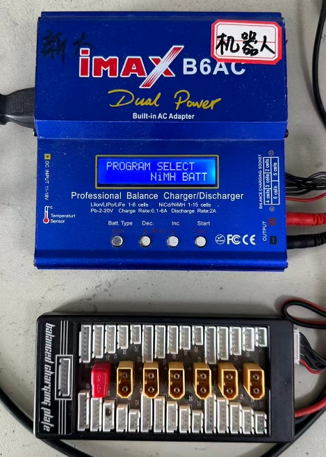
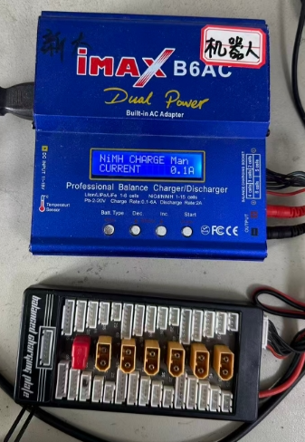

# 电池过放急救指南

电池过放是指锂电池电量耗尽后仍持续放电，导致电压低于安全阈值的现象。过放会损伤电池内部结构，轻则导致电池容量衰减、无法正常充电，重则引发漏液、鼓包、发热甚至起火，因此及时、正确的急救处理至关重要。本指南详细说明6s、4s锂电池过放后的急救流程、操作要点及注意事项。

## B6AC镍氢模式

电池过放至低于额定电压时，需要使用镍氢模式充电（NiMH BATT）

点击Start选择，默认0.1A充电，此时插上电池的电源接口，**不要接平衡充接口**，长按Start开始充电，**镍氢模式充电时务必有人看守**。

## 平衡充模式

待电池在镍氢模式充到额定电压后即可用平衡充模式充电
