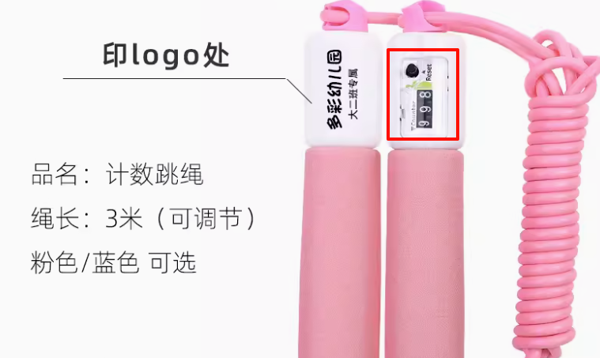
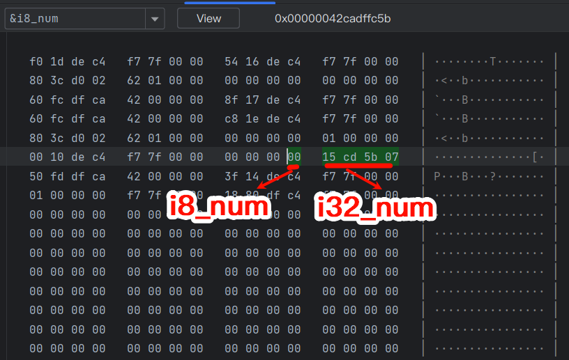
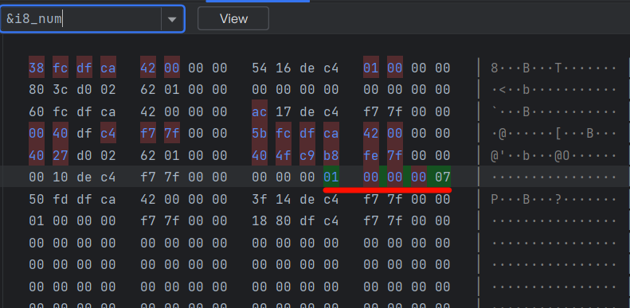
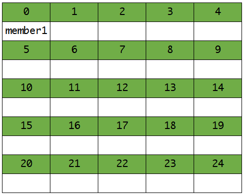
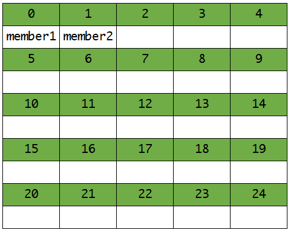
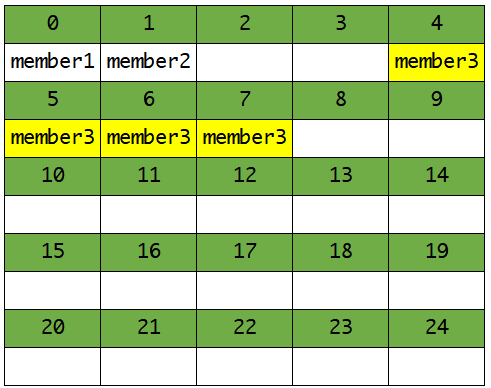
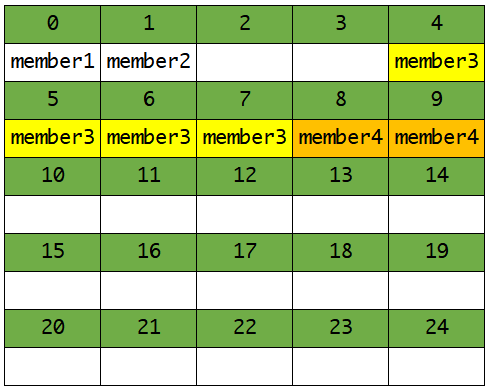
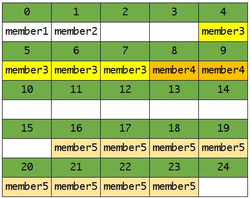
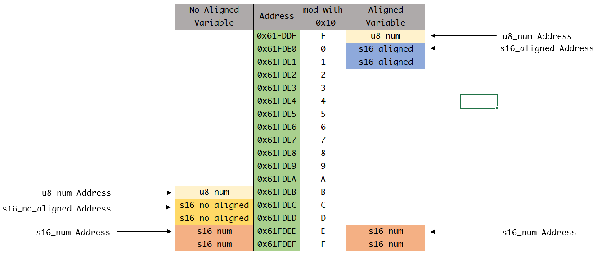

# C语言基础

<h1> <b>最吊C语言，没有之一：<br>
<a href="https://www.bilibili.com/video/av238869905/">C语言大师：编得狂，骂得响[前篇]</a><br>
<a href="https://www.bilibili.com/video/av1250963900/">C语言大师：编得狂，骂得响[后篇]</a></b><br>
</h1>

---

这里很少讲基础的语法，会有大量的代码，如果你对语法不熟练（比如搞不清楚`for`循环），自行根据上面两个链接的视频学习。

我会标注这部分知识在视频中的位置（以标题的标号为主，比如`P17 011-2.小学数学0-二进制`，我会标注011，而非P17。175小节前的都在前篇），以及添加部分文档、博客供参考。

没有顺序，想到什么写什么。

## 位运算

> C大师 011, 055-063

在嵌入式和算法中，位运算符非常常见。一般寄存器都是以bit为单位来操作的。因此，掌握位运算的方法，非常重要。至于位运算符什么原理，怎么用，看上面的视频。下面总结一下：

- 读取位用「与」
- 位置0用「与」`&=`，置1用「或」`|=`
- 位取反用「异或」`^=`
- 操作某个位用移位操作，例如操作`bit3`: `(1U << 3)`

下面举个例子：

``` C
#include <stdint.h>
#include <stdio.h>

/**
 * 状态寄存器
 * bit[0]:  保留
 * bit[4:1]:要操作的步骤
 * bit[5]:  是否就绪
 * bit[6:7]:操作结果
 */
uint8_t status_reg = 0;

#define READY_POS     5

#define OPERATE_START (1 << 1U)
#define OPERATE_STOP  (3 << 1U)
#define OPERATE_RESET (7 << 1U)
#define OPERATE_ABORT (12 << 1U)

#define RESULT_MASK   (0b11 << 6)
#define RESULT_NONE   (0 << 6U)
#define RESULT_OK     (1 << 6U)
#define RESULT_ERR    (2 << 6U)

int main(void) {
    /* 开始操作 */
    status_reg |= OPERATE_START;

    if ((status_reg & RESULT_MASK) == RESULT_OK) {
        /* 如果操作结果成功, 将就绪位置1 */
        status_reg |= (1 << READY_POS);
    } else {
        /* 否则就绪位置0 */
        status_reg &= ~(1 << READY_POS);
    }
}
```

如果你看不懂，不知道是怎么读取写入的，说明还是不够熟练，继续练习。

从x位到y位一般表示成`bit[y:x]`，y在x前面是因为低位在后面。而我们说从x到y一般是从低位到高位。而说从x到y个字节可以表示成`byte[x:y]`。

## 变量的初值

全局变量和`static`变量的初始值必须在**编译时**就确定的，如果变量不是在编译时确定的，那么就会报错。例如：

``` C
int a_demo_function(void) {
    return 1;
}

int global_variable = a_demo_function();

int main(void) {
    static int local_static_variable = a_demo_function();

    return 0;
}
```

编译结果：

```bash
E:/C_Learn/main.c:6:23: error: initializer element is not constant
    6 | int global_variable = a_demo_function();
      |                       ^~~~~~~~~~~~~~~
E:/C_Learn/main.c: In function 'main':
E:/C_Learn/main.c:9:40: error: initializer element is not constant
    9 |     static int local_static_variable = a_demo_function();
      |                                        ^~~~~~~~~~~~~~~
```

如果给全局变量初始值，它的初值必须在运行前就确定，如果运行前初值不确定，必然报错。

虽然`a_demo_function()`的返回值永远是1，但是在编译器看来这个函数需要执行才可以得到返回值，`global_value`的初始值不确定，因此编译报错。

而对于局部变量，初始值可以在运行时才确定，因此下面的代码不会报错：

``` C
int a_demo_function(void) {
    return 1;
}

int main(void) {
    int local_static_variable = a_demo_function();

    return 0;
}
```

其实这里涉及到两个概念：编译时(Compile Time)和运行时(RunTime)。

顾名思义，编译时就是编译时候的动作，编译时的操作对象是源代码文件，生成可执行文件。其中会涉及到语法检查、类型检查、优化、链接等操作。

运行时就是指运行时的动作，比如动态内存分配、动态链接等操作。

## 整数

> [Storage of basic types | Microsoft Learn](https://learn.microsoft.com/en-us/cpp/c-language/storage-of-basic-types?view=msvc-170)
> 
> C大师 022-031

整数可谓是在程序中最常用的一种数据类型。但是，整数是有范围的，如果超出了其存储范围就会溢出。

为什么整数会溢出，举个例子。下面这种机械计数的跳绳用过吧。当我们跳了999下后，再跳一下就会变成000，千位的1丢失了。



在计算机里也一样，`uint8_t`占用8个二进制位，当到255即二进制`1111 1111`时，继续加1会变成`1 0000 0000`，但是`uint8_t`只有8个二进制位。最高位的1会被舍弃，变成0。

关于整数范围与CPU架构那点破事，参见：「C大师 023.long,long long与CPU架构的那些事儿」

### `stdint.h`

如果要确定一个整数的范围，可以使用`stdint.h`中定义的类型。这个头文件会根据系统平台与CPU架构来确定整数的范围。下面是ARM Clang编译器的`stdint.h`头文件简单介绍：

``` C
/* Copyright (C) ARM Ltd., 1999,2014 */
/* All rights reserved */

/* 省略部分代码注释。。。 */

/* 定义有符号固定宽度整数 */
typedef   signed          char int8_t;
typedef   signed short     int int16_t;
typedef   signed           int int32_t;
typedef   signed       __INT64 int64_t;

/* 定义无符号固定宽度整数 */
typedef unsigned          char uint8_t;
typedef unsigned short     int uint16_t;
typedef unsigned           int uint32_t;
typedef unsigned       __INT64 uint64_t;

/* 定义有符号最小宽度整数 */
typedef   signed          char int_least8_t;
typedef   signed short     int int_least16_t;
typedef   signed           int int_least32_t;
typedef   signed       __INT64 int_least64_t;

/* 定义无符号最小宽度整数 */
typedef unsigned          char uint_least8_t;
typedef unsigned short     int uint_least16_t;
typedef unsigned           int uint_least32_t;
typedef unsigned       __INT64 uint_least64_t;

/* 定义有符号快速整数 */
typedef   signed           int int_fast8_t;
typedef   signed           int int_fast16_t;
typedef   signed           int int_fast32_t;
typedef   signed       __INT64 int_fast64_t;

/* 定义无符号快速整数 */
typedef unsigned           int uint_fast8_t;
typedef unsigned           int uint_fast16_t;
typedef unsigned           int uint_fast32_t;
typedef unsigned       __INT64 uint_fast64_t;

/* 定义int指针 */
#if __sizeof_ptr == 8
typedef   signed       __INT64 intptr_t;
typedef unsigned       __INT64 uintptr_t;
#else
typedef   signed           int intptr_t;
typedef unsigned           int uintptr_t;
#endif

/* 定义平台支持的最大整数类型 */
typedef   signed     __LONGLONG intmax_t;
typedef unsigned     __LONGLONG uintmax_t;

/* 定义有符号数最小值 */
#define INT8_MIN                   -128
#define INT16_MIN                -32768
#define INT32_MIN          (~0x7fffffff)   /* -2147483648 is unsigned */
#define INT64_MIN  __INT64_C(~0x7fffffffffffffff) /* -9223372036854775808 is unsigned */

/* 定义有符号数最大值 */
#define INT8_MAX                    127
#define INT16_MAX                 32767
#define INT32_MAX            2147483647
#define INT64_MAX  __INT64_C(9223372036854775807)

/* 定义无符号数最大值 */
#define UINT8_MAX                   255
#define UINT16_MAX                65535
#define UINT32_MAX           4294967295u
#define UINT64_MAX __UINT64_C(18446744073709551615)

/* 省略fast, least, 指针和最大整数类型的最大值和最小值 */

/* 省略常量整数定义 */

/* end of stdint.h */
```

这个头文件包含了各种条件编译来判断编译器、编译平台、编译C标准以及C++等。

### `inttypes.h`

我们在用`scanf, printf`这类带格式控制符的函数时，`int`类型的整数可以用`%d`，`unsigned int`类型的整数可以用`%u`，那么`int16_t`类型，`int8_t`类型的整数用什么呢？你可能会想，我全用`%d`不就行了？其实还真不行。请看下面代码：

``` C
#include <stdint.h>
#include <stdio.h>

int main(void) {
    int32_t i32_num = 123456789;
    uint8_t i8_num;

    scanf("%d", &i8_num);
    printf("i32_num = %d, i8_num = %d", i32_num, i8_num);

    return 0;
}
```

输入1, 运行结果:

``` bash
>>> 1
i32_num = 117440512, i8_num = 1
```

`scanf`只给`i8_num`赋值了，没有给`i32_num`赋值。但是我们输出`i32_num`却发现值变了，这是为什么呢？那么这其中究竟发送了什么？我们用Debug来探究一下：

我们在内存中定位到的`i8_num`和`i32_num`的位置如下，由于是小端序，所以`i32_num`的十六进制值实际是`0x075bcd15`，也就是我们初始定义的123456789。



接着，`scanf`输入1，继续。



发现什么了？`i32_num`前三字节全部变成0了，这时候`i32_num = 0x07000000 = 117440512(10)`。在64位机上，`int`类型占4字节，也就是说，`%d`输入整数的时候一次会填充四个字节。但是i8_num只占一字节，那么剩下三个字节就会覆盖其他变量的位置，造成上面的问题。

你可能会问，为什么`i32_num`在`i8_num`的后面呢？这是由于栈是向下生长的，也就是从高地址往低地址生长。当`main`函数入栈后按照顺序将局部变量依次进栈，先是`i32_num`，再是`i8_num`，`i32_num`在高地址，`i8_num`在低地址。而我们看内存一般从左往右是低地址到高地址，所以`i32_num`在`i8_num`的后面。

> 地址实际上就是对内存位置的编号。就像你家的门牌号一样，低地址就是编号小的，高地址就是编号大的。我们假如要统计一个社区各家的人口，那么做表的时候自然也会按照门牌号从小到大依次排列。这就跟内存一样的。

因此如果要用格式控制符输入或者输出整数，最好用`inttypes.h`中定义的头文件。`inttypes.h`定义了各种不同宽度整数的格式控制符，因此我们可以安全的输入和输出变量。上面的代码就可以改写成：
``` C
#include <inttypes.h>
#include <stdint.h>
#include <stdio.h>

int main(void) {
    int32_t i32_num = 123456789;
    uint8_t i8_num;

    scanf("%" SCNd8, &i8_num);
    printf("i32_num = %" PRId32 ", i8_num = %" PRId8, i32_num, i8_num);

    return 0;
}
```

可以自行跳转到`inttypes.h`中看看，不算难这里就不多赘述了。

### 整数的隐式类型转换

> [Assignment conversions | Microsoft Learn](https://learn.microsoft.com/en-us/cpp/c-language/assignment-conversions?view=msvc-170)
>
> C大师 028


首先想一下下面的代码运行结果是什么：
``` C
#include <stdint.h>
#include <stdio.h>
#include <inttypes.h>

int main(void) {
    /* 无符号到有符号 */
    uint16_t u16num_1 = 45024;
    int16_t s16num_1 = u16num_1;
    printf("u16num = %" PRIu16 ", s16num = %" PRId16 "\n", u16num_1, s16num_1);

    /* 大范围到小范围 */
    int32_t s32num_2 = 40328;
    int16_t s16num_2 = s32num_2;
    printf("s32num = %" PRId32 ", s16num = %" PRId16 "\n", s32num_2, s16num_2);

    /* 小范围到无符号大范围 */
    int16_t s16num_3 = -1;
    uint32_t u32num_3 = s16num_3;
    printf("s16num = %" PRId16 ", s32num = %" PRIu32 "\n", s16num_3, u32num_3);

    return 0;
}

```

运行结果

``` bash
u16num = 45024, s16num = -20512
s32num = 40328, s16num = -25208
s16num = -1, s32num = 4294967295
```

没什么多说的，如果理解了上面所说的整数溢出，那么应该很容易理解为什么结果是这样。

除了上述直接赋值的情况，还有一种情况就是两个不同类型的数运算。请看以下代码：

``` C
#include <stdint.h>
#include <stdio.h>

int main(void) {
    uint32_t u32_num = 10;
    int32_t s32_num = -1;

    if (s32_num > u32_num) {
        printf("%d > %u\n", s32_num, u32_num);
    }

    if ((s32_num - u32_num) > 0) {
        printf("signed:     %d - %u = %d\n", s32_num, u32_num,
               (s32_num - u32_num));
        printf("unsigned:   %d - %u = %u\n", s32_num, u32_num,
               (s32_num - u32_num));
    }

    return 0;
}
```

运行结果：
``` bash
-1 > 10
signed:     -1 - 10 = -11
unsigned:   -1 - 10 = 4294967285
```

显然`-1 > 10`在数学上是不成立的，而且第二个if虽然`-1 - 10 = -11 > 0`在数学上也不成立。那这是为什么呢？

这是由于`uint32_t`与`int32_t`运算时，结果会自动变成`uint32_t`，也就是说，第一个`if`虽然在数学上`s32_num > u32_num`，但是计算机在比较的时候第二个数隐式转换成了`uint32_t`，按照二进制补码，-1就是`0xFFFF FFFF`，转换成十进制就是4,294,967,295，显然这么大的数比10大的多，因此计算机认为第一个`if`条件为真。

同样的`uint32_t`与`int32_t`相减的结果也是无符号数，因此第二个`if`在计算机看来是`4294967285 > 0`，而非`-11 > 0`。

上面的类型如果换成`uint16_t, int16_t`，你会发现结果又对了。这是由于隐式类型转换是有顺序的，`char, short`等低类型会被转换成`int`高类型，优先级如下：

```
char, short --> int --> unsigned --> long --> double <-- float
```

具体可参考：[混合运算中不同数据类型之间的隐式转换原则（C语言） - 箐茗 - 博客园](https://www.cnblogs.com/MinPage/p/14117237.html)。

## 结构体

> C大师 176-181

结构体可谓是在复杂数据类型里最常用的数据类型之一了。在嵌入式开发中函数的句柄就是结构体，如果结构体不熟悉，阅读代码会比较困难。

`struct`的意思是构造，建造，因此结构体又叫构造体。构造，顾名思义是由各个基础数据类型组合而成，构造自己的数据类型。结构体成员也可以是枚举或者其他类型的结构体变量或指针，甚至是指向自身类型的指针，但是唯独不可以是自身类型的结构体变量。显而易见，结构体是一种比较复杂的数据类型，一般是由程序编写者自己定义的用于方便描述特定对象的数据类型。

打个比方，如果我需要描述一位同学的基本信息，那我需要用char类型的数组来存储名字，int类型来存储他的年龄，float类型存储成绩等等等等，那能不能用一个自定义的变量去存储这位同学的所有信息呢？于是便有了以下的结构体

``` C
struct {
    int num;       /*!< 成员1 int类型用于存储学号 */
    char name[20]; /*!< 成员2 char型数组用于存储姓名 */
    char sex;
    int age;
    float score;
    char addr[30];
} student1, student2; /* 定义了student1和student2两个结构体变量 */
```

通过上面的结构体就是通过各个结构体成员，把想要描述的学生信息分条记录下来，这样一个变量就可以包含一个学生的全部信息。

### `typedef`与结构体

上面的方法有个问题，你只能在结构体后声明几个变量或指针，不能在其他地方使用这个结构体类型。那这就很不方便了，哪怕写两个成员一模一样的结构体变量，在编译器看来仍然不是同一种数据类型：

``` C
int main(void) {
    struct {
        int num;
        char name[20];
        char sex;
    } student1;

    struct {
        int num;
        char name[20];
        char sex;
    } *student_ptr;

    student_ptr = &student1;
    
    return 0;
}
```

编译结果：

``` bash
E:/C_Learn/main.cpp: In function 'int main()':
E:/C_Learn/main.cpp:20:20: error: cannot convert 'main()::<unnamed struct>*' to 'main()::<unnamed struct>*' in assignment
     student_ptr = &student1;
                    ^~~~~~~~
```

所以如果我们需要在别的地方使用结构体，必须给结构体起个名字，然后用`struct 结构体名`就可以声明这种类型的变量了。

``` C
struct student {
    int num;       /*!< 成员1 int类型用于存储学号 */
    char name[20]; /*!< 成员2 char型数组用于存储姓名 */
    char sex;
};
struct student student1, *student_ptr;  /* 在结构体声明之后进行，struct是关键字 */
```

但是带`struct`关键字还是很麻烦，可以通过`typedef`给结构体类型起别名的方式来简化，这样声明变量的时候就不需要带`struct`关键字了。

> 虽然有些编译器允许你省略`struct`关键字，但是建议还是写上，省略`struct`是不规范的写法。

``` C
/* typedef给struct student变量类型起了一个student_t的别名 */
typedef struct student {  /* 此处的student名称可以省略 */
    int num;
    char name[20];
    char sex;
} student_t;

student_t student1, *student_ptr; /* 用student_t来表示变量类型 */
```

上面struct后的结构体名称可以省略，省略就是匿名结构体，只使用别名。一般用`typedef`定义结构体类型时结构体名可以省略名，除非必须要引用这个名称，比如链表的`next`指针：

``` C
typedef struct list_node {
    ...
    struct list_node *next;
} list_node_t;
/* 写成下面这样编译会报错 */
typedef struct list_node {
    ...
    list_node_t *next;
} list_node_t;
```

`list_node_t`名称是后面定义的，在这之前`list_node_t`这个标识符不存在，因此编译报错。

### 结构体赋值与函数间传递

结构体变量赋初值可以在声明的时候用大括号依次赋值，括号内的数据会根据结构体声明时成员的排列顺序来依次给成员赋值，也可以以`.成员名称`的方式赋值。

``` C
typedef struct {
    int num;
    char name[20];
    char sex;
    int age;
    char addr[30];
    struct {
        int Chinese;
        int math;
        int English;
    } scores;
} student_t;
/* 依次给num, name, sex, age赋值 */
student_t student1 = student_t student1 = {89031, "Li Lin", 'M', 22};

/* 也可以这样, 更直观 */
student_t student2 = {
    .num = 12300, /* 学号为12300 */
    .age = 22,    /* 年龄为22 */
    /* 嵌套结构体定义初值 */
    .scores.Chinese = 100, /* 语文100分 */
    .scores.math = 90,     /* 数学90分 */
    .scores.English = 98   /* 英语98分 */
};
```

**P.S. 你无法一次性输出整个结构体变量，只能输出结构体变量的成员。**

作为一种数据类型，自定义的结构体和其他数据类型一样，也可以定义该结构体类型的指针和数组，这样定义的数组每一个元素都是一个结构体变量，在上个例子中你就可以通过定义结构体数组来记录一个班的学生的信息。

想要通过结构体指针访问结构体成员，可以用`(*结构体指针).成员`的方式，当然`结构体指针->成员`更为常用。

> `结构体指针->成员`这种方式非常常用，几乎C代码都采用这种方式，因此必须熟悉这种方式。

``` C
typedef struct {
    int num;
    char name[20];
    char sex;
    int age;
    float score;
    char addr[30];
} student_t;

student_t student;
student_t *student_ptr = &student;

student_ptr->num;           /* 访问num成员 */
student_ptr->score = 88;    /* score赋值为88 */

```

结构体同样也可以作为函数参数与返回值。但是建议用**指针**的方式在函数间传递。

- 如果结构体类型作为函数参数，在函数参数压栈时**结构体变量会复制一份**，这不仅意味着会花费更多的时间与空间，还意味着**函数内所有对结构体的修改操作都不会修改调用方的结构体**
- 如果结构体类型作为返回值，相较与返回指针会花费更长的时间（参照调用约定）

举个例子：

``` C
#include <stdio.h>
#include <string.h>

typedef struct {
    char name[10];
    int age;
    char sex;
} student_t;

void modify_name(student_t student);

int main(void) {
    student_t student1 = {.age = 20, .sex = 'M'};
    strcpy(student1.name, "Tom");
    printf("Student 1 name: %s\n", student1.name);
    modify_name(student1);
    printf("Student 1 new name: %s\n", student1.name);
    return 0;
}

void modify_name(student_t student) {
    puts("Enter new name: ");
    scanf("%s", student.name);
}
```

运行结果:

``` bash
Student 1 name: Tom
Enter new name: Jerry
Student 1 new name: Tom
```

~~这代码如果都看不懂可以回炉重造了。~~ 

显然`modify_name`并没有返回我们想要的结果，这就说明在调用这个函数的时候传入的参数`student`被拷贝了一份，函数调用完就被销毁了。所以说`modify_name`函数应该传入的是`student_t *`也就是结构体指针类型的数据。

### 结构体内存对齐

> [【结构体内功修炼】结构体内存对齐（一）](https://xie.infoq.cn/article/99a458efeba148a9299c484f2)
>
> [Storage and Alignment of Structures | Microsoft Learn](https://learn.microsoft.com/en-us/cpp/c-language/storage-and-alignment-of-structures?view=msvc-170)

为了加快CPU访问速度，结构体成员在内存中并不是连续分布的。内存对齐遵循以下的规则：

- 第一个成员偏移地址为0
- 结构体偏移地址，必须是对齐数的整数倍
- 结构体总大小，必须是最大对齐数的整数倍

可能有点绕，解释几个概念：

- 偏移地址：从结构体的首地址到成员首地址的偏移量（其实很简单，假如排了一个长队，从第一个人算0号，你在5号，那么你相对与第一个人的偏移量就是5，也就是说你前面有5个人）
- 对齐数：「成员自身大小」和「默认对齐数」的较小值
- 最大对齐数：结构体内成员对齐数最大的那个
- 不是所有编译器都有默认对齐数，VS的默认对齐数是8，Linux没有默认对齐数，因此对齐数就是自身成员大小
- **「对齐数」和「默认对齐数」不是一个东西**

开始探究上面的规则之前，我们需要再介绍两个宏：

- `offsetof(TYPE, MEMBER)`：获取结构体TYPE的成员MEMBER的偏移地址，在`stddef.h`中
- `sizeof()`：获取变量、数据类型的大小

**他们的返回值单位都是字节！**

先来一段代码：

``` C
#include <stddef.h>
#include <stdint.h>
#include <stdio.h>

typedef struct foo {
    uint8_t member1;
    int8_t member2;
    uint32_t member3;
    uint16_t member4;
    uint64_t member5;
} foo_t;

int main(void) {
    printf("sizeof foo_t: %zu\n", sizeof(foo_t));
    printf("offset of member1: %zu\n", offsetof(foo_t, member1));
    printf("offset of member2: %zu\n", offsetof(foo_t, member2));
    printf("offset of member3: %zu\n", offsetof(foo_t, member3));
    printf("offset of member4: %zu\n", offsetof(foo_t, member4));
    printf("offset of member5: %zu\n", offsetof(foo_t, member5));
}
```

VS编译，运行结果：

``` bash
sizeof foo_t: 24
offset of member1: 0
offset of member2: 1
offset of member3: 4
offset of member4: 8
offset of member5: 16

```

`member1`: 结构体第一个成员，偏移量为0，存在第0个位置：



`member2`: `int8_t`类型，自身大小1，默认对齐数8，对齐数取较小值为1。1是1的倍数，偏移量为1，存在第1个位置：



`member3`: `uint32_t`类型，自身大小4，默认对齐数8，对齐数取较小值为4。 **3不是4的倍数，往前移动到4，** 偏移量为4，存在第4个位置：



`member4`: `uint16_t`类型，自身大小2，默认对齐数8，对齐数取较小值为2。8是2的倍数，偏移量为8，存在第8个位置：



`member5`: `uint64_t`类型，自身大小8，默认对齐数8，对齐数取较小值为8。 **10不是8的倍数，往前移动到16，** 偏移量为16，存在第16个位置：



最大对齐数是8，因此结构体总大小为24。

强烈建议先研究清楚上面的东西再来看下面的。

对于嵌套结构体，还有一个规则：

- 嵌套结构体对齐在自己**最大对齐数**的整数倍

还记得我们怎么计算结构体的总体大小的吗？

- 结构体总大小，必须是最大对齐数的整数倍
- 最大对齐数：结构体内成员对齐数最大的那个

弄清楚这些规则后，我们来看以下的代码：

``` C
#include <stddef.h>
#include <stdint.h>
#include <stdio.h>

typedef struct nest_struct {
    uint32_t member1;
    uint64_t member2;
} nest_struct_t;

typedef struct foo {
    uint8_t member1;
    int8_t member2;
    nest_struct_t member3;
} foo_t;

int main(void) {
    printf("sizeof foo_t: %zu\n", sizeof(foo_t));
    printf("offset of member1: %zu\n", offsetof(foo_t, member1));
    printf("offset of member2: %zu\n", offsetof(foo_t, member2));
    printf("offset of member3: %zu\n", offsetof(foo_t, member3));
    printf("sizeof nest_struct: %zu\n", sizeof(nest_struct_t));
}
```

VS运行结果：

``` bash
sizeof foo_t: 24
offset of member1: 0
offset of member2: 1
offset of member3: 8
sizeof nest_struct: 16

```

我们来看`member3`：`nest_struct_t`的最大对齐数是8，也就是结构体内的`uint64 member2`成员。因此在`foo_t`中它要对齐在8的整数倍。所以`foo_t.member3`的偏移量为8。其他的就和上面一样了，没什么好多说的。

搞清楚上面的内容后，我们再来说最后一个，用`#pragma pack(n)`指定默认对齐数。注意这是预编译指令，不是以分号结尾。

还是刚才的结构体，我在结构体开头加一个`#pragma pack(2)`，看看运行结果有什么变化：

``` C
#include <stddef.h>
#include <stdint.h>
#include <stdio.h>

#pragma pack(2)

typedef struct foo {
    uint8_t member1;
    int8_t member2;
    uint32_t member3;
    uint16_t member4;
    uint64_t member5;
} foo_t;

int main(void) {
    printf("sizeof foo_t: %zu\n", sizeof(foo_t));
    printf("offset of member1: %zu\n", offsetof(foo_t, member1));
    printf("offset of member2: %zu\n", offsetof(foo_t, member2));
    printf("offset of member3: %zu\n", offsetof(foo_t, member3));
    printf("offset of member4: %zu\n", offsetof(foo_t, member4));
    printf("offset of member5: %zu\n", offsetof(foo_t, member5));
}
```

VS编译，运行结果：

``` bash
sizeof foo_t: 16
offset of member1: 0
offset of member2: 1
offset of member3: 2
offset of member4: 6
offset of member5: 8

```

我们发现从`member3`开始偏移量就不一样了。由于我们设置了默认对齐数为2，那么他的对齐数就不是4了，而是2。紧接着影响后面的结构体偏移量。这时候结构体的最大对齐数就是2，也会影响结构体的大小。

如果我们写成`#pragma pack()`，也就是括号内不写对齐数，那么就会取消掉前面我们用`#pragma pack(n)`设置的默认对齐数，还原成编译器的默认设置。

除此之外我们还可以用`__attribute__`关键字设置内存对齐，参照[下面的内容](/Program-Design/C-basic/#_16)。注意`__attribute__`关键字是GNU对ISO C的扩展，支持GCC, Clang等编译器，VS默认的MSVC是不支持的。如果你的代码要在不同编译器下编译，需要用宏定义判断编译器做好处理。

为什么要把内存对齐讲的这么细呢？~~因为面试会问~~

我们在设计自己的通信协议时，不同架构设备之间数据传输就可能存在结构体内存对齐的问题。还有一点就是跨平台，如果不考虑内存对齐，那么可能会产生意料之外的问题。

建议自己写几个结构体练习一下。

### 位域(bit field)

> [C Bit Fields | Microsoft Learn](https://learn.microsoft.com/en-us/cpp/c-language/c-bit-fields?view=msvc-170)
>
> [C++ struct 位域 | 拾荒志](https://murphypei.github.io/blog/2019/06/struct-bit-field)
>
> [【结构体内功修炼】结构体实现位段（二）_C语言_Albert Edison_InfoQ写作社区](https://xie.infoq.cn/article/d63013a03e86ece67f3aedbc9)（这个文章有个小歧义，就是位域成员应该是整形类型，不单是`int`和`unsigned int`，要是说扩充`int`到`char short long`也不是不行）

位域是将数据以位的形式存储成员，并可以按位操作操作成员。好处显而易见，可以节省存储空间。位域的声明格式是：`类型 成员名称 : 位数`。例如下面的结构体：

``` C
struct foo {
    int id : 8;
    int result : 4;
    int temperature : 8;
}
```

上面结构体中`id`占8 bit, `result`占4 bit，`temperature`占8 bit。

访问位域成员与访问普通结构体成员是一样的。那么如果位域成员溢出了会发生什么呢？会影响其他成员吗？多说无用，来段代码：

``` C
#include <stdio.h>

struct foo {
    int id: 8;
    int result: 4;
    int temperature: 8;
};

int main(void) {
    struct foo bit_field_test;
    bit_field_test.id = 125;
    bit_field_test.result = 20;
    bit_field_test.temperature = 78;

    printf("id = %d, result = %d, temperature = %d\n", bit_field_test.id, bit_field_test.result,
           bit_field_test.temperature);

    return 0;
}
```

运行结果：

``` bash
id = 125, result = 4, temperature = 78
```

`result`只占4位，也就是它的范围是-8 ~ +7，显然并不能存下20。其他成员的值并没有发生变化。所以如果一个成员溢出后并不会影响到其他成员。

位域定义的位数不能超过其声明的类型大小，比如：

``` C
struct foo {
    signed char field1: 9;
    signed short field2: 20;
};
```

编译结果：

``` bash
E:/C-Learn/main.c:2:17: error: width of 'field1' exceeds its type
     signed char field1: 9;
                 ^~~~~~
E:/C-Learn/main.c:3:18: error: width of 'field2' exceeds its type
     signed short field2: 20;
                  ^~~~~~
```

`signed char`只有8位，我们定义了`field1`的宽度为9位，显然超过了`signed char`的大小，编译会报错。

在位域中除了数据以外的其他部分都用空白填充。

需要注意的是位域只能用整数，不可以用浮点与指针：

``` C
struct foo {
    float fp8: 8;
    int *ptr4: 4;
    double fp16: 16;
};
```

编译结果：

``` bash
E:/C-Learn/main.c:2:11: error: bit-field 'fp8' has invalid type
     float fp8 : 8;
           ^~~
E:/C-Learn/main.c:3:10: error: bit-field 'ptr4' has invalid type
     int *ptr4 : 4;
          ^~~~
E:/C-Learn/main.c:4:12: error: bit-field 'fp16' has invalid type
     double fp16 : 16;
            ^~~~
```

位域成员可以跨越两个存储空间，也就是说如果第一个空间的位置不够了，可以自动存到下一个空间。比如：

``` C
#include <stdio.h>

struct foo {
    short field1: 10;
    short field2: 12;
};

int main(void) {
    printf("sizeof struct foo: %zu\n", sizeof(struct foo));

    return 0;
}
```

运行结果：

``` bash
sizeof struct foo: 4
```

第一个成员`field1`已经用了10位，`short`只有16位，显然不够`field2`存储，因此需要在开辟一个`short`空间来存储`field2`，因此这个结构体大小是4字节。

虽然位域可以节省存储空间，相比与位操作更直观。但是存在跨平台的问题。整数类型依赖机器和系统，建议搭配`stdint.h`使用。

那么位域的应用有那些呢？下面是nginx的一部分代码片段（链接：[https://github.com/nginx/nginx/blob/00637cce366f17b78fe1ed5c1ef0e534143045f6/src/http/ngx_http_core_module.h#L234](https://github.com/nginx/nginx/blob/00637cce366f17b78fe1ed5c1ef0e534143045f6/src/http/ngx_http_core_module.h#L234)），可以看到这个结构体用到了位域。这个项目中有非常多地方用到位域。

``` C
struct ngx_http_addr_conf_s {
    /* the default server configuration for this address:port */
    ngx_http_core_srv_conf_t  *default_server;

    ngx_http_virtual_names_t  *virtual_names;

    unsigned                   ssl:1;
    unsigned                   http2:1;
    unsigned                   quic:1;
    unsigned                   proxy_protocol:1;
};
```

## 联合体

> C大师 183

联合体(`union`)，又叫共用体。联合体不同于结构体，**数据都存储在同一片内存空间**。其实共用体这个词更直白，数据都共用同一片内存区域。其声明方式与结构体类似，同样也可以使用`typedef`关键字定义类型名，使用也可以用`联合体.成员 联合体指针->成员`的形式。

由于数据都共用同一内存区域，那么意味着在某个时刻**只能使用其中的一种类型**，其他类型虽然也可以用，但结果可能并不是我们想要的。说白了，联合体就是**同一种数据的不同类型**，可以用它实现面向对象语言中的泛型。

明白上面的概念以后，那么联合体的大小就很而易见了，既然成员都共用一片内存区域，那么联合体就要保证每一个成员都能存的下。怎么保证每一个成员都能存的下呢？满足最大的那个成员能存下就行了，既然最大的都能存下了，那比它小的肯定可以存下。所以联合体的大小就是成员里最大的那一个。

那么联合体有什么用呢？下面举几个实际的案例。

### 联合体在通信中的应用

一般在通信中，数据是按字节传输的。如果我们要传输`int, float, double`这种多字节的数据，可以用联合体，发送时将数据拆分成字节发送，接收时将字节组合成数据，下面是一个例子：

``` C
#include <stdio.h>
#include <stdint.h>

typedef union {
    double data;
    uint8_t byte[8];
} fp_data_t;

typedef union {
    int32_t data;
    uint8_t byte[4];
} s32_data_t;

/* In actually program, you can use interrupt to fill the buff. */
fp_data_t recv_fp_buf;
s32_data_t recv_s32_buf;

void send_fp_data(fp_data_t *fp_data);

void send_s32_data(s32_data_t *s32_data);

int main(void) {
    fp_data_t send_fp;
    s32_data_t send_s32;

    send_fp.data = 3.14f;
    send_s32.data = 3321;
    printf("Send data: %lf, %d\n", send_fp.data, send_s32.data);

    send_fp_data(&send_fp);
    send_s32_data(&send_s32);

    printf("Received data: %lf, %d\n", recv_fp_buf.data, recv_s32_buf.data);

    return 0;
}

void send_fp_data(fp_data_t *fp_data) {
    /* Just a demonstration, fill the received buf.
     * If successful, the received data is the same as the sent data. */
    for (int i = 0; i < 8; ++i) {
        recv_fp_buf.byte[i] = fp_data->byte[i];
    }
}

void send_s32_data(s32_data_t *s32_data) {
    /* Just a demonstration, fill the received buf.
     * If successful, the received data is the same as the sent data. */
    for (int i = 0; i < 4; ++i) {
        recv_s32_buf.byte[i] = s32_data->byte[i];
    }
}

```

运行结果：

``` bash
Send data: 3.140000, 3321
Received data: 3.140000, 3321

```

这段代码只是简单的将发送的数据按字节填充到`recv_s32_buf, recv_fp_buf`中。如果成功，发送的数据将会与接收的数据相同。

我们发送的`send_fp`是3.14，接收到的也是3.14；发送的`send_s32`是3321，接收到的也是3321。这就实现了数据的拆分与组合，符合我们的预期。

在实际应用时我们还要考虑大小端的问题。大多数CPU都是小端序，编译器默认也是用小端序编译。如果是小端序编译，上面的代码适用于小端通信，也就是LSB(先发送低字节)。如果要用大端通信MSB，这种方法就要稍微变化一下了，将数组倒过来接收，先将接受到的数据填充在后面。就比如网络字节序就是大端模式，上面的代码就需要稍微变换一下了，一些通信协议为了方便调试阅读，也会用大端模式。

### 联合体判断字节序

字节序是在多字节数据类型中存储数据的顺序。例如一个整数1234567890，十六进制数为0x499602D2：

```
大端序存储在内存的样子: 49 96 02 D2
小端序存储在内存的样子: D2 02 96 49
```

大端序对人类易于阅读，但是对于计算机来说就不太方便，比如要将这个数加1，那么就需要找到最后一位的位置后再加1.。而对于小端序来说只需要在第一个位置加1就行了。第一个字节就是一个数的低位。

更多请参考：[端序 - 维基百科，自由的百科全书](https://zh.wikipedia.org/zh-cn/%E5%AD%97%E8%8A%82%E5%BA%8F#%E5%B0%8F%E7%AB%AF%E5%BA%8F)。

那么我们怎么用联合体判断字节序呢？很简单，只需要把一个数存在联合体内，判断第一个字节是低位还是高位就可以了：

``` C
#include <stdio.h>
#include <stdint.h>

int main(void) {
    union {
        uint32_t u32_data;
        uint8_t byte_array[4];
    } determine_endian;

    determine_endian.u32_data = 0x11223344;

    if (determine_endian.byte_array[0] == 0x11) {
        printf("Big Endian! \n");
    } else {
        printf("Little Endian! \n");
    }

    return 0;
}

```

我在`determine_endian.u32_data`里存了一个数，`0x11223344`。如果是大端序，这个联合体在内存中是`11 22 33 44`，`byte_array`的第一个数是`0x11`；如果是小端序，这个联合体在内存是`44 33 22 11`，`byte_array`第一个数是`0x44`。这样我们就可以判断是大端还是小端了。

### 联合体模拟函数重载

如果你学习过C++, Java, Python等OOP语言，那么你一定很熟悉函数重载。如果你不知道，也没关系，我会解释。

函数重载就是我们可以在程序中存在**同名的函数**，同名函数**可以有不同的参数类型，参数数量和返回值**，当我们使用时编译器（或解释器）会**自动根据上下文来调用相应的函数。** 大多数OOP语言都支持函数重载。下面我以一个案例来演示如何用C语言实现部分函数重载。

``` C
#include <stdio.h>

/**
 * @brief Definition of param and return value type.
 */
typedef union {
    int s32;
    float fp32;
} generic_data_t;

/**
 * @brief Determine the data type.
 */
typedef enum {
    INT_DATA = 0x0U,
    FP_DATA
} generic_type_t;

/**
 * @brief Add two float number.
 *
 * @param a First number
 * @param b Second number
 * @return The sum of two number.
 */
float add_float(float a, float b) {
    return a + b;
}

/**
 * @brief Add two int number.
 *
 * @param a First number
 * @param b Second number
 * @return The sum of two number.
 */
int add_int(int a, int b) {
    return a + b;
}

/**
 * @brief Add two number.
 *
 * @param type The type of the data
 * @param data1 First data
 * @param data2 Second data
 * @return The sum of two number.
 */
generic_data_t add(generic_type_t type, generic_data_t *data1,
                   generic_data_t *data2) {
    generic_data_t result;

    switch (type) {
        case FP_DATA: {
            result.fp32 = add_float(data1->fp32, data2->fp32);
        } break;

        case INT_DATA: {
            result.s32 = add_int(data1->s32, data2->s32);
        } break;

        default: {
        } break;
    }

    return result;
}

int main(void) {
    generic_data_t generic_data1, generic_data2;
    generic_data_t result;

    int s32_num1 = 10, s32_num2 = 16;
    float fp32_num1 = 12.3f, fp32_num2 = 22.1f;

    generic_data1.s32 = s32_num1;
    generic_data2.s32 = s32_num2;
    result = add(INT_DATA, &generic_data1, &generic_data2);
    printf("s32_num1 + s32_num2 = %d\n", result.s32);

    generic_data1.fp32 = fp32_num1;
    generic_data2.fp32 = fp32_num2;
    result = add(FP_DATA, &generic_data1, &generic_data2);
    printf("fp32_num1 + fp32_num2 = %f\n", result.fp32);

    return 0;
}
```

运行结果：

``` bash
s32_num1 + s32_num2 = 26
fp32_num1 + fp32_num2 = 34.400002

```

这样`add`函数就可以处理不同的数据了。可能你会觉得这怎么这么麻烦，其实OOP实现函数重载的原理跟这个是一样的，给同名函数给不同的标识，根据类型和参数数量调用不同的函数。

这个案例不支持不同参数数量。如果要实现不同的参数数量，我们可以借助可变参实现。

还可以通过宏定义模拟函数重载，比如用`__VA_ARGS__`这种更花的玩法。C11添加了`_Generic`关键字，可以通过它实现函数重载。可以参照：[宏定义的黑魔法，C语言模拟函数重载 - 王晨晓的博客 | Chinsyo Blog](https://chinsyo.com/2020/05/06/macro-magic-overload/)

## 枚举

> C大师 182

你可能觉得枚举没什么用，但其实枚举非常强大。枚举说白了就是列举一组常量，方便阅读与调试。

枚举相比与直接用`#define`，会更方便。要注意的是枚举的成员是以逗号结尾，这一点与结构体和联合体不同。

如果不定义成员初值，默认从0开始递增。如果中间有个成员定义初值，后面的成员会从这个成员的值开始递增。

``` C
enum {
    MEMBER1, /* = 0 */
    MEMBER2, /* = 1 */
    MEMBER3, /* = 2 */
};

enum {
    MEMBER1 = 1,
    MEMBER2, /* = 2 */
    MEMBER3, /* = 3 */
};

enum {
    MEMBER1, /* = 0 */
    MEMBER2, /* = 1 */
    MEMBER3, /* = 2 */
    MEMBER4 = 1,
    MEMBER5, /* = 2 */
    MEMBER6  /* = 3 */
};
```

**枚举也是一种数据类型**，用枚举可以定义变量。那你可能会问枚举这种类型有什么用呢？枚举就是把变量所有可能取的值列出来，并用标识符标记。主要定义一些有限的事物，比如星期、月份、状态码、错误码等。

当一个变量只有几种取值的时候，就可以考虑用枚举。枚举在调试时显示当前枚举所定义的标识符，而宏定义只有一个数字。

枚举常常与`switch-case`搭配使用。`switch-case`的意思是根据不同的情况做不同的事情，那么我们就可以用枚举来定义不同的情况，然后用`switch-case`处理。下面举一个案例：

``` C
#include <stdio.h>
#include <string.h>

typedef enum {
    ROOT = 0U,
    ADMIN,
    USER,
    GUEST
} identity_t;

typedef struct {
    char name[10];
    char password[30];
    identity_t identity;
} user_t;

void delete_root_file(user_t *user) {
    char password[30];
    printf("User name: %s\n", user->name);

    puts("Please Input password: ");
    gets(password);
    if (strcmp(password, user->password)) {
        puts("Password error! \n");
    }

    switch (user->identity) {
        case ROOT:
        case ADMIN: {
            puts("Deleted root file. \n");
        } break;

        case USER:
        case GUEST: {
            puts("Permission Denied. \n");
        } break;

        default: {
            puts("Unknown User. \n");
        } break;
    }
}

int main(void) {
    user_t root = {"root", "123456", ROOT};
    user_t user = {"user", "123456", USER};
    user_t guest = {"guest", "123456", GUEST};

    delete_root_file(&root);
    delete_root_file(&user);
    delete_root_file(&guest);

    return 0;
}

```

运行结果：
``` bash
User name: root
Please Input password:
123456
Deleted root file.

User name: user
Please Input password:
123456
Permission Denied.

User name: guest
Please Input password:
123456
Permission Denied.

```

这里用枚举简单定义了几个用户权限级别，只有`ROOT, ADMIN`级别的用户才可以删除`root`文件，其他用户操作提示`Permission Denied.`，当然这个案例比较简单，你可以带到实际的程序中去思考怎么使用枚举。

既然枚举可以定义情况，那么我们就可以用枚举定义状态实现状态机。参照软件工程常用方法。

如果你还是觉得枚举没什么用，多说无用，我们来看看freemodbus的源码：

``` C
/* https://github.com/cwalter-at/freemodbus/blob/f16701094ca64df3a0366dde1c186a55976d61e4/modbus/rtu/mbrtu.c#L61 */
typedef enum
{
    STATE_TX_IDLE,              /*!< Transmitter is in idle state. */
    STATE_TX_XMIT               /*!< Transmitter is in transfer state. */
} eMBSndState;

static volatile eMBSndState eSndState;

/* https://github.com/cwalter-at/freemodbus/blob/f16701094ca64df3a0366dde1c186a55976d61e4/modbus/rtu/mbrtu.c#L284 */
BOOL
xMBRTUTransmitFSM( void )
{
    BOOL            xNeedPoll = FALSE;

    assert( eRcvState == STATE_RX_IDLE );

    switch ( eSndState )
    {
        /* We should not get a transmitter event if the transmitter is in
         * idle state.  */
    case STATE_TX_IDLE:
        /* enable receiver/disable transmitter. */
        vMBPortSerialEnable( TRUE, FALSE );
        break;

    case STATE_TX_XMIT:
        /* check if we are finished. */
        if( usSndBufferCount != 0 )
        {
            xMBPortSerialPutByte( ( CHAR )*pucSndBufferCur );
            pucSndBufferCur++;  /* next byte in sendbuffer. */
            usSndBufferCount--;
        }
        else
        {
            xNeedPoll = xMBPortEventPost( EV_FRAME_SENT );
            /* Disable transmitter. This prevents another transmit buffer
             * empty interrupt. */
            vMBPortSerialEnable( TRUE, FALSE );
            eSndState = STATE_TX_IDLE;
        }
        break;
    }

    return xNeedPoll;
}

```

这里用枚举定义了发送状态，然后用`switch-case`来进行处理。枚举用来处理状态、错误时非常有用，而且非常容易扩展，多用就知道它的好处了。

## 指针

### 多维指针

### 函数指针

### 数组与指针传参

## `size_t`与`sizeof`

## 预处理命令

### `#define`与条件编译

### `#pragma`

## `__attribute__`关键字

### 设置内存对齐
> [Arm Compiler for Embedded Reference Guide - __attribute__((packed)) variable attribute](https://developer.arm.com/documentation/101754/0622/armclang-Reference/Compiler-specific-Function--Variable--and-Type-Attributes/--attribute----packed---variable-attribute)
>
> [Arm Compiler for Embedded Reference Guide - __attribute__((aligned)) variable attribute](https://developer.arm.com/documentation/101754/0622/armclang-Reference/Compiler-specific-Function--Variable--and-Type-Attributes/--attribute----aligned---variable-attribute)

`__attribute((packed))`可以取消对齐，按照实际的成员大小对齐内存地址。阅读以下的代码：

``` C
#include <stddef.h>
#include <stdint.h>
#include <stdio.h>

typedef struct foo {
    uint8_t member1;
    int8_t member2;
    uint32_t member3;
    uint16_t member4;
    uint64_t member5;
}  __attribute__((packed)) foo_t;

int main(void) {
    printf("sizeof foo_t: %zu\n", sizeof(foo_t));
    printf("offset of member1: %zu\n", offsetof(foo_t, member1));
    printf("offset of member2: %zu\n", offsetof(foo_t, member2));
    printf("offset of member3: %zu\n", offsetof(foo_t, member3));
    printf("offset of member4: %zu\n", offsetof(foo_t, member4));
    printf("offset of member5: %zu\n", offsetof(foo_t, member5));
}
```

运行结果：

``` C
sizeof foo_t: 16
offset of member1: 0
offset of member2: 1
offset of member3: 2
offset of member4: 6
offset of member5: 8

```

我们可以看到结构体后加`__attribute((packed))`后取消了内存对齐，所有成员在内存里都是连续的，偏移量不是对齐数的整数倍。

`__attribute__((align(n)))`是设置内存对齐，也就是说变量或类型大小必须是n的整数倍，如果作用在结构体上，**它只会扩大结构体的大小**，不像`#pramga pack(n)`会缩小结构体大小。注意这里的n只能是2的幂次方。请看以下代码：

``` C
#include <stddef.h>
#include <stdint.h>
#include <stdio.h>

typedef struct struct1 {
    int8_t member1;
    int16_t member2 __attribute__((aligned(4)));
} struct1_t;

int main(void) {
    printf("sizeof struct1: %zu\n", sizeof(struct1_t));
    printf("offset of member 1 in struct 1: %zu\n",
           offsetof(struct1_t, member1));
    printf("offset of member 2 in struct 2: %zu\n",
           offsetof(struct1_t, member2));

    return 0;
}

```

运行结果：

``` bash
sizeof struct1: 8
offset of member 1 in struct 1: 0
offset of member 2 in struct 2: 4

```

我们给`member2`设置了内存对齐为4，所以它要对齐在4的整数倍，如果不设置那么`member2`的偏移量将会是2。

除了设置结构体成员对齐，也可以整个设置结构体对齐，设置后结构体大小会发生变化。这里就不细说了，可以自己试试。

除了设置结构体，我们也可以设置变量对齐：

``` C
#include <stddef.h>
#include <stdint.h>
#include <stdio.h>

void align_test(void);
void no_align_test(void);

int main(void) {
    align_test();
    no_align_test();
    return 0;
}

void align_test(void) {
    int16_t s16_num;
    int16_t s16_aligned __attribute__((aligned(16)));
    uint8_t u8_num;
    printf("Align variable address: \n");
    printf("s16_num address: 0x%p, align: %zu\n", &s16_num, alignof(s16_num));
    printf("s16_aligned address: 0x%p, align: %zu\n", &s16_aligned,
           alignof(s16_aligned));
    printf("u8_num address 0x%p, align: %zu\n", &u8_num, alignof(u8_num));
}

void no_align_test(void) {
    int16_t s16_num;
    int16_t s16_no_aligned;
    uint8_t u8_num;

    printf("\nNo align variable address: \n");
    printf("s16_num address: 0x%p, align: %zu\n", &s16_num, alignof(s16_num));
    printf("s16_no_aligned address: 0x%p, align: %zu\n",
           &s16_no_aligned, alignof(s16_no_aligned));
    printf("u8_num address 0x%p, align: %zu\n", &u8_num, alignof(u8_num));
}
```

运行结果：

``` bash
Align variable address:
s16_num address: 0x000000000061FDEE, align: 2
s16_aligned address: 0x000000000061FDE0, align: 16
u8_num address 0x000000000061FDDF, align: 1

No align variable address:
s16_num address: 0x000000000061FDEE, align: 2
s16_no_aligned address: 0x000000000061FDEC, align: 2
u8_num address 0x000000000061FDEB, align: 1

```

`alignof()`宏用来获取对齐数。可以看到，如果不指定对齐，那么将会按照变量自身大小对齐。下面来分析下变量在内存里是怎么存的（省略前面的一堆0）：



两个函数的局部变量的类型、数量、顺序都是一样的。区别在于`aalign_test`函数会对`s16_aligned`变量进行对齐，而`no_align_test`不会对`s16_no_aligned`变量对齐。根据输出的地址，可以看到如果不指定对齐，那么三个局部变量是紧挨在一起的。如果指定对齐，`s16_aligned`变量的地址就会在`0x61FDE0`上，**`0x61FDEC`不能被16也就是`0x10`整除，而`0x61FDE0`可以被16整除。**

> 你可能会问，`s16_num`是先声明的，为什么地址在下面？这是因为栈一般是向下生长的，也就是从高地址往低地址生长。那么按照顺序分配空间的话`s16_num`就在高地址了。而我们一般看内存是从低地址往高地址看的。（会有一节详细讲这个问题）

## 函数调用约定

> [关于调用约定(cdecl、fastcall、stcall、thiscall) 的一点知识 - 风雪之隅](https://www.laruence.com/2008/04/01/116.html)
>
> [Calling convention - Wikipedia](https://en.wikipedia.org/wiki/Calling_convention)
>
> [Calling Conventions | Microsoft Learn](https://learn.microsoft.com/en-us/cpp/cpp/calling-conventions?view=msvc-170) 

函数调用约定是指一个函数调用另一个函数参数传递方式以及返回结果方式的约定。他主要规定：

- 参数如何压栈
- 调用前谁来压栈，调用后谁来清栈
- 返回值如何返回

常见的调用约定有:

- `stdcall`
- `cdecl`
- `fastcall`
- `thiscall`
- `nakedcall`

下面的内容需要一点x86和ARM汇编的知识。可参照：[X86汇编基础 - Hackeyes | Hackeye](https://hackeyes.github.io/2021/04/22/X86%E6%B1%87%E7%BC%96%E5%9F%BA%E7%A1%80/), [arm汇编语言学习笔记 | 安和桥南丶的博客](https://chan-shaw.github.io/2020/03/20/arm%E6%B1%87%E7%BC%96%E8%AF%AD%E8%A8%80%E5%AD%A6%E4%B9%A0%E7%AC%94%E8%AE%B0/)

### 如何指定调用规范

在函数名前加`__调用约定`。例如:
``` C
int __stdcall function(int param1, int param2)
int __cdecl function(int param1, int param2)
int __thiscall function(int param1, int param2)
```

