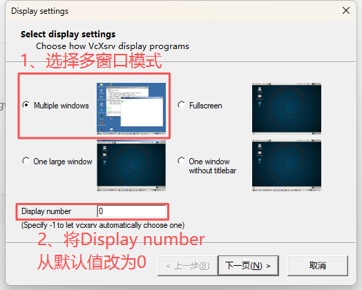
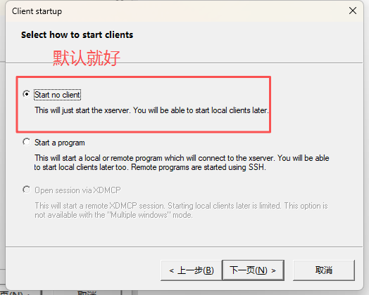
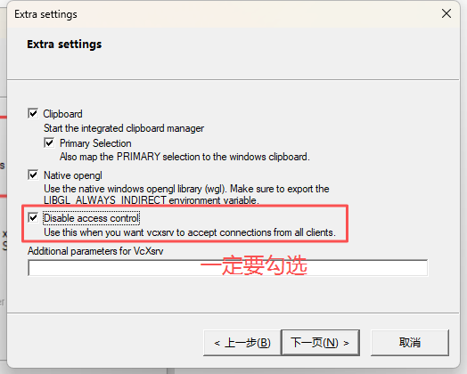

# X11Forwarding远程连接


> 更新时间：2026/3/14
>
> 参与者：Mid-Summer


系统：Ubuntu Server 22.04  & Windows11


***为什么用X11转发***

传统的远程桌面连接方案（如VNC）配置复杂且占用cpu和内存过多，而ssh X11转发只需一条命令且占用带宽小（还能转发GUI）


## 一、准备工作

### 1、Windows安装X服务器

> 原因：Windows和Linux支持图形化用的是不同的协议和方式，需要一个媒介为windows翻译从而实现通信

#### （1）下载X服务器（推荐VcXsrv）

链接：

```
https://sourceforge.net/projects/vcxsrv/
```

安装时保持默认设置就好（安装路径自己决定）


#### （2） 配置向导（XLaunch）







其他保持默认，选择下一页，最后确定就好

#### （3） 配置Windows的系统变量

> 在windows的终端（cmd或powershell）

```
set DISPLAY=localhost:0.0
```


## 二、Linux服务器配置

```python
# 编辑SSH配置文件
sudo nano /etc/ssh/sshd_config

# 确保以下两行未被注释
X11Forwarding yes
X11UseLocalhost no

# 重启SSH服务
sudo systemctl restart sshd

# 安装xauth（关键！）
sudo apt install xauth  # Debian/Ubuntu
sudo yum install xauth  # CentOS/RHEL
```


## 三、ssh连接与图形转发

### 1、连接

```python
ssh -X username@server_ip （安全模式）

或 

ssh -Y username@server_ip （无限制模式）
```

> 参数我一般直接用 -Y，操作更方便，而且我练的是我自己可信任的服务器

```python
ip a
# 查看服务器ip（如果需要的话，软件推荐Advanced Ip Scanner)
```

>  局域网扫描工具（Advanced Ip Scanner）

```python
https://www.advanced-ip-scanner.com/cn/
```


### 2、验证

```python
echo $DISPLAY	#成功则显示：localhost:10.0 也可能不是localhost是用户名

xclock	# 测试程序，连接成功则会显示一个时钟在windows
```


### 3、手动设置DISPLAY

> 如果ssh自动转发失败

1. 查看windows本机ip

2. 在服务器上执行

   ```python
   export DISPLAY=192.168.1.100:0.0
   
   xclock & # 测试时钟程序
   ```

3. windows防火墙需放行TCP 6000端口（虽然一般防火墙都关着）