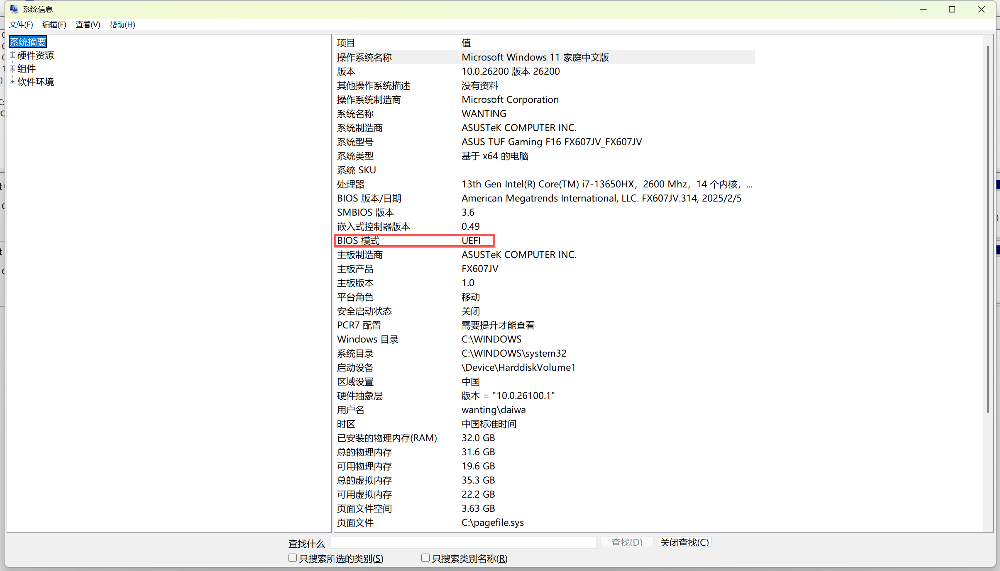
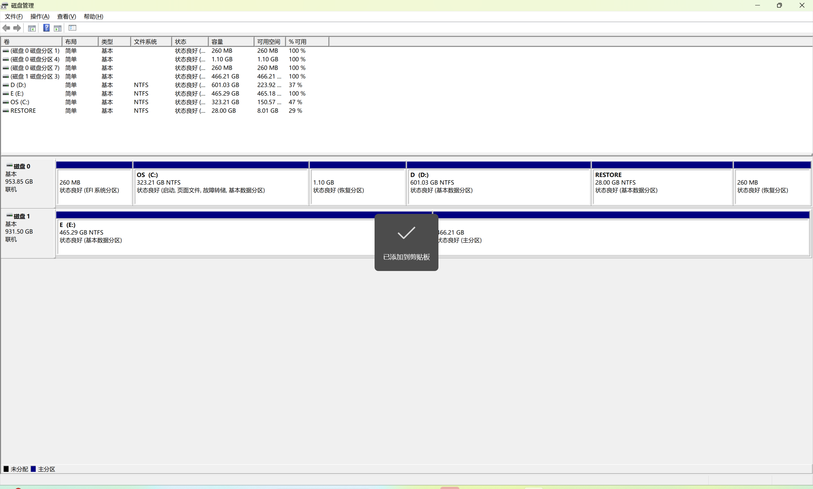
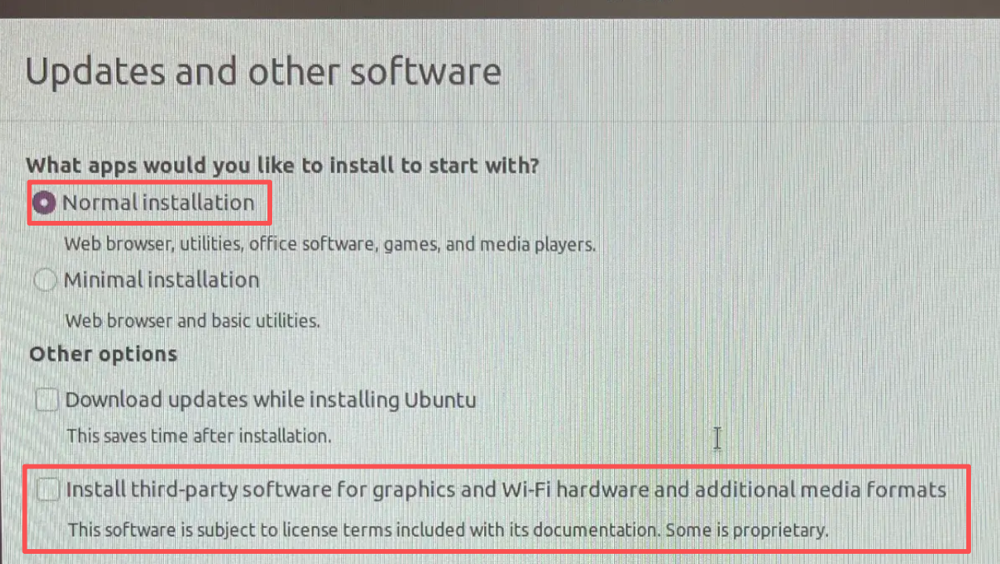
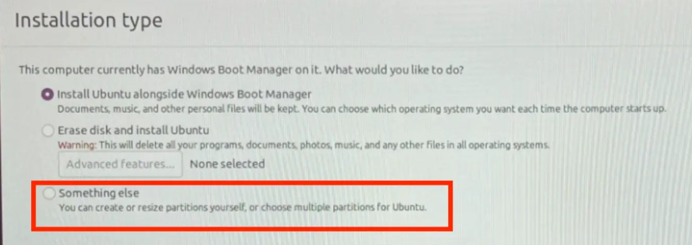
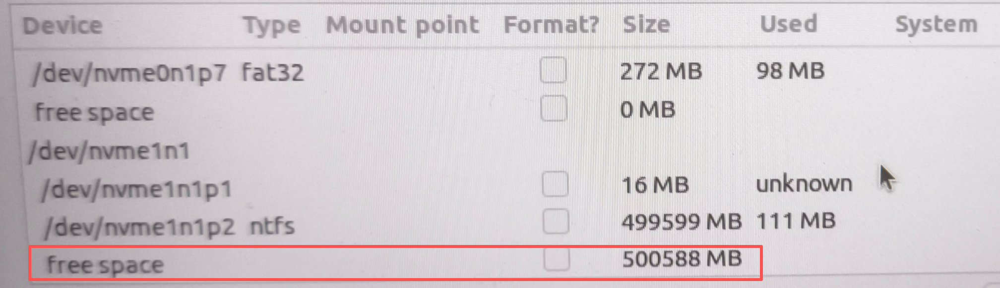
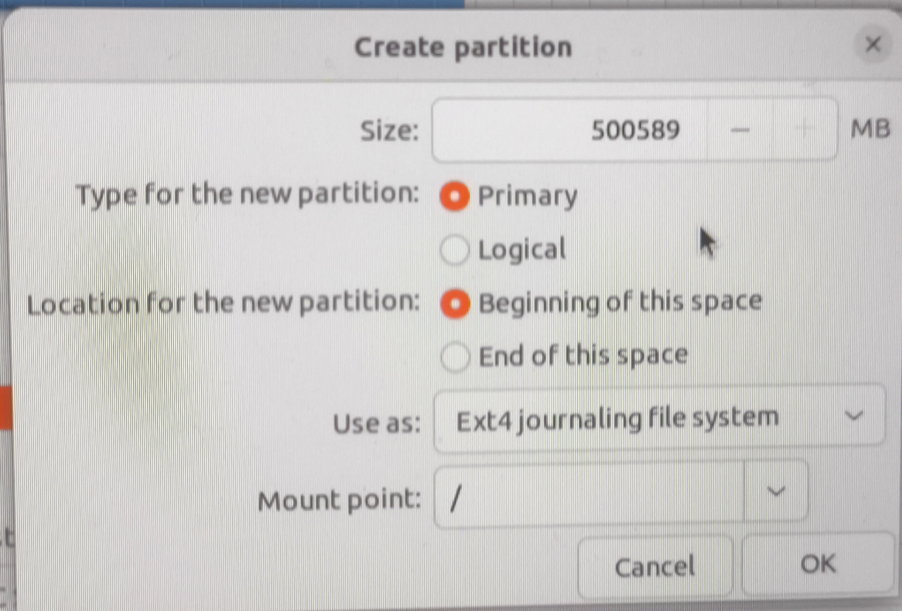
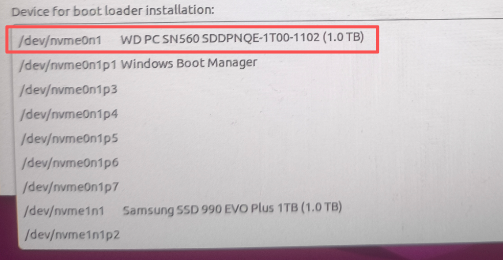

# 双系统安装

> 更新时间：2026/3/20
>
> 参与者：Mid-Summer

### 一、环境确认

1. 确认BIOS模式

   - win + R 打开运行窗口，输入msinfo32

   - 观察系统信息

   - BIOS模式是否为UEFI

     

2. 磁盘分区（单硬盘双硬盘同操作）

   - 打开磁盘管理

     

   - 单硬盘只会显示一个磁盘0，双硬盘或者多硬盘会显示磁盘1、磁盘2......

   - 不管是单硬盘还是双硬盘，确认自己想给Ubuntu的空间，然后分区。

   - 单硬盘：留出对应的未分配磁盘区域（free space）    双硬盘：同单硬盘，如果想一整个硬盘都用于装另一个系统（例如Ubuntu），就不用分区，如果该硬盘之前装过系统，现在想重新装，就直接右键点击磁盘选择删除卷，然后按自己的需要分区。

3. 打开设置 - 隐私和安全性 - 设备加密 - 关掉设备加密（即bitlocker） ***很重要，不关装完双系统可能打不开Windows***

4. 制作引导盘

5. 设置BIOS

   - 插入引导盘

   - 在电脑启动时按F2（大部分电脑）进入BIOS，将引导盘的优先启动顺序设置为1
   - 进入高级模式 - 安全 - 关闭安全启动
   - 保存并退出

6. 准备好以上后就可以开始安装双系统

### 二、安装

1. 第一界面是一个黑框，选择 **Try or Install**，按 Enter键

2. 语言选中文和英文都可以，练不联网看个人

3. 选择红框中这两项，安装必要组件和驱动

   

4. 在installation type中选择自定义分区（something else）

   

5. 现在 device/设备 这部分找到自己预留的空间，一般会显示 free space/空闲，类似于红框中这种

   

6. 双击选择的freespace，配置新分区

   - 

   - size按照完整大小，不用管

     

7. 引导加载器位置

   - 
   - 选择 /dev/nvme0n1（因为在BIOS/UEFI设置中，启动顺序第一顺位是/dev/nvme0n1，也就是windows所在的硬盘，只有把引导加载器GRUB放在这里，电脑开机才能找到他，然后再双系统开机时显示选择菜单）

8. 后续点击continue和install now就可以

9. 安装好后，会出现这句话 *Please remove the installation medium,then press ENTER*，即拔出引导盘然后按下enter键